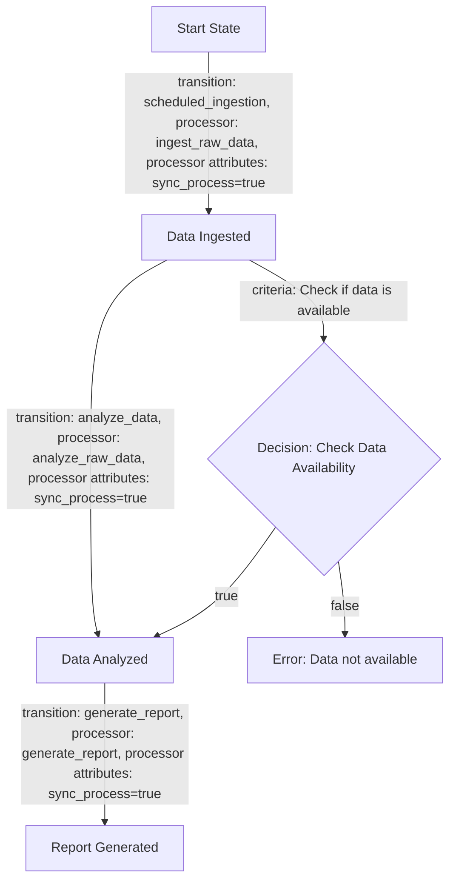
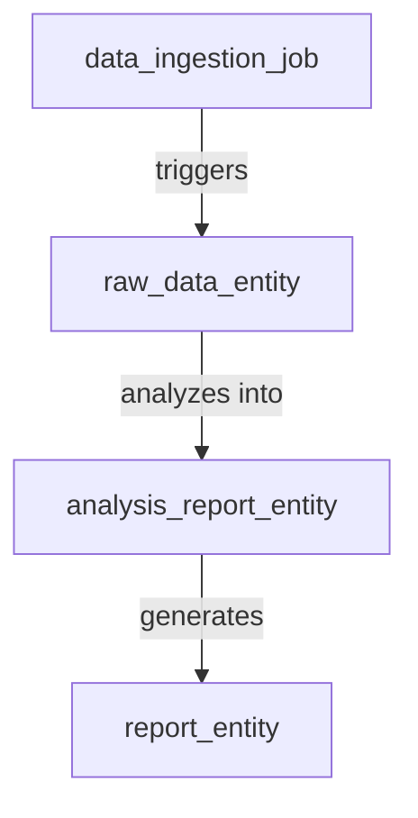
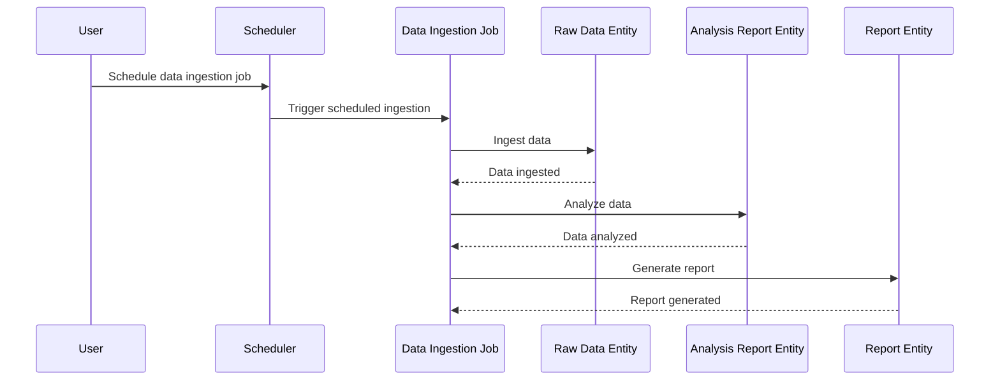

# Product Requirements Document (PRD) for Cyoda Design

## Introduction

This document delineates the Cyoda-based application designed to manage the download, analysis, and reporting of London Houses Data. It elucidates how the Cyoda design aligns with the stated requirements, providing insights into the structure of entities, workflows, and the event-driven architecture that supports the application. The design is represented in a human-readable format, supplemented by various markdown diagrams for clarity.

## What is Cyoda?

Cyoda is a serverless, event-driven framework facilitating the management of workflows through entities that represent jobs and data. Each entity has a defined state, and transitions between states are governed by events occurring within the system—enabling responsive and scalable architecture.

## Cyoda Entity Database

The Cyoda design JSON outlines several entities for our application, complete with their workflows and transitions:

1. **Data Ingestion Job (`data_ingestion_job`)**:
   - **Type**: JOB
   - **Source**: SCHEDULED
   - **Description**: Manages the process of downloading the raw data.

2. **Raw Data Entity (`raw_data_entity`)**:
   - **Type**: EXTERNAL_SOURCES_PULL_BASED_RAW_DATA
   - **Source**: ENTITY_EVENT
   - **Description**: Stores the raw data that has been downloaded.

3. **Analysis Report Entity (`analysis_report_entity`)**:
   - **Type**: SECONDARY_DATA
   - **Source**: ENTITY_EVENT
   - **Description**: Contains the results of the data analysis.

4. **Report Entity (`report_entity`)**:
   - **Type**: SECONDARY_DATA
   - **Source**: ENTITY_EVENT
   - **Description**: Holds the generated report based on the analysis.

## Workflow Overview

The workflows in Cyoda define how each job entity operates through a series of transitions:

- **Data Ingestion**: Initiates the downloading of raw data.
- **Data Analysis**: Analyzes the ingested raw data using Pandas.
- **Report Generation**: Generates and saves a report based on the analysis.

### Flowchart for Data Ingestion Job Workflow

### Entity Diagram

### Sequence Diagram

## Conclusion

The Cyoda design effectively aligns with the requirements for creating a robust data ingestion and reporting application. By utilizing an event-driven model, the application efficiently manages state transitions of each entity involved, from data ingestion through to report generation. The outlined entities, workflows, and events comprehensively address the application needs, ensuring a smooth and automated process.

The provided diagrams visualize workflows and entity relationships, promoting understanding and facilitating easier implementation by the technical team. This PRD serves as a foundation for development, guiding the team through the specifics of the Cyoda architecture while clarifying usage for new users.