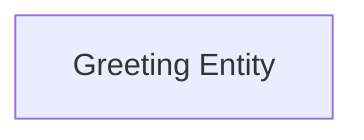
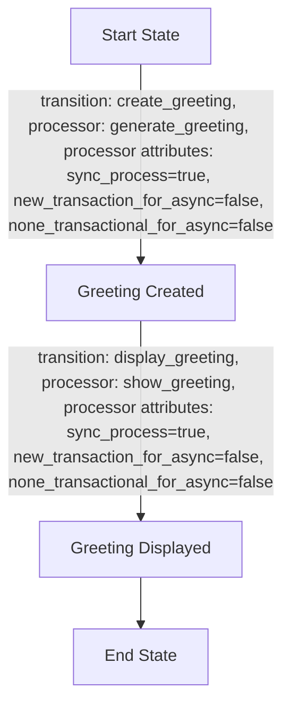

Sure! Here’s a complete Product Requirements Document (PRD) for the "Hello World" application, focusing on the Greeting Entity.

# Product Requirements Document (PRD) for Hello World Application

## Introduction

This document provides a detailed overview of the "Hello World" application designed to greet users with a personalized message. The app allows users to input their names and receive a customized greeting, enhancing user interaction and experience.

## What is the Hello World Application?

The Hello World application is a simple web application that demonstrates basic user interaction by displaying personalized greetings based on user input. It serves as an introductory project for understanding web application development.

## User Requirements

### User Stories

1. **As a user, I want to see "Hello World" when I visit the app, so I know the app is working.**
   - Acceptance Criteria: The app must display "Hello World" on the homepage.

2. **As a user, I want to enter my name and receive a personalized greeting, so I feel welcomed.**
   - Acceptance Criteria: When I input my name and click submit, the app should respond with "Hello, [Name]!"

3. **As a user, I want to be able to refresh the page without losing my greeting, so I can see it again easily.**
   - Acceptance Criteria: The greeting should persist after refreshing.

## Entities Outline

### Greeting Entity

- **Description:** Stores the personalized greeting message for the user.
- **Workflow:** Manages the process of creating and displaying a greeting.

### Greeting Entity Diagram



### Example JSON Data Model for Greeting Entity

```json
{
  "greeting_id": "12345",
  "message": "Hello, John!",
  "timestamp": "2023-10-01T12:00:00Z",
  "user_id": "67890"
}
```

### Workflow Flowchart for Greeting Entity



## Event-Driven Approach

The application employs an event-driven architecture that allows it to respond automatically to user input. When a user enters their name and submits it, the application processes this event to generate a personalized greeting.

### Benefits of the Event-Driven Approach

- **Responsiveness:** The app can immediately present feedback to users based on their input.
- **Scalability:** The architecture can easily adapt to more complex features in the future.

## Conclusion

The Hello World application is a simple yet effective way to engage users with personalized greetings. The outlined Greeting Entity and its workflow comprehensively cover the basic requirements of the app, ensuring a smooth and user-friendly experience.

This PRD serves as a guide for implementation and development, helping the technical team understand the application's structure while providing clarity for users new to the project.

---

Feel free to tweak any part of this PRD or let me know if there's anything more you'd like to add!