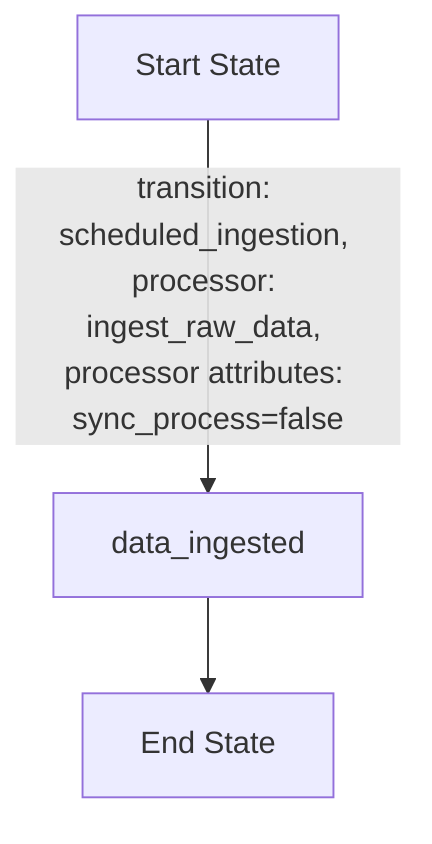
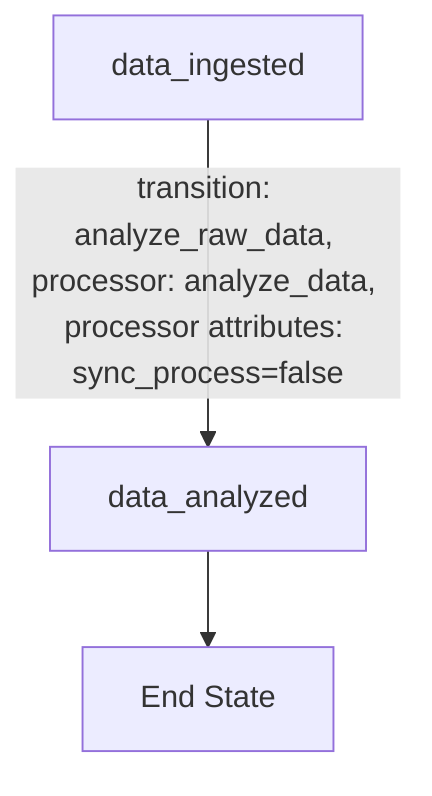
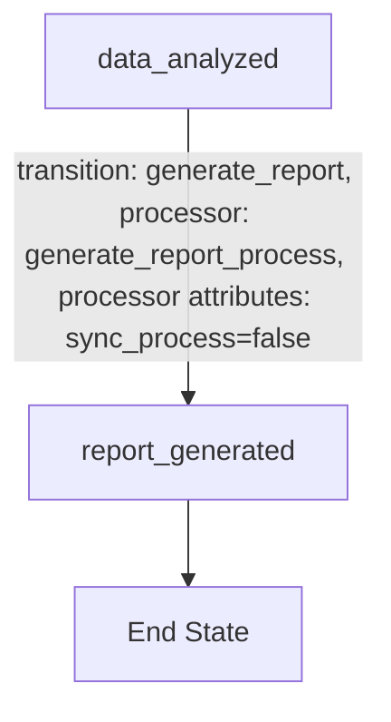
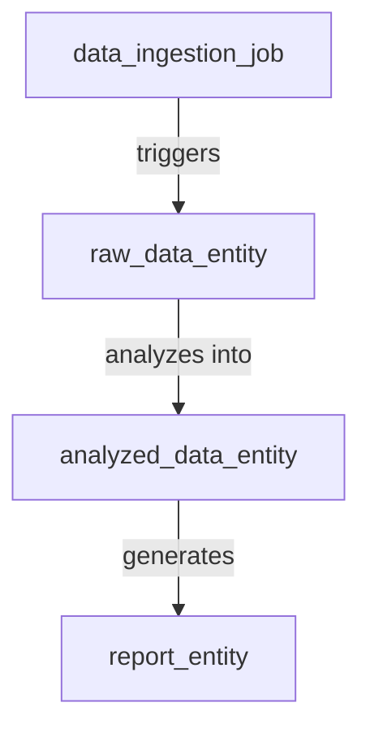
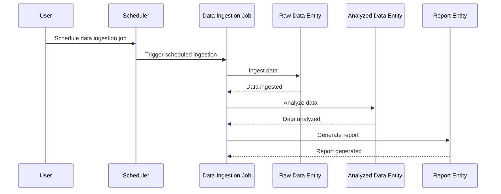

# Product Requirements Document (PRD) for Cyoda Design

## Introduction

This document outlines the Cyoda-based application designed to manage the ingestion, analysis, and reporting of London Houses Data. It explains how the provided Cyoda design JSON structure aligns with the specified requirement, delineating entities, workflows, and their relationships. The document also includes various markdown diagrams to illustrate the workflows, entity relationships, and processes within the system.

## Cyoda Design Overview

In the Cyoda architecture, workflows are structured around "entities" which represent different components of the data processing lifecycle. Each entity has defined states and transitions that dictate how it behaves in response to events.

### Entities and Workflows

The following entities are defined in the Cyoda design JSON:

1. **Data Ingestion Job (`data_ingestion_job`)**
   - Type: JOB
   - Source: SCHEDULED
   - Description: Responsible for ingesting data from specified sources.

2. **Raw Data Entity (`raw_data_entity`)**
   - Type: EXTERNAL_SOURCES_PULL_BASED_RAW_DATA
   - Source: ENTITY_EVENT
   - Description: Stores the raw data that has been ingested.

3. **Analyzed Data Entity (`analyzed_data_entity`)**
   - Type: SECONDARY_DATA
   - Source: ENTITY_EVENT
   - Description: Contains data that has been analyzed using pandas.

4. **Report Entity (`report_entity`)**
   - Type: SECONDARY_DATA
   - Source: ENTITY_EVENT
   - Description: Contains the generated report derived from the analyzed data.

## Workflow Flowcharts

### Data Ingestion Job Workflow

### Analyzed Data Workflow

### Report Generation Workflow

## Entity Relationships and State Transitions

## Sequence Diagram

## Conclusion

The Cyoda design efficiently encapsulates the requirements for processing London Houses Data, from ingestion to report generation. By leveraging an event-driven architecture with defined entities and workflows, the application ensures smooth data processing and reporting. The structures outlined in this document provide a comprehensive overview for developers and stakeholders, ensuring clarity and alignment with the project goals.