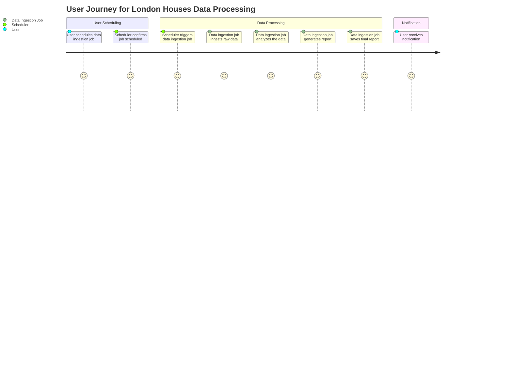
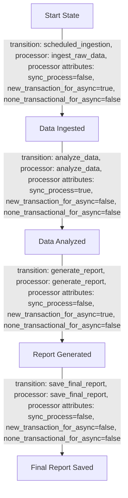
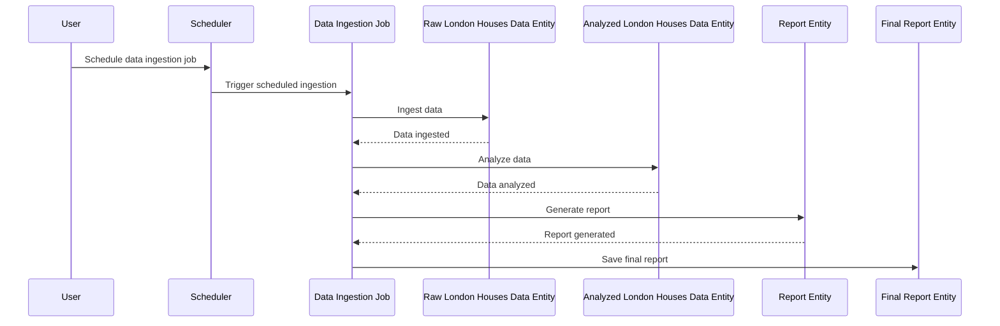

# Product Requirements Document (PRD) for Cyoda Design

## Introduction

This document provides a comprehensive overview of the Cyoda-based application designed to manage the ingestion, analysis, and reporting of London Houses Data. The Cyoda design aligns with the specified requirements while ensuring an efficient workflow through a well-defined single JOB entity, streamlining processes and minimizing complexity. The design is represented in a Cyoda JSON format, which is translated into a human-readable document for clarity.

## What is Cyoda?

Cyoda is a serverless, event-driven framework that facilitates the management of workflows through entities representing jobs and data. In this design, a single JOB entity orchestrates the entire workflow, allowing the system to respond automatically to events, thus promoting scalability and efficiency in processing data.

### Cyoda Entity Database

The Cyoda entity database consists of several entities, each fulfilling specific roles:

1. **Data Ingestion Job (`data_ingestion_job`)**:
   - **Type**: JOB
   - **Source**: SCHEDULED
   - **Description**: Initiates the data ingestion process, analyzes the data, and generates reports.

2. **Raw London Houses Data Entity (`raw_london_houses_data`)**:
   - **Type**: EXTERNAL_SOURCES_PULL_BASED_RAW_DATA
   - **Source**: ENTITY_EVENT
   - **Description**: Stores unprocessed data obtained from various sources.

3. **Analyzed London Houses Data Entity (`analyzed_london_houses_data`)**:
   - **Type**: SECONDARY_DATA
   - **Source**: ENTITY_EVENT
   - **Description**: Contains transformed data derived from the raw data.

4. **Report Entity (`report_entity`)**:
   - **Type**: SECONDARY_DATA
   - **Source**: ENTITY_EVENT
   - **Description**: Holds the generated report from analyzed data.

5. **Final Report Entity (`final_report`)**:
   - **Type**: SECONDARY_DATA
   - **Source**: ENTITY_EVENT
   - **Description**: Stores the finalized report for end-users.

### User Flow

The user flow outlines the sequence of actions that a user takes to interact with the Cyoda application, leading to the successful generation of the final report. The following steps summarize this flow:

1. **User Schedules Data Ingestion**:
   - The user accesses the application and schedules the data ingestion job to fetch London Houses Data.

2. **Scheduler Triggers Job**:
   - The scheduler automatically triggers the `data_ingestion_job` based on the defined schedule.

3. **Data Ingestion**:
   - The job ingests raw data from the specified sources and stores it in the `raw_london_houses_data` entity.

4. **Data Analysis**:
   - The job analyzes the ingested data and generates transformed data stored in the `analyzed_london_houses_data` entity.

5. **Report Generation**:
   - The job generates a report based on the analyzed data and stores it in the `report_entity`.

6. **Final Report Creation**:
   - The job saves the finalized report in the `final_report` entity, making it available for the user.

7. **User Receives Notification**:
   - The user receives a notification once the final report is available.

### User Journey Diagram

### Workflow Overview

The workflows in Cyoda define the processes tied to the single JOB entity. The `data_ingestion_job` includes transitions that specify how the entities change state based on events. The following flowchart represents the workflow for the JOB entity with transitions:

#### Flowchart for Data Ingestion Job

### Event-Driven Approach

1. **Data Ingestion**: The data ingestion job is triggered on a scheduled basis, automatically initiating the process of fetching data.
2. **Data Analysis**: Upon ingestion, an event signals the need to analyze the raw data.
3. **Report Generation**: After analysis, another event triggers the creation of the report and saving the final report.

This approach promotes scalability and efficiency by allowing the application to handle each process step automatically without manual intervention.

### Sequence Diagram

### Actors Involved

- **User**: Initiates the scheduling of the data ingestion job.
- **Scheduler**: Responsible for triggering the job at predefined times.
- **Data Ingestion Job**: Central entity managing the workflow of data processing.
- **Raw London Houses Data Entity**: Stores the ingested raw data.
- **Analyzed London Houses Data Entity**: Holds the analyzed data.
- **Report Entity**: Contains the generated report.
- **Final Report Entity**: Stores the finalized report.

## Conclusion

The Cyoda design effectively aligns with the requirements for creating a robust data processing application using a single JOB entity. By streamlining the workflow through a single orchestrating job, the application efficiently manages state transitions of each entity involved, from data ingestion to report delivery. The outlined entities, workflows, and events comprehensively cover the needs of the application, ensuring a smooth and automated process.

This PRD serves as a foundation for implementation and development, guiding the technical team through the specifics of the Cyoda architecture while providing clarity for users who may be new to the Cyoda framework.