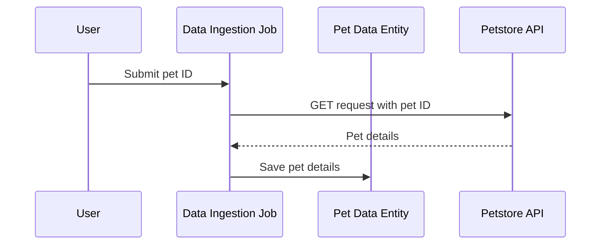
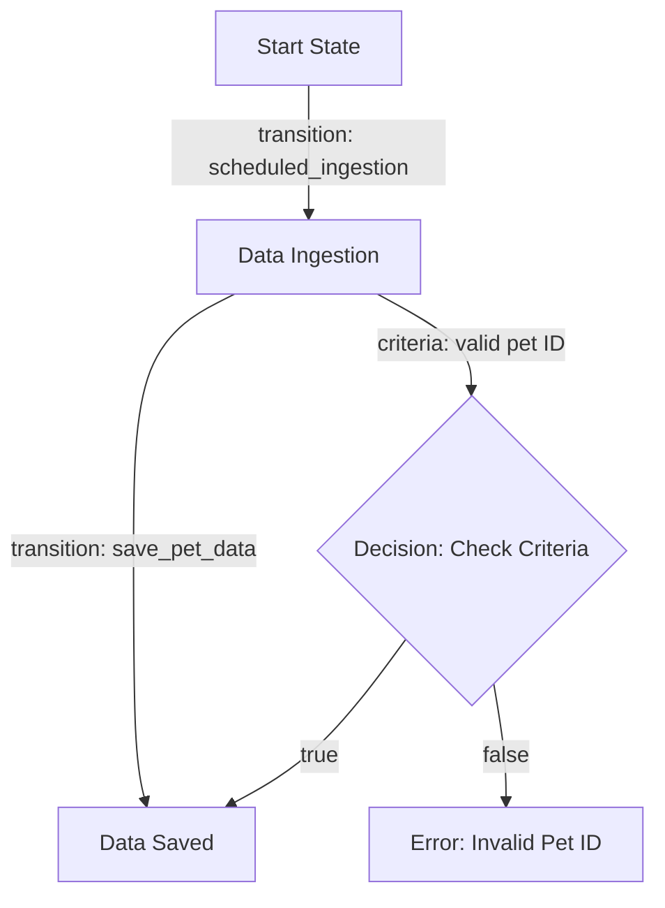
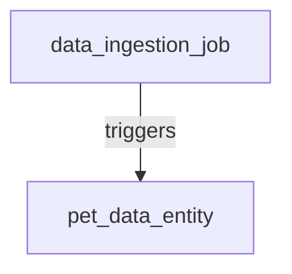
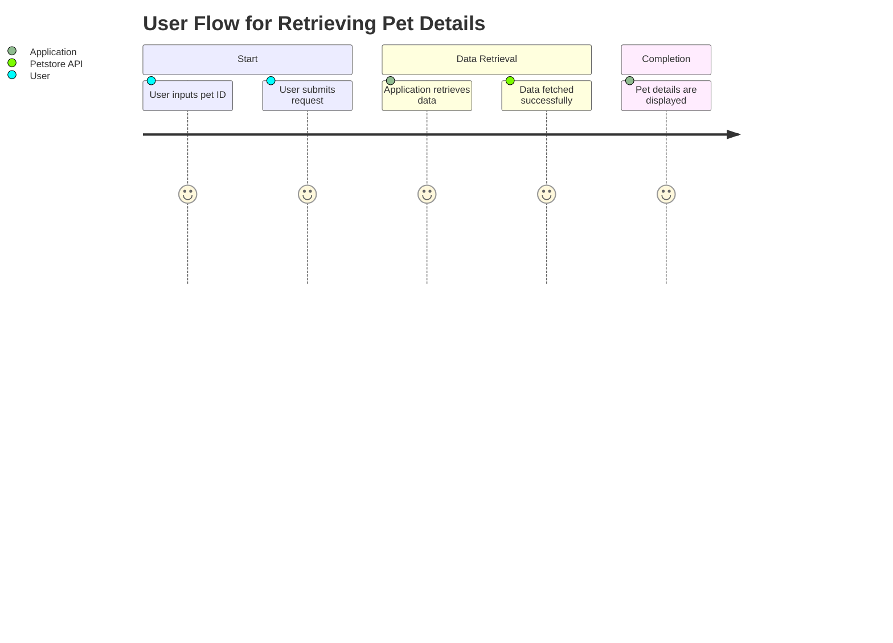

# Product Requirements Document (PRD) for Cyoda Design

## Introduction

This document provides an overview of the Cyoda-based application designed to interact with the Petstore API, fulfilling the requirement to retrieve and display details of pets based on user input. The design aligns with the specified requirements by defining entities, workflows, and the event-driven architecture that powers the application. 

## What is Cyoda?

Cyoda is a serverless, event-driven framework that facilitates the management of workflows through entities representing jobs and data. Each entity has a defined state, and transitions between states are governed by events that occur within the system, enabling a responsive and scalable architecture.

## Cyoda Design JSON Overview

The Cyoda design JSON outlines the following key components:

### Entities and Workflows

1. **Data Ingestion Job (`data_ingestion_job`)**:
   - **Type**: JOB
   - **Source**: API_REQUEST
   - **Description**: This job is responsible for initiating the data retrieval process from the Petstore API using a pet ID provided by the user.

2. **Pet Data Entity (`pet_data_entity`)**:
   - **Type**: EXTERNAL_SOURCES_PULL_BASED_RAW_DATA
   - **Source**: ENTITY_EVENT
   - **Description**: This entity stores the retrieved pet details from the Petstore API.

### Workflow Overview

The `data_ingestion_job` contains a workflow with the following transition:

- **Scheduled Ingestion**: This transition triggers the process of retrieving pet data based on a provided pet ID, marking the entity as "data_ingested."

### Event-Driven Architecture

The application operates on an event-driven architecture, allowing workflows to respond automatically to user inputs and API events. For instance:

1. **Data Retrieval**: When the user provides a pet ID, an event triggers the data ingestion job to fetch the pet details from the Petstore API.
2. **Data Storage**: Once data is retrieved, it is stored in the `pet_data_entity`.

## Diagrams

### Sequence Diagram

### Flowchart for Data Ingestion Job Workflow

### Graph of Entity Relationships

### Journey of User Interaction

## Conclusion

The Cyoda design effectively aligns with the requirements for creating an application that seamlessly retrieves and displays pet details from the Petstore API. By utilizing the event-driven model, the application can efficiently manage state transitions of each entity involved, ensuring a smooth and automated process of data ingestion and retrieval. The outlined entities, workflows, and diagrams comprehensively cover the needs of the application, providing clarity and structure for implementation.