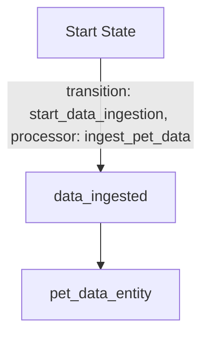
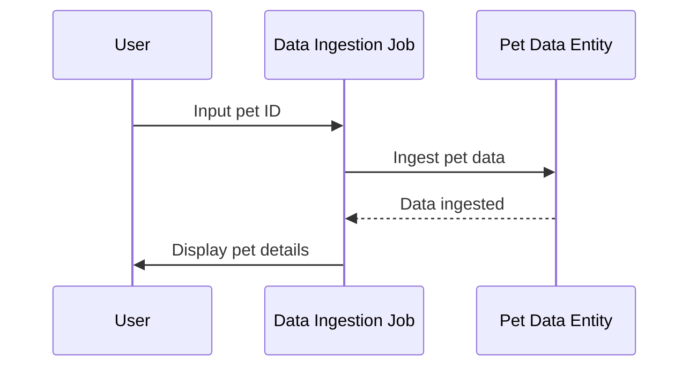
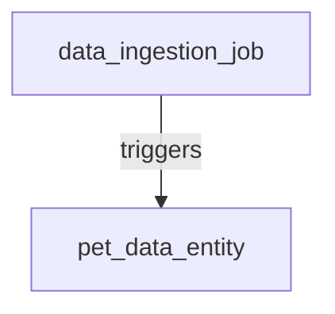
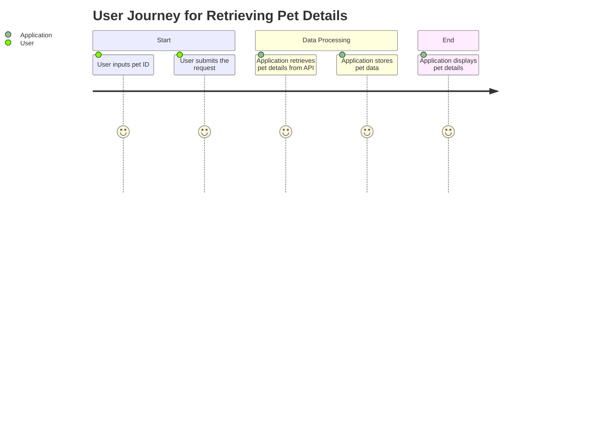

# Product Requirements Document (PRD) for Cyoda Design

## Introduction

This document provides a detailed overview of the Cyoda-based application designed to interact with the Petstore API to retrieve and display details of pets based on user input. It explains how the Cyoda design aligns with the specified requirements and provides a comprehensive overview of the concepts involved in the Cyoda entity database, the event-driven architecture, and the various workflows, entities, and actors involved in the system.

## What is Cyoda?

Cyoda is a serverless, event-driven framework that facilitates the management of workflows through entities representing jobs and data. Each entity has a defined state, and transitions between states are governed by events that occur within the system, enabling a responsive and scalable architecture.

## Cyoda Design Overview

The Cyoda design consists of two primary entities: a Job entity (`data_ingestion_job`) and a Data entity (`pet_data_entity`). This design allows for seamless data ingestion, transformation, and error handling in alignment with the user requirements of fetching pet details from the Petstore API based on user-provided input.

### Entities and Their Roles

1. **Data Ingestion Job (`data_ingestion_job`)**:
   - **Type**: JOB
   - **Source**: API_REQUEST
   - **Description**: Triggers the ingestion of pet data from the Petstore API whenever a user inputs a pet ID. It manages the workflow for retrieving and preparing the pet data.

2. **Pet Data Entity (`pet_data_entity`)**:
   - **Type**: EXTERNAL_SOURCES_PULL_BASED_RAW_DATA
   - **Source**: ENTITY_EVENT
   - **Description**: Stores the retrieved pet details from the Petstore API. This entity is tied to the data ingestion job and is created upon successful ingestion.

## Entity Workflows

### Flowchart for Data Ingestion Job

### Sequence Diagram for User Interaction

## Event-Driven Approach

An event-driven architecture allows the application to respond automatically to user inputs and API interactions. In this specific requirement, the following events occur:

1. **Data Ingestion**: The data ingestion job is triggered when a user inputs a pet ID, which initiates the process of fetching data from the Petstore API.
2. **Data Storage**: Once the data is successfully ingested, the pet data entity is created to store the details.
3. **Data Display**: The application then displays the pet details to the user.

## Entity Relationships Diagram

## User Journey Diagram

## Conclusion

The Cyoda design aligns effectively with the requirements for creating an application that retrieves and displays pet details from the Petstore API based on user input. The outlined entities, workflows, and events comprehensively cover the needs of the application, ensuring a smooth and automated process.

This PRD serves as a foundation for implementation and development, guiding the technical team through the specifics of the Cyoda architecture while providing clarity for users who may be new to the Cyoda framework.