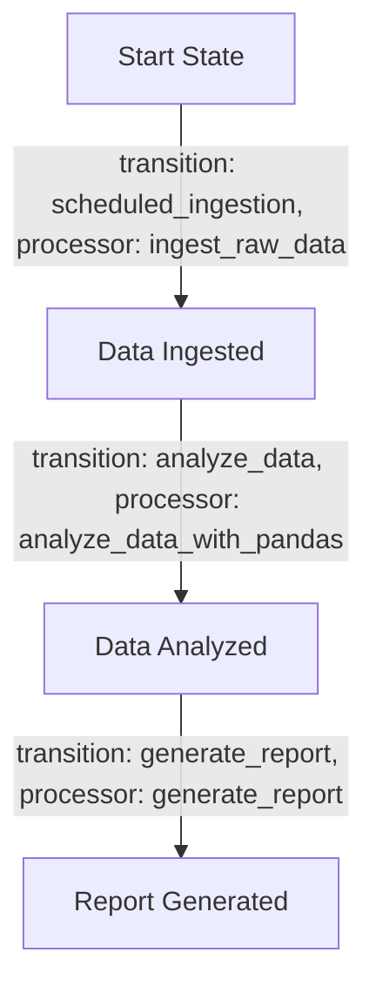
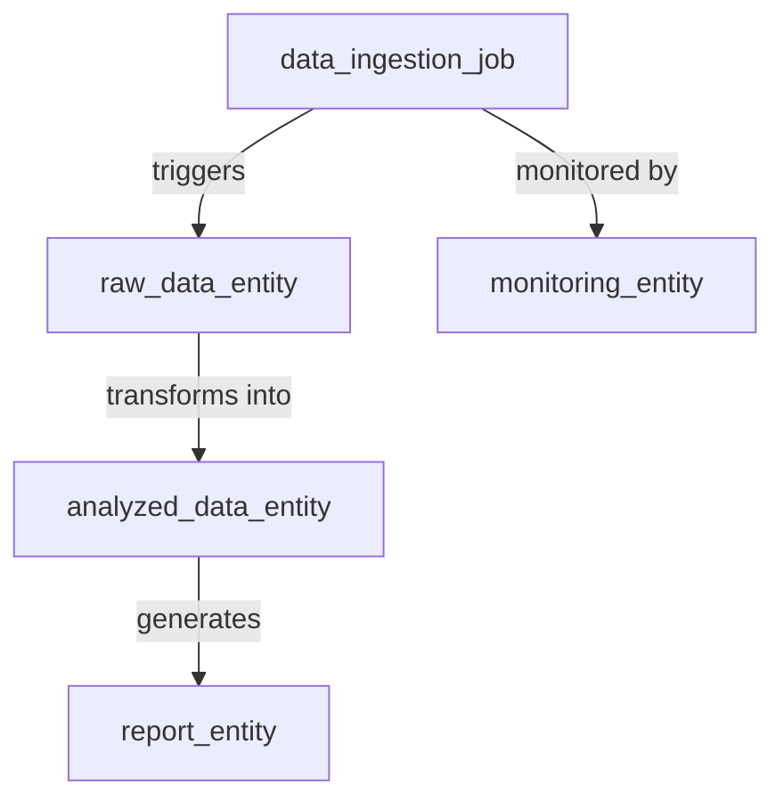
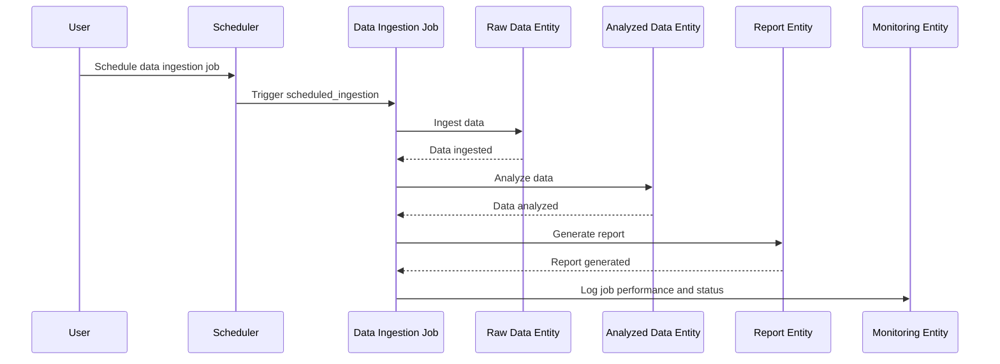
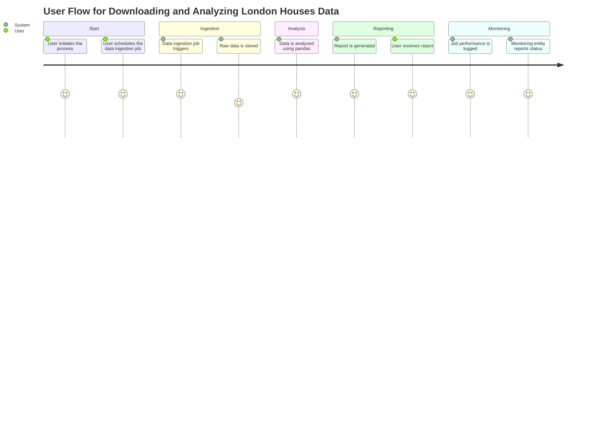

# Product Requirements Document (PRD) for Cyoda Design

## Introduction

This document explains the Cyoda-based application designed to download, analyze, and report on London Houses Data. The design outlines the necessary entities, workflows, and how they align with the specified requirements. It provides a comprehensive overview of the Cyoda framework through the Cyoda design JSON.

## Overview of Cyoda Design JSON

The Cyoda design JSON comprises several entities primarily focused on data ingestion, processing, and report generation. Each entity has defined workflows that dictate its behavior through state transitions. The design incorporates a well-structured approach, ensuring that each process is automated and can react to events.

### Cyoda Entities

1. **Data Ingestion Job (`data_ingestion_job`)**:
   - **Type**: JOB
   - **Source**: SCHEDULED
   - **Workflow**: Responsible for downloading, analyzing, and generating a report from the data.
   - **Transitions**:
     - `scheduled_ingestion`: Initiates the data ingestion from an API.
     - `analyze_data`: Analyzes the ingested data using pandas.
     - `generate_report`: Creates a report from the analyzed data.

2. **Raw Data Entity (`raw_data_entity`)**:
   - **Type**: EXTERNAL_SOURCES_PULL_BASED_RAW_DATA
   - **Source**: ENTITY_EVENT
   - **Workflow**: Represents the raw data obtained from external sources.

3. **Analyzed Data Entity (`analyzed_data_entity`)**:
   - **Type**: SECONDARY_DATA
   - **Source**: ENTITY_EVENT
   - **Workflow**: Represents the analyzed data after data processing.

4. **Report Entity (`report_entity`)**:
   - **Type**: SECONDARY_DATA
   - **Source**: ENTITY_EVENT
   - **Workflow**: Contains the generated report after analyzing the data.

5. **Monitoring Entity (`monitoring_entity`)**:
   - **Type**: SECONDARY_DATA
   - **Source**: ENTITY_EVENT
   - **Workflow**: Tracks the status and performance of the data processing workflows.

## Workflows as Flowcharts

### Data Ingestion Job Workflow

### Entity Relationship Diagram

### Sequence Diagram

### User Journey Diagram

## Conclusion

The Cyoda design outlined in this document effectively meets the requirements for downloading, analyzing, and reporting on London Houses Data. By leveraging an event-driven architecture, each entity can operate autonomously based on state transitions triggered by specific events. The provided workflows, flowcharts, and diagrams enhance clarity and provide a comprehensive understanding of the Cyoda framework and its alignment with the application's objectives.