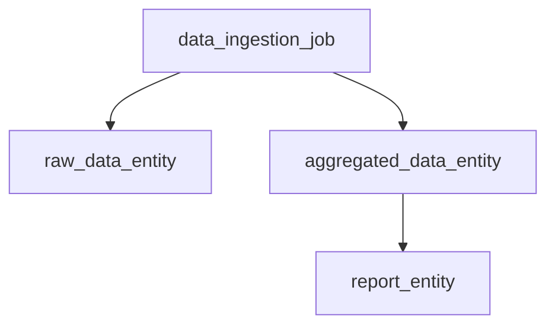
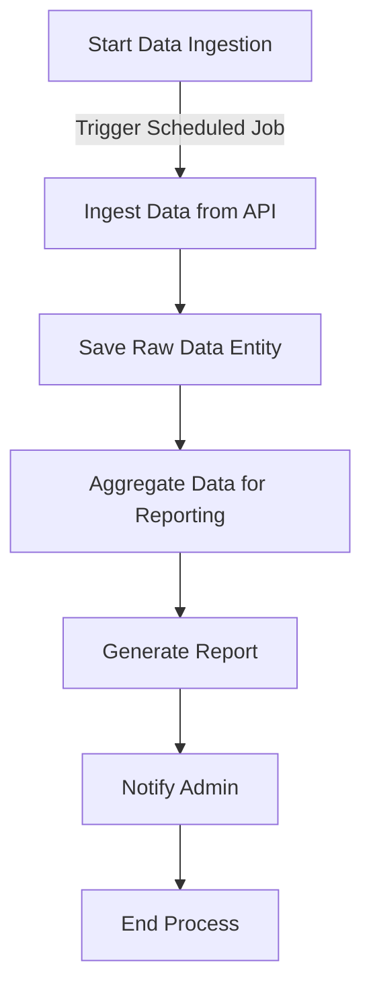
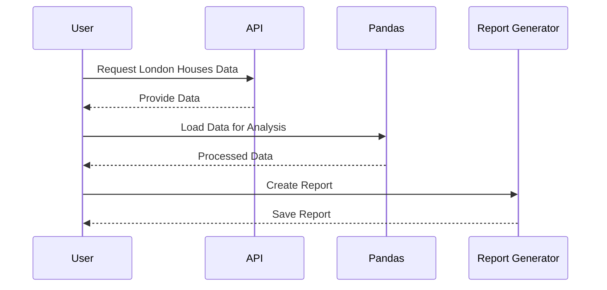

Here’s the complete Product Requirements Document (PRD) that encompasses all the elements we've discussed, including the overview of the project, entities, workflows, and diagrams.

---

# Product Requirements Document (PRD) for London Houses Data Analysis

## Introduction

This document outlines the requirements for a project aimed at downloading, analyzing, and reporting data related to London houses. The project utilizes a Cyoda-based application framework to manage the workflow, ensuring efficient data processing and reporting.

## Objectives

- **Download Data**: Automatically download data related to London houses from a specified source.
- **Data Analysis**: Use pandas to analyze the downloaded data, extracting meaningful insights.
- **Report Generation**: Generate a comprehensive report summarizing the analysis and findings.

## User Stories

### User Story 1
**As a user**, I want to download information about London houses so that I can analyze the real estate market in that area.

### User Story 2
**As a user**, I want to use pandas to perform data analysis on the downloaded London houses data so that I can gain insights and understand trends.

### User Story 3
**As a user**, I want to generate a report summarizing the analysis of the London houses data, so I can share my findings with others.

## Entities Overview

The following key entities are involved in the project:

1. **Data Ingestion Job (`data_ingestion_job`)**
   - **Type**: JOB
   - **Role**: Orchestrates the process of downloading and ingesting data.

2. **Raw Data Entity (`raw_data_entity`)**
   - **Type**: EXTERNAL_SOURCES_PULL_BASED_RAW_DATA
   - **Role**: Stores the raw data received from the API.

3. **Aggregated Data Entity (`aggregated_data_entity`)**
   - **Type**: SECONDARY_DATA
   - **Role**: Contains processed data after analysis.

4. **Report Entity (`report_entity`)**
   - **Type**: SECONDARY_DATA
   - **Role**: Holds the generated report based on the analysis.

### Entities Diagram



### Example JSON Models

1. **Data Ingestion Job**:
```json
{
  "entity_name": "data_ingestion_job",
  "entity_type": "JOB",
  "entity_source": "SCHEDULED",
  "depends_on_entity": "None",
  "entity_workflow": {
    "name": "data_ingestion_workflow",
    "class_name": "com.cyoda.tdb.model.treenode.TreeNodeEntity",
    "transitions": []
  }
}
```

2. **Raw Data Entity**:
```json
{
  "id": "raw_data_1",
  "title": "string",
  "dueDate": "2025-01-22T20:36:27.945Z",
  "completed": true
}
```

3. **Aggregated Data Entity**:
```json
{
  "id": 1,
  "total_activities": 2,
  "completed_activities": 1,
  "pending_activities": 1,
  "activity_summary": [
    {
      "activity_id": 1,
      "title": "Activity 1",
      "due_date": "2025-01-22T21:36:27.6587562+00:00",
      "status": "Pending"
    },
    {
      "activity_id": 2,
      "title": "Activity 2",
      "due_date": "2025-01-22T22:36:27.6587592+00:00",
      "status": "Completed"
    }
  ],
  "overall_status": "Partially Completed",
  "aggregation_timestamp": "2023-10-01T10:00:00Z"
}
```

4. **Report Entity**:
```json
{
  "report_id": "report_2023_10_01",
  "generated_at": "2023-10-01T10:05:00Z",
  "report_title": "Monthly Data Overview",
  "total_entries": 150,
  "successful_ingests": 145,
  "failed_ingests": 5
}
```

## Workflows Overview

### Workflow for Data Ingestion Job



### Sequence Diagram



## Conclusion

This PRD encapsulates the requirements for the project focused on downloading, analyzing, and reporting London houses data. It outlines the objectives, user stories, entities, workflows, and visuals that will guide the development process.

If there's anything more you'd like to add or modify, just let me know! I'm here to help! 😊