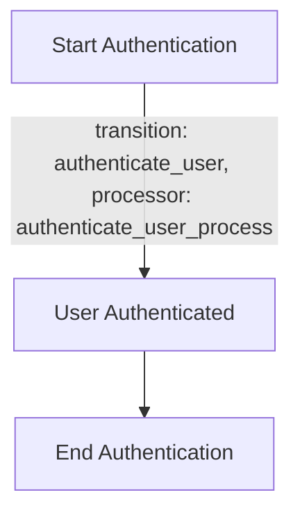
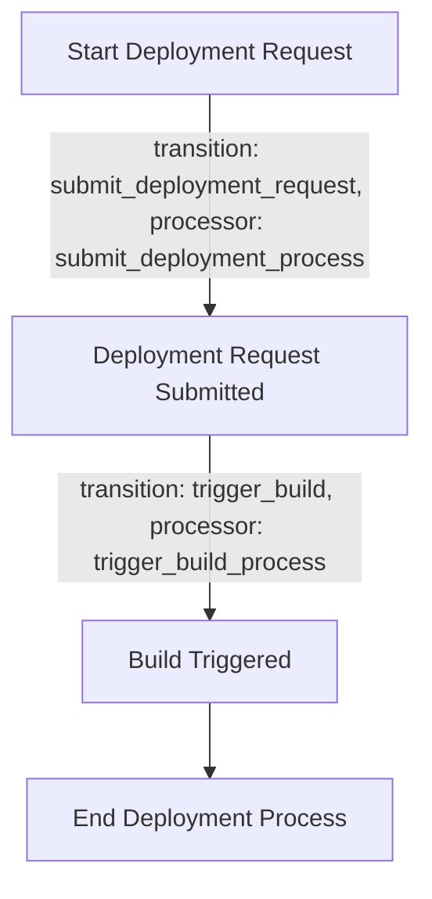
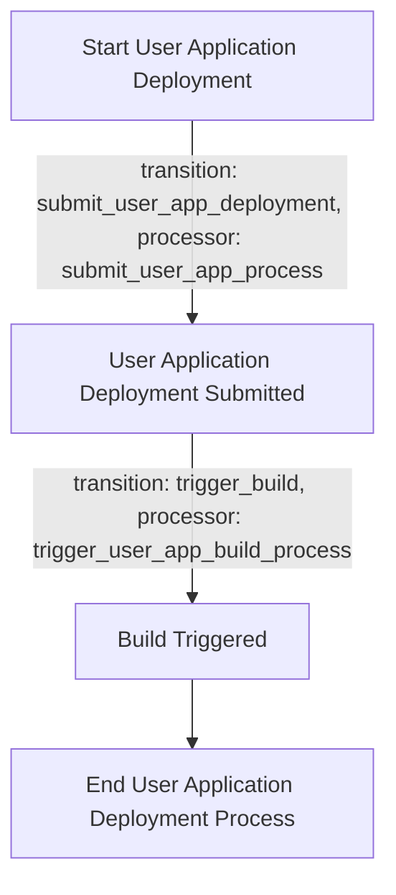
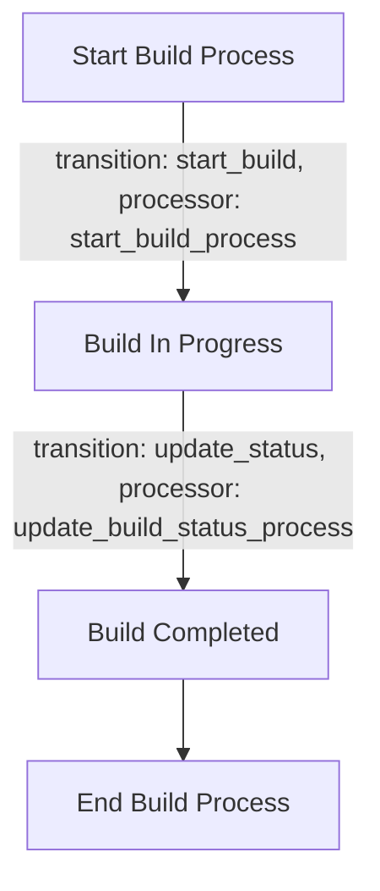

Certainly! Below is a human-readable Markdown representation of the Cyoda design JSON, outlining the entities and their associated workflow flowcharts.

---

# Cyoda Application Design

## Entities Overview

### 1. User Entity
- **Description**: Represents the user interacting with the application for authentication.
- **Workflow**: User Authentication Workflow

#### User Entity JSON Example
```json
{
    "user_id": "user_123",
    "user_name": "test_user",
    "token": "your_jwt_token"
}
```

#### User Authentication Workflow Flowchart


---

### 2. Deployment Environment Entity
- **Description**: Represents the deployment environment that is being managed and built.
- **Workflow**: Deployment Request Workflow

#### Deployment Environment Entity JSON Example
```json
{
    "env_id": "env_456",
    "user_id": "user_123",
    "deployment_config": {
        "repository_url": "http://example.com/repo.git",
        "is_public": true
    },
    "build_id": "build_789"
}
```

#### Deployment Request Workflow Flowchart


---

### 3. User Application Entity
- **Description**: Represents the user's application that needs to be deployed.
- **Workflow**: User Application Deployment Workflow

#### User Application Entity JSON Example
```json
{
    "app_id": "app_101",
    "user_id": "user_123",
    "repository_url": "http://example.com/repo.git",
    "is_public": true,
    "env_id": "env_456"
}
```

#### User Application Deployment Workflow Flowchart


---

### 4. Build Entity
- **Description**: Represents the build process and status for both deployment environments and user applications.
- **Workflow**: Build Workflow

#### Build Entity JSON Example
```json
{
    "build_id": "build_789",
    "env_id": "env_456",
    "app_id": "app_101",
    "status": "successful",
    "build_time": "5min",
    "success_rate": "95%"
}
```

#### Build Workflow Flowchart


---

## Summary

This document outlines the core entities within the Cyoda application design, highlighting their purpose and the associated workflows. Each entity includes a JSON example to illustrate its structure and a flowchart depicting the workflow processes to clarify how the various components interact in the system. 

If any additional details or modifications are required, feel free to ask!