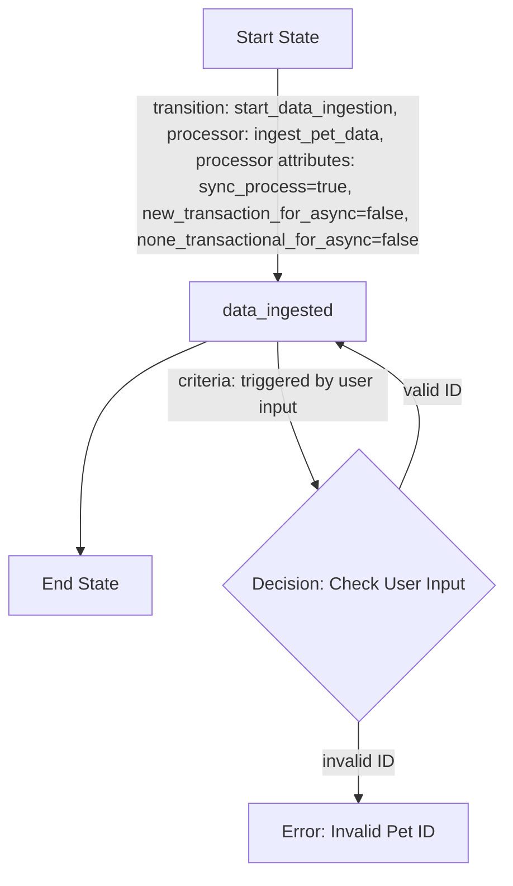
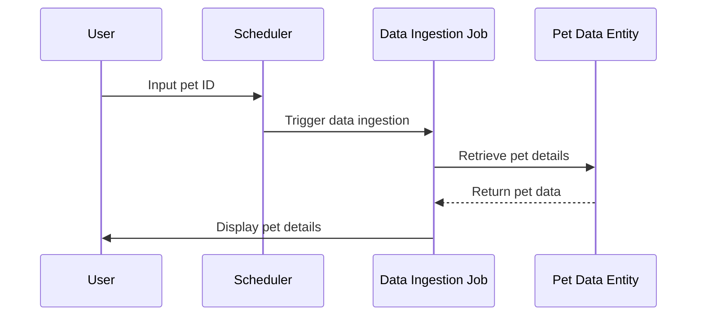
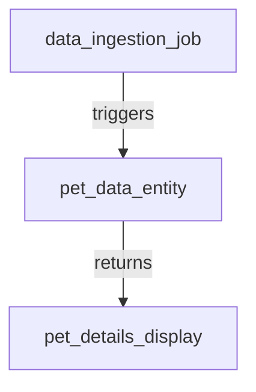
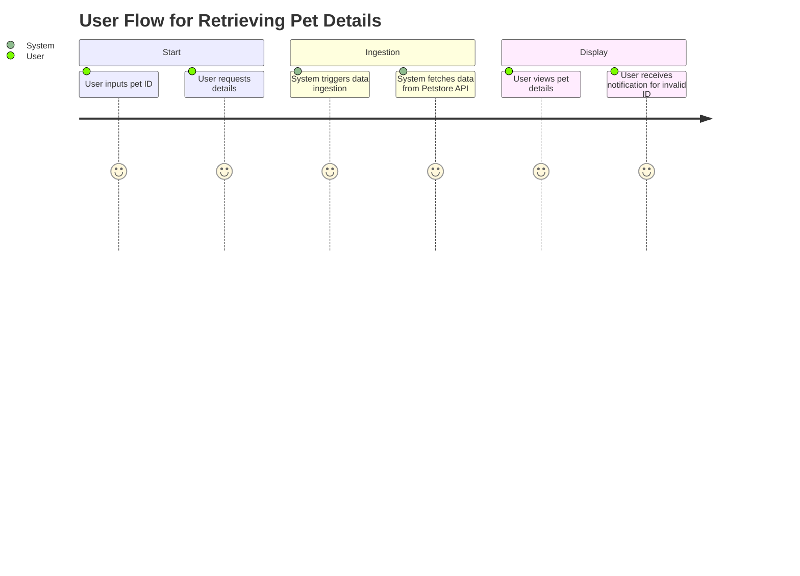

# Product Requirements Document (PRD) for Cyoda Design

## Introduction

This document outlines the Cyoda-based application designed to interact with the Petstore API to retrieve and display pet details based on user input. It explains how the Cyoda design aligns with the specified requirements, focusing on the structure of entities, workflows, and the event-driven architecture that powers the application.

## Cyoda Design Explanation

The Cyoda design JSON represents the core architecture of the application, detailing the entities involved, their types, sources, dependencies, and workflows. 

### Entities

1. **Data Ingestion Job (`data_ingestion_job`)**:
   - **Type**: JOB
   - **Source**: SCHEDULED
   - **Description**: Responsible for ingesting pet details from the Petstore API based on user input.
   - **Workflow**: Includes the process to initiate data ingestion when a user requests pet information.

2. **Pet Data Entity (`pet_data_entity`)**:
   - **Type**: EXTERNAL_SOURCES_PULL_BASED_RAW_DATA
   - **Source**: ENTITY_EVENT
   - **Description**: Stores the raw pet data retrieved from the Petstore API.
   - **Workflow**: No transitions defined, as its creation is directly tied to the data ingestion job.

### Workflow Overview

The workflows defined in the Cyoda design specify how data flows through the various entities, emphasizing the interactions and state transitions.

#### Workflow Flowchart for Data Ingestion Job

## Event-Driven Architecture

The event-driven approach employed in this design allows the application to react to user inputs dynamically. The data ingestion job is triggered when a user enters a pet ID, which leads to the retrieval of data from the Petstore API. 

### Sequence Diagram for User Interaction

### Entity Relationship Diagram

## User Journey

The user journey involves inputting a pet ID, triggering the data ingestion process, and viewing the retrieved pet details. 

## Conclusion

The Cyoda design effectively aligns with the requirements for creating a robust application capable of interacting with the Petstore API. By leveraging a clear structure of entities, workflows, and an event-driven architecture, the application fulfills the user’s goal of seamlessly retrieving and displaying pet information. 

This PRD serves as a foundation for implementation and a guide for the technical team in understanding the Cyoda architecture.