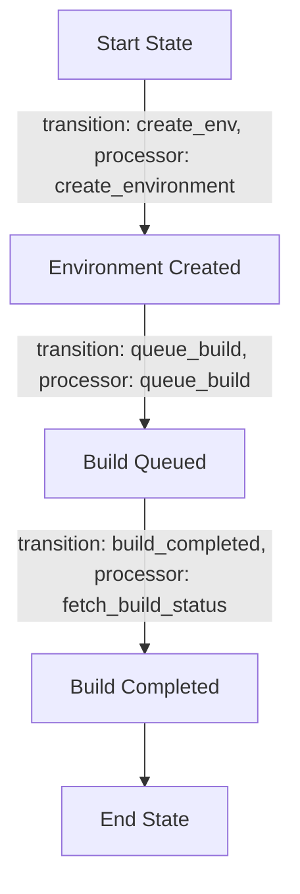
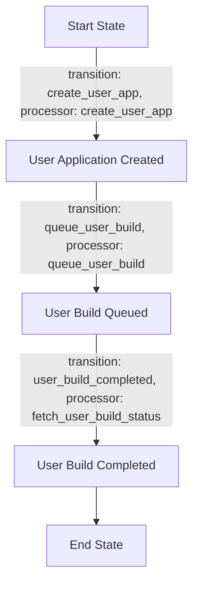

Here is a final Product Requirements Document (PRD) based on your requirements and suggestions for the Cyoda-like application.

---

# Product Requirements Document (PRD)

## Project Overview
The objective of this project is to develop an application that manages deployment and environment configuration for multiple users through a defined set of APIs and workflows. The application will leverage Cyoda's event-driven architecture to ensure seamless integration and orchestration of business logic.

## Key Concepts
- **Entity Management**: The application will manage core data models (entities) representing deployment configurations and user-specific settings.
- **Workflow Orchestration**: Workflows will trigger based on entity state changes, executing business logic through processors.
- **State Machine**: Each workflow will function as a state machine, representing the lifecycle of each entity.

## Entities
1. **Environment**
   - **Data Model**: 
   ```json
   {
     "entity_name": "cyoda_env",
     "user_name": "test_user",
     "repository_url": "http://example.com/repo.git",
     "is_public": true,
     "status": "created",
     "build_id": null
   }
   ```
   - **Save Method**: This entity should be saved via API call upon creation.

2. **User Application**
   - **Data Model**: 
   ```json
   {
     "entity_name": "user_app",
     "repository_url": "http://example.com/user_app.git",
     "is_public": true,
     "status": "pending",
     "build_id": null
   }
   ```
   - **Save Method**: This entity should also be saved via API call.

## Workflows and Flowcharts

### Environment Workflow


### User Application Workflow


## API Endpoints
- **POST /deploy/cyoda-env**
  - Business Logic:
    - Call `entity_service.add(current_entity)`
    - Trigger environment workflow

- **POST /deploy/user_app**
  - Business Logic:
    - Call `entity_service.add(current_entity)`
    - Trigger user application workflow

- **GET /deploy/cyoda-env/status/{id}**
  - Business Logic:
    - Call `entity_service.get(current_entity)` to fetch the environment status.

- **GET /deploy/user_app/status/{id}**
  - Business Logic:
    - Call `entity_service.get(current_entity)` to fetch the user application status. 

## Final Workflow Functions
- **Create Environment Workflow**
    - Add the environment.
    - Queue the build in TeamCity.
    - Fetch and update the build status.

- **Create User Application Workflow**
    - Add the user application.
    - Queue the user build in TeamCity.
    - Fetch and update the user build status.

## Conclusion
This PRD outlines the key aspects of the Cyoda-like application focused on deployment and environment management. The defined entities, workflows, and API endpoints ensure that the application meets user requirements in a structured and efficient manner.

---

Feel free to make any adjustments or request further modifications to this document!