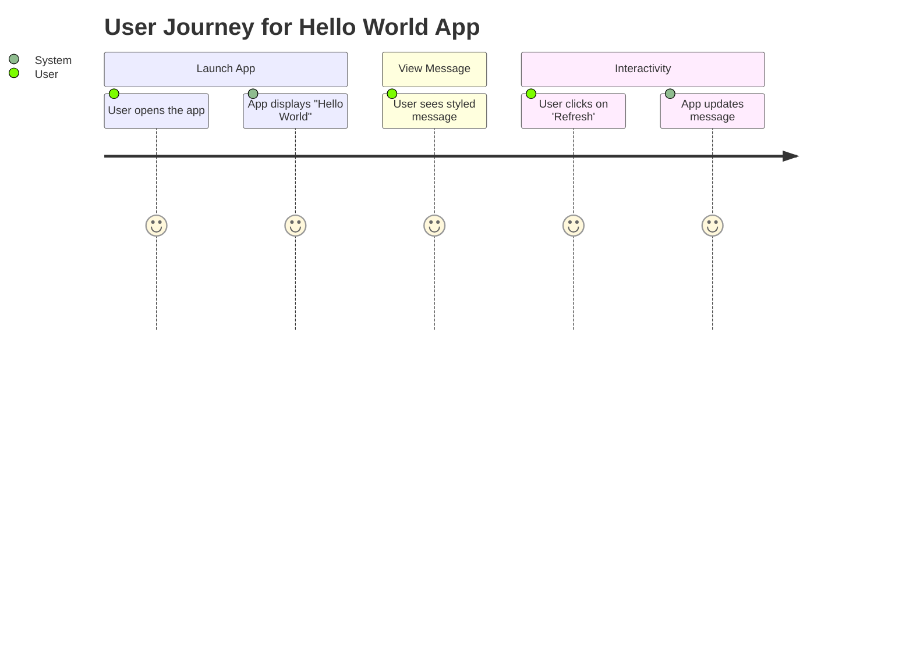
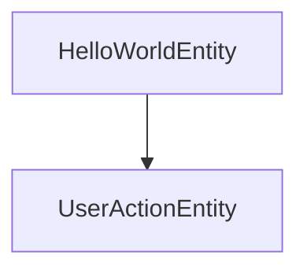
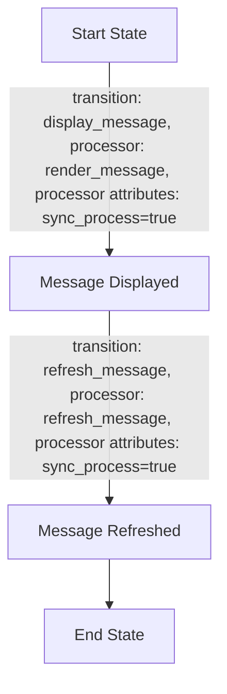
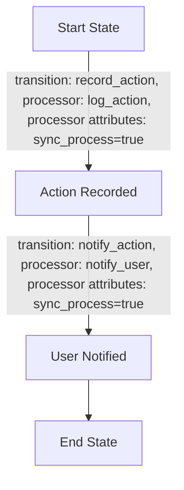

Sure! Here’s a complete Product Requirements Document (PRD) for your "Hello World" app. 

# Product Requirements Document (PRD) for Hello World App

## Introduction

This document outlines the requirements for a simple "Hello World" application. The app will display a welcoming message and allow users to refresh it for an updated experience. This PRD includes user stories, entities, workflows, and diagrams to visualize the design and architecture of the application.

## User Requirements

### User Stories

1. **As a user, I want to see a "Hello World" message when I open the app.**
2. **As a user, I want to see the message styled in a friendly and welcoming way.**
3. **As a user, I want to refresh the message or see an updated message when I click a button.**

### Journey Diagram



## Entities Outline

### 1. HelloWorldEntity
- **Description**: Represents the core output of the app, which is the "Hello World" message.
- **Data Model Example**:
```json
{
  "id": 1,
  "message": "Hello World!",
  "style": "font-size: 24px; color: blue;"
}
```
- **Saved via**: Directly through an API call.

### 2. UserActionEntity
- **Description**: Tracks the user's interactions (e.g., refreshing the message).
- **Data Model Example**:
```json
{
  "id": 1,
  "action_type": "refresh",
  "timestamp": "2023-10-01T12:00:00Z"
}
```
- **Saved via**: ENTITY_EVENT triggered by the user action.

### Entities Diagram



## Workflows

### Workflow for HelloWorldEntity



### Workflow for UserActionEntity



## Conclusion

The "Hello World" app is designed to be straightforward yet user-friendly. With clear user stories and defined workflows, the app will provide a warm greeting while allowing users to interact with the displayed message. The outlined entities and their interactions ensure that the app is maintainable and scalable for future enhancements.

---

If there’s anything you’d like to add or modify, just let me know! I’m here to help! 😊