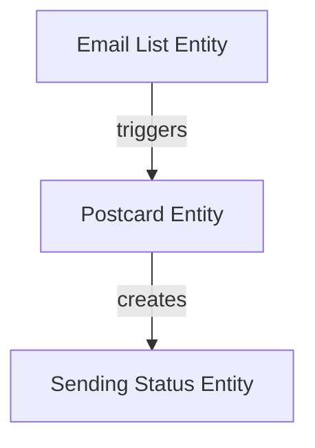
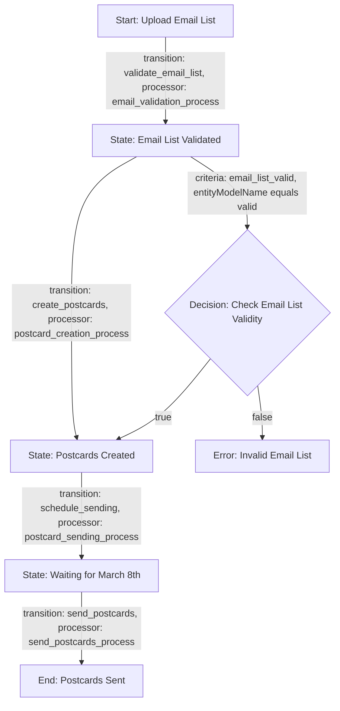

Sure! Here is a complete Product Requirements Document (PRD) for your application that sends postcards to a list of emails every March 8th. This document includes all sections we've discussed, such as the introduction, user requirements, entities, workflows, and diagrams. 

---

# Product Requirements Document (PRD) for Postcard Application

## Introduction

This document provides a comprehensive overview of an application designed to automatically send postcards to a list of email addresses every March 8th, celebrating International Women's Day. The application aims to simplify the process of sending personalized greetings through an event-driven architecture, leveraging Cyoda's workflows and entity management.

## User Requirements

### User Stories

1. **As a user, I want to upload a list of email addresses, so that I can easily manage the recipients of the postcards.**
2. **As a user, I want to design my postcards with images and text, so that I can send personalized greetings.**
3. **As a user, I want the application to automatically send postcards every March 8th, so that I can celebrate International Women's Day without manual effort.**
4. **As a user, I want to receive a confirmation notification after postcards are sent, so that I know the task has been completed successfully.**
5. **As a user, I want to view a log of sent postcards, so that I can track who received what.**

## Entities

### Proposed Entities

1. **Email List Entity**
   - **Type**: `EXTERNAL_SOURCES_PULL_BASED_RAW_DATA`
   - **Source**: `API_REQUEST`
   - **Description**: Holds the list of email addresses to which postcards will be sent.

2. **Postcard Entity**
   - **Type**: `SECONDARY_DATA`
   - **Source**: `ENTITY_EVENT`
   - **Description**: Captures details of the postcard being sent, including design and content.

3. **Sending Status Entity**
   - **Type**: `SECONDARY_DATA`
   - **Source**: `ENTITY_EVENT`
   - **Description**: Tracks the status of postcard sending, indicating whether it was successful or failed.

### Entities Diagram

## Workflows

### Orchestration Entity: Postcard Sending Workflow

This workflow manages the process from uploading the email list to sending postcards on March 8th.

#### Flowchart

### Explanation of Workflow Launch

1. **Upload Email List**: The user starts by uploading a list of email addresses, which triggers the workflow.
2. **Email List Validation**: The system validates the email list to ensure it contains valid email addresses. An error state is triggered if validation fails.
3. **Create Postcards**: Once the email list is validated, postcards are created with the provided design and content.
4. **Schedule Sending**: The postcards are scheduled to be sent on March 8th.
5. **Send Postcards**: On the scheduled date, the postcards are sent to the recipients.

## Conclusion

This PRD outlines the requirements for an application that automates the process of sending postcards to a list of email addresses every March 8th. By leveraging Cyoda's event-driven architecture and workflows, the application aims to provide a reliable and efficient solution for celebrating International Women's Day. The outlined user stories, entities, and workflows comprehensively cover the needs of the application, ensuring a smooth and automated process.

---

Let me know if you need any adjustments or additional information!