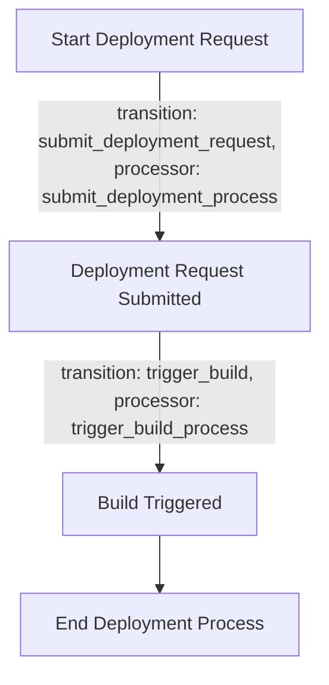
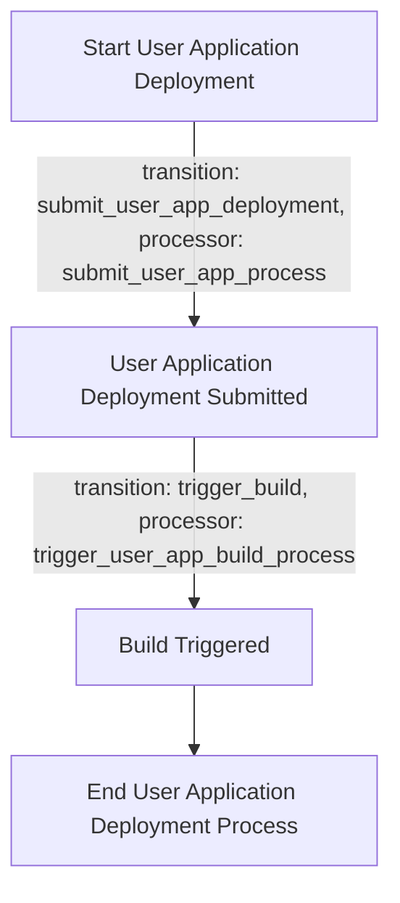
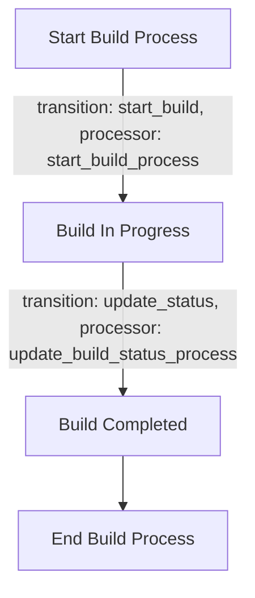

Here's a final Product Requirement Document (PRD) based on the user suggestions and the previous discussions:

---

# Product Requirement Document (PRD) for Cyoda Application

## Overview

The Cyoda application aims to provide a streamlined workflow management system, enabling users to deploy and manage application environments efficiently. The system will leverage event-driven architecture to handle entities and state machines for orchestration.

## Key Concepts

1. **Entity Management**: Core data models (entities) representing aspects such as deployment environments, user applications, and builds.
2. **Workflow Orchestration**: Each entity will have workflows triggered by Cyoda's state machine. Workflows contain business logic, making integrations with external APIs, performing calculations, and executing various operations.

## Entities

### 1. Deployment Environment Entity
- **Description**: Represents the deployment environment being managed and built.
- **Fields**:
    - `env_id`: Unique identifier for the environment.
    - `deployment_config`: Configuration details for deployment.
        - `repository_url`: URL of the repository.
        - `is_public`: Boolean indicating if the deployment is public.
    - `build_id`: ID of the associated build.

#### JSON Example
```json
{
    "env_id": "env_456",
    "deployment_config": {
        "repository_url": "http://example.com/repo.git",
        "is_public": true
    },
    "build_id": "build_789"
}
```

#### Workflow: Deployment Request Workflow


---

### 2. User Application Entity
- **Description**: Represents the user's application that needs to be deployed.
- **Fields**:
    - `app_id`: Unique identifier for the application.
    - `repository_url`: URL of the repository for the application.
    - `is_public`: Boolean indicating if the application is public.
    - `env_id`: ID of the associated deployment environment.

#### JSON Example
```json
{
    "app_id": "app_101",
    "repository_url": "http://example.com/repo.git",
    "is_public": true,
    "env_id": "env_456"
}
```

#### Workflow: User Application Deployment Workflow


---

### 3. Build Entity
- **Description**: Represents the build process and status for deployment environments and user applications.
- **Fields**:
    - `build_id`: Unique identifier for the build.
    - `env_id`: ID of the associated deployment environment.
    - `app_id`: ID of the associated user application.
    - `status`: Current status of the build (e.g., successful, failed).
    - `build_time`: Time taken for the build.
    - `success_rate`: Rate of success for the build.

#### JSON Example
```json
{
    "build_id": "build_789",
    "env_id": "env_456",
    "app_id": "app_101",
    "status": "successful",
    "build_time": "5min",
    "success_rate": "95%"
}
```

#### Workflow: Build Workflow


---

## User APIs

### Deployment Environment APIs

- **POST /deploy/cyoda-env**
  - **Description**: Submit a deployment request for an environment.
  - **Request Format:**
    ```json
    {
        "deployment_config": {
            "repository_url": "http://example.com/repo.git",
            "is_public": true
        }
    }
    ```

- **GET /deploy/cyoda-env/{env_id}**
  - **Description**: Retrieve details of a specific deployment environment.

### User Application APIs

- **POST /deploy/user_app**
  - **Description**: Submit a deployment request for a user application.
  - **Request Format:**
    ```json
    {
        "repository_url": "http://example.com/repo.git",
        "is_public": true
    }
    ```

- **GET /deploy/user_app/{app_id}**
  - **Description**: Retrieve details of a specific user application.

### Build APIs

- **GET /deploy/build/{build_id}**
  - **Description**: Retrieve details of a specific build.

---

## Summary

This PRD outlines the core components of the Cyoda application, detailing the entities, their workflows, and user APIs. The design emphasizes a clear structure for managing deployment processes and user applications while integrating with external services effectively. 

If you require further modifications or additional information, feel free to ask!