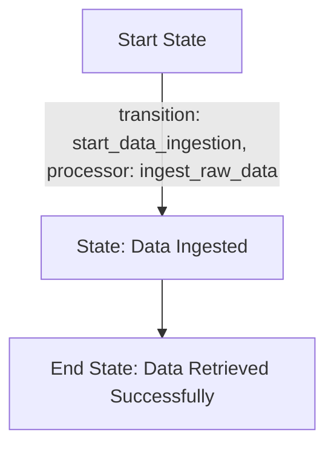
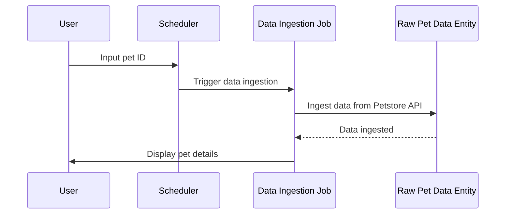
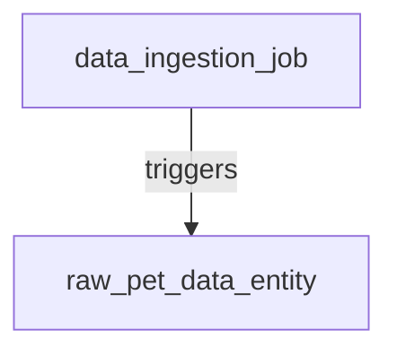

# Product Requirements Document (PRD) for Cyoda Design

## Introduction

This document provides a comprehensive overview of the Cyoda-based application designed to retrieve and display pet details from the Petstore API based on user input. It explains how the Cyoda design aligns with the specified requirements, focusing on the structure of entities, workflows, and the event-driven architecture that powers the application.

## What is Cyoda?

Cyoda is a serverless, event-driven framework that facilitates the management of workflows through entities representing jobs and data. Each entity has a defined state, and transitions between states are governed by events that occur within the system—enabling a responsive and scalable architecture.

### Cyoda Entity Database

In the Cyoda ecosystem, entities are fundamental components that represent processes and data. The Cyoda design JSON outlines several entities for our application:

1. **Data Ingestion Job (`data_ingestion_job`)**:
   - **Type**: JOB
   - **Source**: SCHEDULED
   - **Description**: This job is responsible for ingesting data from the Petstore API using a specified pet ID.

2. **Raw Pet Data Entity (`raw_pet_data_entity`)**:
   - **Type**: EXTERNAL_SOURCES_PULL_BASED_RAW_DATA
   - **Source**: ENTITY_EVENT
   - **Description**: This entity stores the raw data retrieved from the Petstore API.

### Workflow Overview

The workflows in Cyoda define how each job entity operates through a series of transitions. The `data_ingestion_job` includes a singular workflow that outlines the following transition:

- **Start Data Ingestion**: Initiates the data ingestion process from the Petstore API using the provided pet ID.

### Flowchart for Data Ingestion Workflow

### Sequence Diagram

### Entity Relationships Diagram

## Event-Driven Approach

An event-driven architecture allows the application to respond automatically to changes or triggers. The workflow transitions specified in the design ensure that the necessary actions occur as specific events happen within the system. 

## Actors Involved

- **User**: Initiates the data ingestion process by inputting the pet ID.
- **Scheduler**: Triggers the data ingestion job based on user input.
- **Data Ingestion Job**: Manages the overall workflow of data processing.
- **Raw Pet Data Entity**: Stores the raw data retrieved from the Petstore API.

## Conclusion

The Cyoda design effectively aligns with the requirements for creating a robust application that retrieves and displays pet details from the Petstore API. By utilizing the event-driven model and clearly defined workflows, the application ensures a smooth and automated process for data ingestion and user interaction.

This PRD serves as a foundation for implementation and development, guiding the technical team through the specifics of the Cyoda architecture while providing clarity for users who may be new to the Cyoda framework.