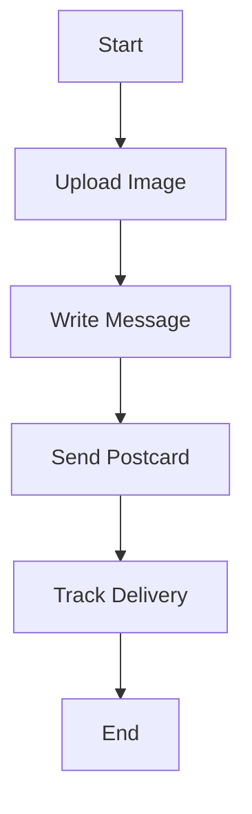
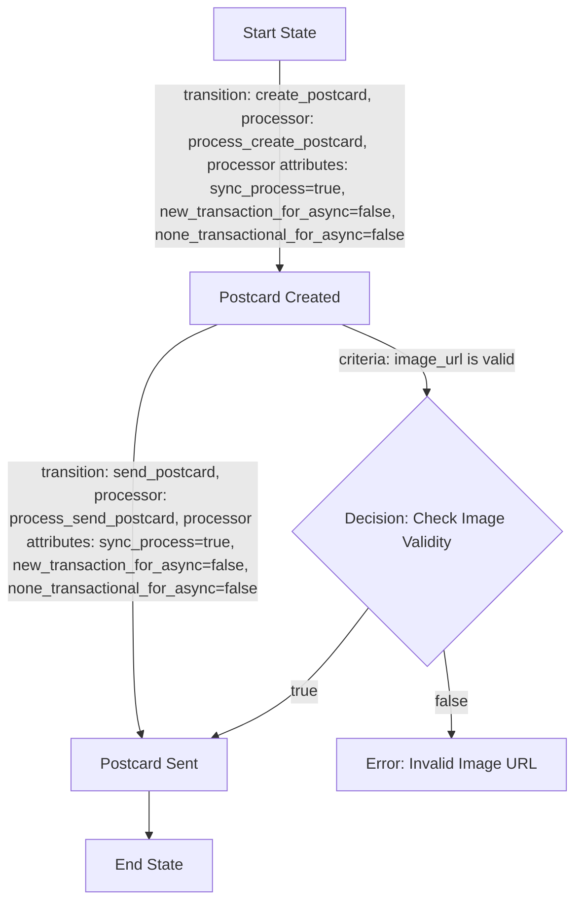

Sure! Let’s put together a complete Product Requirements Document (PRD) for your postcard-sending app. This document will include an overview, user requirements, entities, workflows, and diagrams to provide a comprehensive understanding of your project.

# Product Requirements Document (PRD) for Postcard-Sending App

## Introduction

This document outlines the requirements for a postcard-sending application. The app allows users to upload images, write messages, and send personalized postcards to recipients. The focus is on creating an intuitive user experience with a streamlined workflow for postcard creation and delivery.

## User Requirements

### User Stories
1. **As a user**, I want to upload an image for my postcard, so I can create a personalized card.
2. **As a user**, I want to write a message on my postcard, so I can send a heartfelt note to my friends.
3. **As a user**, I want to track the delivery status of my postcard, so I know when it has been received.

### Journey Diagram


## Entities

### Proposed Entity: Postcard
- **Entity Name**: Postcard
- **Type**: POSTCARD
- **Source**: API_REQUEST

### JSON Example of Postcard Entity
```json
{
  "postcard_id": "54321",
  "user_id": "12345",
  "image_url": "https://example.com/image.jpg",
  "message": "Wish you were here!",
  "created_at": "2023-10-01T12:05:00Z",
  "status": "pending"
}
```

## Workflow

### Workflow Overview
The workflow for the Postcard Entity manages the process of creating and sending postcards.

### How the Workflow is Launched
The workflow is triggered when a user makes an API request to create and send a postcard.

### Workflow Flowchart


### Explanation of Workflow Transitions
1. **create_postcard**: Triggered when the user submits the postcard creation request. It processes the uploaded image and the message.
2. **send_postcard**: Once the postcard is created, this transition sends the postcard to the specified recipient.

## Conclusion

This PRD outlines the essential components for building a postcard-sending app. By focusing on user-friendly interactions and a clear workflow, the app can efficiently manage the creation and delivery of personalized postcards. The outlined user stories, entities, and workflows provide a robust foundation for development and implementation.

---

If you need any modifications or additional sections in the PRD, just let me know! 😊