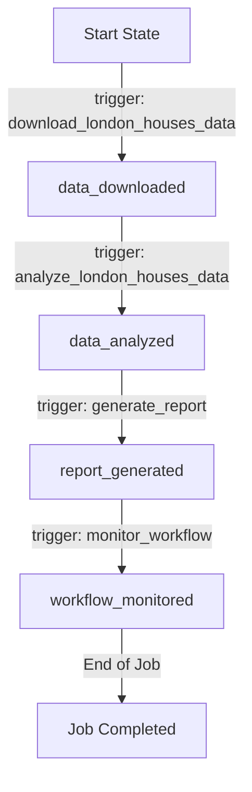
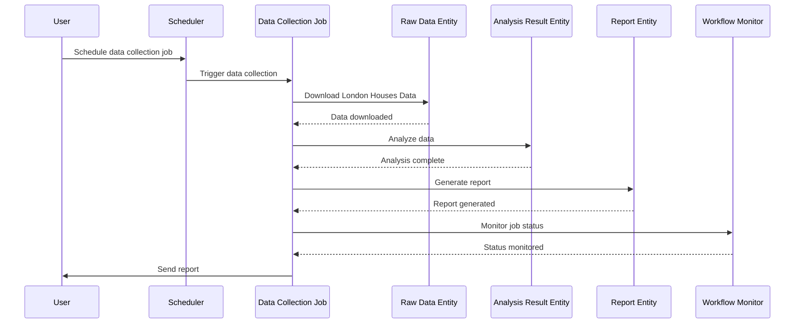
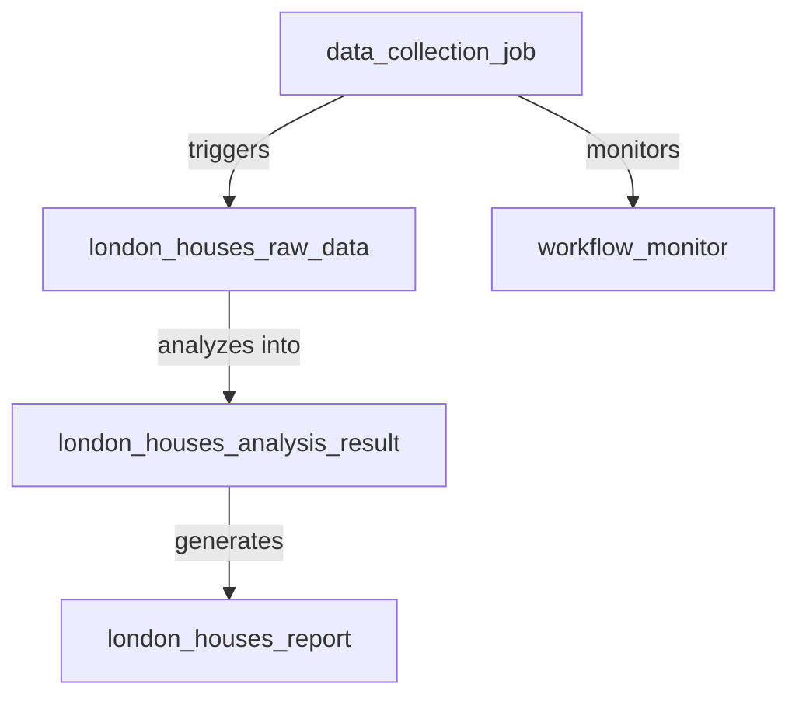
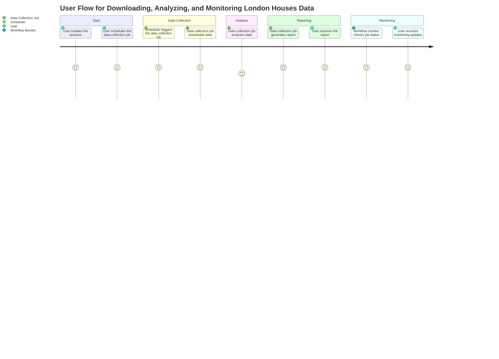

# Product Requirements Document (PRD) for Cyoda Design

## Introduction

This document outlines the Cyoda design for managing the download, analysis, reporting, and monitoring of London Houses Data. The design is aligned with the specified requirements and explains the structure of entities, their workflows, and an event-driven architecture. The document includes mermaid diagrams to visualize workflows and relationships between entities, emphasizing the orchestration of the flow through a JOB entity and the addition of a monitoring entity.

## What is Cyoda?

Cyoda is a serverless, event-driven framework that helps manage workflows through entities that represent jobs and data. Each entity has defined states, and transitions between these states are governed by events, enabling efficient and scalable processing.

## Cyoda Design JSON Overview

The Cyoda design JSON outlines the following entities and their properties:

1. **Data Collection Job (`data_collection_job`)**:
   - **Type**: JOB
   - **Source**: SCHEDULED
   - **Description**: This job orchestrates the entire process, responsible for downloading the London Houses Data, analyzing it, generating a report, and monitoring the overall workflow.

2. **Raw Data Entity (`london_houses_raw_data`)**:
   - **Type**: EXTERNAL_SOURCES_PULL_BASED_RAW_DATA
   - **Source**: ENTITY_EVENT
   - **Description**: Stores the raw data downloaded by the data collection job.

3. **Analysis Result Entity (`london_houses_analysis_result`)**:
   - **Type**: SECONDARY_DATA
   - **Source**: ENTITY_EVENT
   - **Description**: Holds the results of the data analysis performed on the raw data.

4. **Report Entity (`london_houses_report`)**:
   - **Type**: SECONDARY_DATA
   - **Source**: ENTITY_EVENT
   - **Description**: Contains the generated report based on the analysis results.

5. **Monitoring Entity (`workflow_monitor`)**:
   - **Type**: UTIL
   - **Source**: ENTITY_EVENT
   - **Description**: Monitors the status of the data collection job and alerts if any issues arise during the workflow.

### Entity Workflow Diagrams

#### Flowchart for Data Collection Workflow

#### Sequence Diagram

### Entity Relationships Diagram

### User Journey

## Conclusion

The Cyoda design effectively aligns with the requirements for orchestrating the download, analysis, reporting, and monitoring of London Houses Data through a JOB entity. By utilizing an event-driven model, the application efficiently manages state transitions among entities, ensuring a smooth and automated process from data collection to report delivery and monitoring.

This PRD serves as a foundation for implementation, guiding the technical team through the specifics of the Cyoda architecture while providing clarity for users new to the framework.