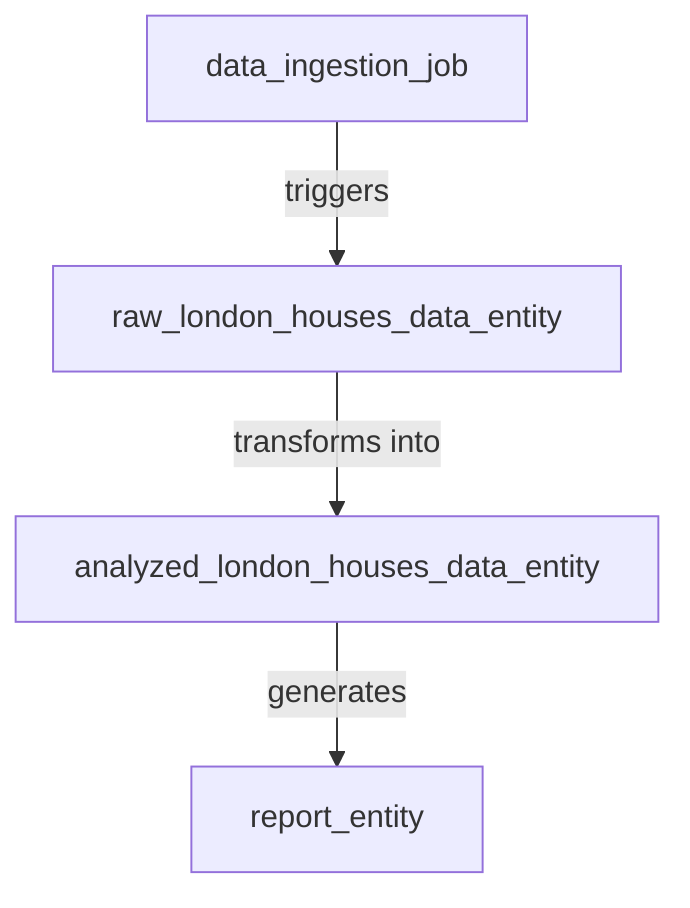
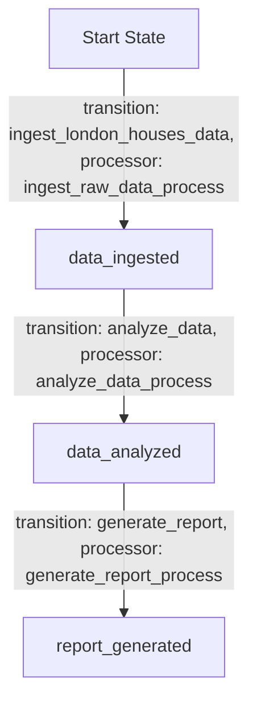
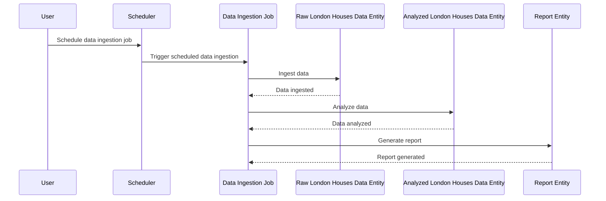

# Product Requirements Document (PRD) for Cyoda Design

## Introduction

This document provides a comprehensive overview of the Cyoda-based application designed to manage the ingestion, analysis, and reporting of London Houses Data. It explains how the Cyoda design aligns with the specified requirements, focusing on the structure of entities, workflows, and the event-driven architecture that powers the application. The design is expressed in the Cyoda JSON format, supplemented by human-readable diagrams for clarity.

## What is Cyoda?

Cyoda is a serverless, event-driven framework that facilitates the management of workflows through entities representing jobs and data. Each entity has a defined state, and transitions between states are governed by events that occur within the system—enabling a responsive and scalable architecture.

## Cyoda Entity Database

The Cyoda entity database consists of several entities that represent the core functionalities required for the application. The design contains the following entities:

1. **Data Ingestion Job (`data_ingestion_job`)**:
   - **Type**: JOB
   - **Source**: SCHEDULED
   - **Description**: Responsible for ingesting London Houses Data at scheduled intervals.

2. **Raw London Houses Data Entity (`raw_london_houses_data_entity`)**:
   - **Type**: EXTERNAL_SOURCES_PULL_BASED_RAW_DATA
   - **Source**: ENTITY_EVENT
   - **Description**: Stores the raw data ingested.

3. **Analyzed London Houses Data Entity (`analyzed_london_houses_data_entity`)**:
   - **Type**: SECONDARY_DATA
   - **Source**: ENTITY_EVENT
   - **Description**: Holds the analyzed data derived from the raw data.

4. **Report Entity (`report_entity`)**:
   - **Type**: SECONDARY_DATA
   - **Source**: ENTITY_EVENT
   - **Description**: Contains the generated report based on the analyzed data.

### Entity Relationship Diagram

## Workflow Overview

The workflows in Cyoda define how each job entity operates through a series of transitions. The `data_ingestion_job` includes a workflow that outlines the following transitions:

1. **Ingest London Houses Data**: This transition initiates the process of ingesting data from the specified source, marking the data as "ingested."
2. **Analyze Data**: After ingestion, this transition analyzes the ingested data.
3. **Generate Report**: Finally, this transition creates a report from the analyzed data.

### Flowchart for Data Ingestion Job Workflow

### Sequence Diagram

## Event-Driven Approach

An event-driven architecture is employed to ensure that the application can automatically respond to various triggers without manual intervention. The key events in this design include:

1. **Data Ingestion**: The data ingestion job is triggered on a scheduled basis, automatically initiating the process of fetching data from the specified source.
2. **Data Analysis**: Once the data ingestion is complete, an event signals the need to analyze the raw data.
3. **Report Generation**: After the analysis is complete, another event triggers the report generation.

### Benefits of the Event-Driven Approach
- **Scalability**: The system can handle multiple ingestion jobs and data processing tasks simultaneously, distributing workload effectively.
- **Efficiency**: With automation in place, the application can operate continuously and reliably without manual oversight.

## Conclusion

The Cyoda design aligns effectively with the requirements for creating a robust data processing application. By utilizing the event-driven model, the application efficiently manages state transitions of each entity involved, from data ingestion to report delivery. The outlined entities, workflows, and events comprehensively cover the needs of the application, ensuring a smooth and automated process.

This PRD serves as a foundation for implementation and development, guiding the technical team through the specifics of the Cyoda architecture while providing clarity for users who may be new to the framework.