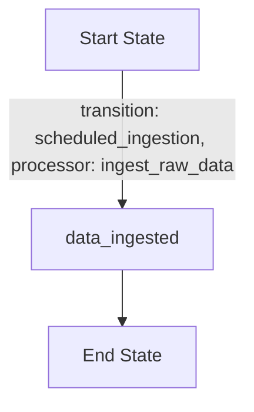
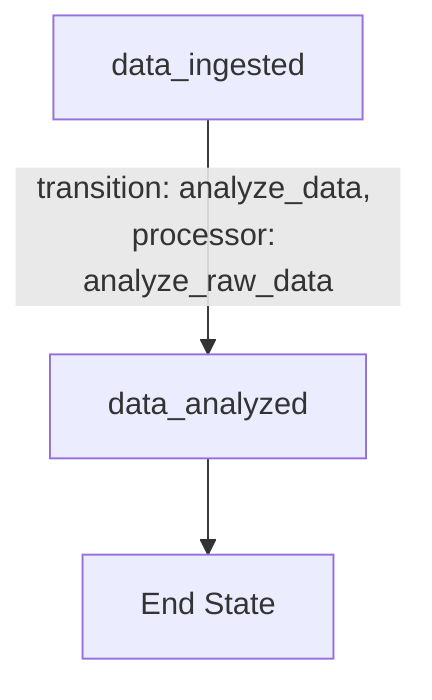
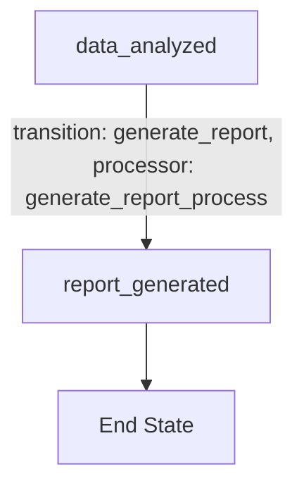
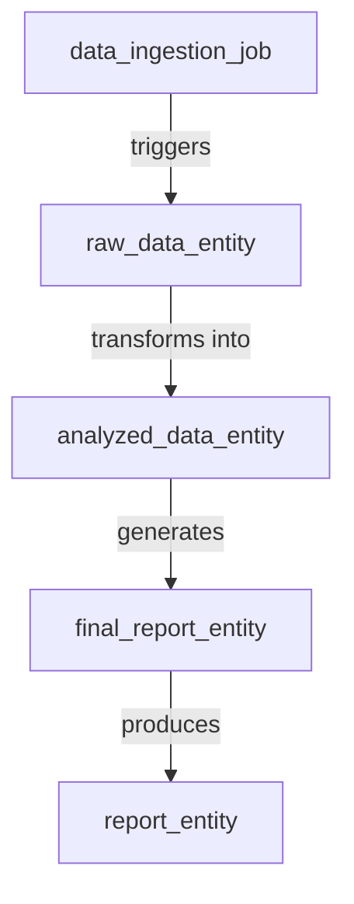
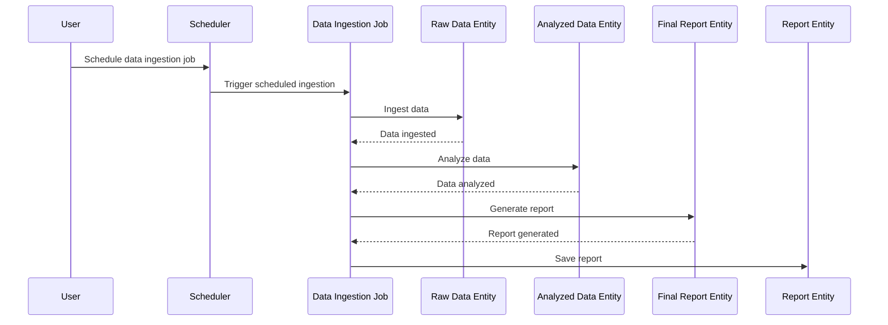
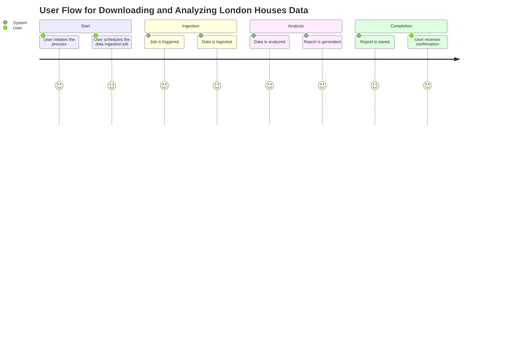

# Product Requirements Document (PRD) for Cyoda Design

## Introduction

This document provides an overview of the Cyoda-based application designed to manage the ingestion of London Houses Data, analyze it using pandas, and generate a report. The Cyoda design is structured around entities, workflows, and events, which facilitate the effective orchestration of these processes.

## What is Cyoda?

Cyoda is an event-driven framework that allows for the definition and management of workflows through entities. Each entity represents a job, data, or processes, with transitions that govern how these entities evolve over their lifecycle.

## Cyoda Design Overview

The Cyoda design JSON outlines the entities and their relationships for processing the London Houses Data, which include:

1. **Data Ingestion Job (`data_ingestion_job`)**: Responsible for initiating the data ingestion process.
2. **Raw Data Entity (`raw_data_entity`)**: Stores the unprocessed data obtained from the specified source.
3. **Analyzed Data Entity (`analyzed_data_entity`)**: Contains the results of the analysis performed on the raw data.
4. **Final Report Entity (`final_report_entity`)**: Represents the report generated from the analyzed data.
5. **Report Entity (`report_entity`)**: Contains the saved report.

### Cyoda Design JSON Structure

The following is a summary of the key components of the Cyoda design JSON:

- **Entities**: Each entity includes properties such as `entity_name`, `entity_type`, `entity_source`, and workflow definitions that describe transitions and processes.
- **Workflows**: Workflows consist of transitions that dictate how entities change states, driven by specific processes or events.

## Entity Workflows

### Flowchart for Each Entity Workflow

#### Data Ingestion Job Workflow

#### Analyzed Data Entity Workflow

#### Final Report Entity Workflow

## Entity Relationships

### Entity Relationship Diagram

## Sequence Diagram

### User Interaction Flow

## User Journey

### User Journey for Downloading and Analyzing London Houses Data

## Conclusion

The Cyoda design effectively aligns with the requirements for managing the ingestion, analysis, and reporting of London Houses Data. By utilizing an event-driven architecture and well-defined workflows, the application can efficiently handle the necessary processes while maintaining clarity and structure. The outlined entities, relationships, and workflows ensure a smooth and automated experience for the user.

This PRD serves as a foundation for the development team to implement and build upon the Cyoda architecture, providing clear direction and expectations for the application.