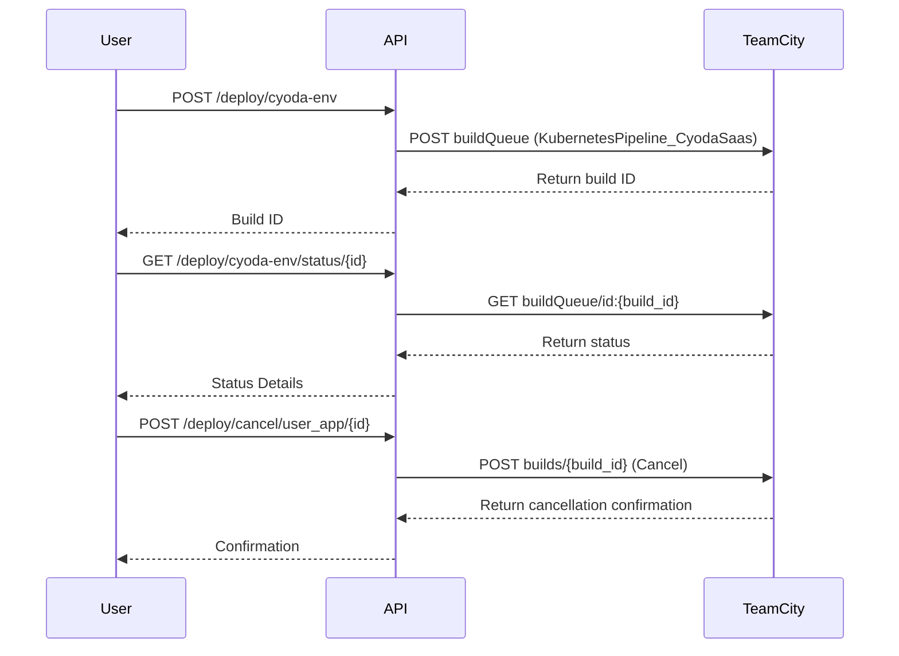

To assist you in outlining the entities and workflows for your deployment and environment management application prototype, here's a structured approach that includes entity definitions, workflow transitions, and a visual representation.

### Entities and Example Data

1. **User**
   - Represents a user of the application.
   - Example JSON data:
     ```json
     {
       "id": "user_123",
       "username": "test_user",
       "email": "test_user@example.com",
       "roles": ["developer", "admin"]
     }
     ```

2. **Deployment**
   - Represents a deployment action for applications or environments.
   - Example JSON data:
     ```json
     {
       "id": "deployment_456",
       "type": "cyoda_env",
       "status": "in_progress",
       "properties": {
         "user_defined_keyspace": "test_user",
         "user_defined_namespace": "test_user"
       },
       "created_at": "2023-10-01T12:00:00Z",
       "user_id": "user_123"
     }
     ```

3. **Application**
   - Represents the user application details.
   - Example JSON data:
     ```json
     {
       "id": "app_789",
       "repository_url": "http://example.com/repo.git",
       "is_public": true,
       "created_by": "user_123",
       "status": "deployed"
     }
     ```

4. **Build Status**
   - Represents the build status of a deployment.
   - Example JSON data:
     ```json
     {
       "id": "status_001",
       "deployment_id": "deployment_456",
       "status": "succeeded",
       "timestamp": "2023-10-01T12:30:00Z"
     }
     ```

### Workflows

1. **Deployment Workflow**
   - A finite state machine to manage deployment states.
   - States: `Pending`, `In Progress`, `Succeeded`, `Failed`, `Cancelled`.
   - Transitions:
     - From `Pending` to `In Progress` when deployment starts.
     - From `In Progress` to `Succeeded` or `Failed` based on outcome.
     - From any state to `Cancelled` on user cancellation.

2. **Application Deployment Workflow**
   - Similar to the Deployment workflow but is tailored for user applications.
   - States: `Pending`, `In Progress`, `Deployed`, `Failed`, `Cancelled`.
   - Transitions mirror the deployment workflow.

### Processors (Lambda Functions)
- Each transition can have an associated processor to execute specific logic, such as sending notifications or updating records in the database.

### Visual Representation Using Mermaid

Here’s a diagram to visualize the interaction between User, Deployment, and the API. This denotes a simple linear process for a user deploying an environment:



### Summary

This outline captures the essential entities and their attributes, along with structured workflows and their transitions. The provided example data represents how each entity may look in JSON format. If you require further detail in any specific area or additional workflows, please let me know!