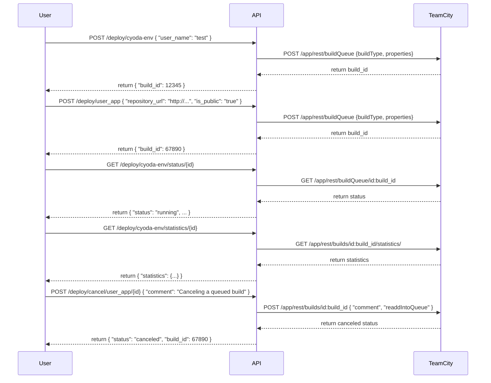

Sure! Here’s an outlined structure for your application prototype using entities and a visual representation with Mermaid diagrams:

### Entity Outline

1. **User**
   - Attributes:
     - `user_name`: The name of the user requesting the deployment.

2. **Deployment Environment**
   - Attributes:
     - `build_id`: Unique identifier for each deployment environment.
     - `user_name`: The associated user that owns the deployment.
     - `status`: Current status (e.g., running, canceled).
     - `repository_url`: URL of the repository for the deployed application.
     - `is_public`: Flag indicating if the repository is public.

3. **Statistics**
   - Attributes:
     - `build_id`: Reference to the deployment environment.
     - `success_rate`: Rate of successful deployments.
     - `execution_time`: Time taken for the deployment.

4. **Build Queue**
   - Attributes:
     - `id`: Unique identifier for the queued build.
     - `comment`: Optional comment provided during build cancellation.
     - `readdIntoQueue`: Flag indicating whether to readd the build to the queue.

### Mermaid Diagrams

#### User-App Interaction Diagram

This diagram represents how the user interacts with the API and the TeamCity backend for deployments.

### Description of Functional Requirements

1. **Create Deployment Environment**
   - **Endpoint:** `/deploy/cyoda-env`
   - **Method:** POST
   - **Request:** `{"user_name": "test"}`
   - **Response:** `{"build_id": 12345}`

2. **Deploy Application**
   - **Endpoint:** `/deploy/user_app`
   - **Method:** POST
   - **Request:** `{"repository_url": "http://...", "is_public": "true"}`
   - **Response:** `{"build_id": 67890}`

3. **Check Deployment Status**
   - **Endpoint:** `/deploy/cyoda-env/status/{id}`
   - **Method:** GET
   - **Response:** `{"status": "running", ...}`

4. **Retrieve Deployment Statistics**
   - **Endpoint:** `/deploy/cyoda-env/statistics/{id}`
   - **Method:** GET
   - **Response:** `{"statistics": {...}}`

5. **Cancel Deployment**
   - **Endpoint:** `/deploy/cancel/user_app/{id}`
   - **Method:** POST
   - **Request:** `{"comment": "Canceling a queued build", "readdIntoQueue": false}`
   - **Response:** `{"status": "canceled", "build_id": 67890}`

### Summary

This structured approach, combined with diagrams, gives a clear overview of how users interact with your system, the various entities involved, and the specific API endpoints that facilitate these interactions. If you need any further clarification or additional diagrams, feel free to ask!