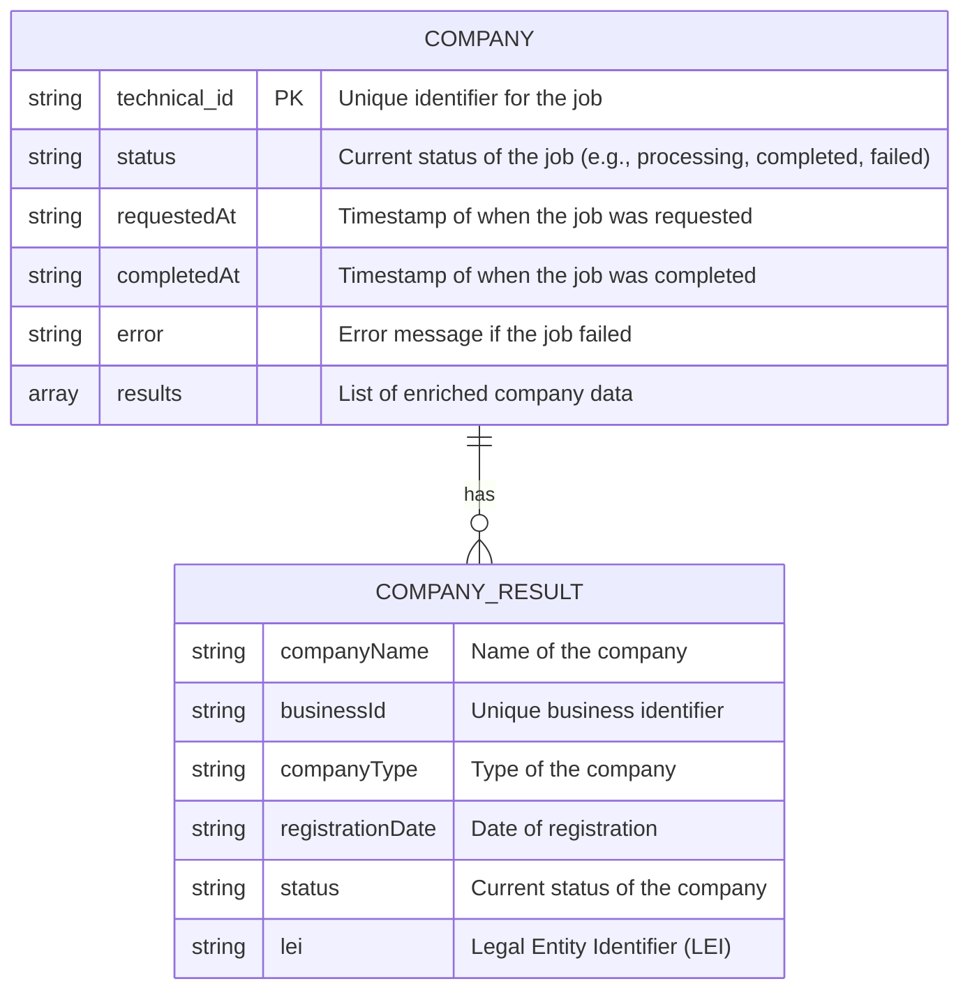
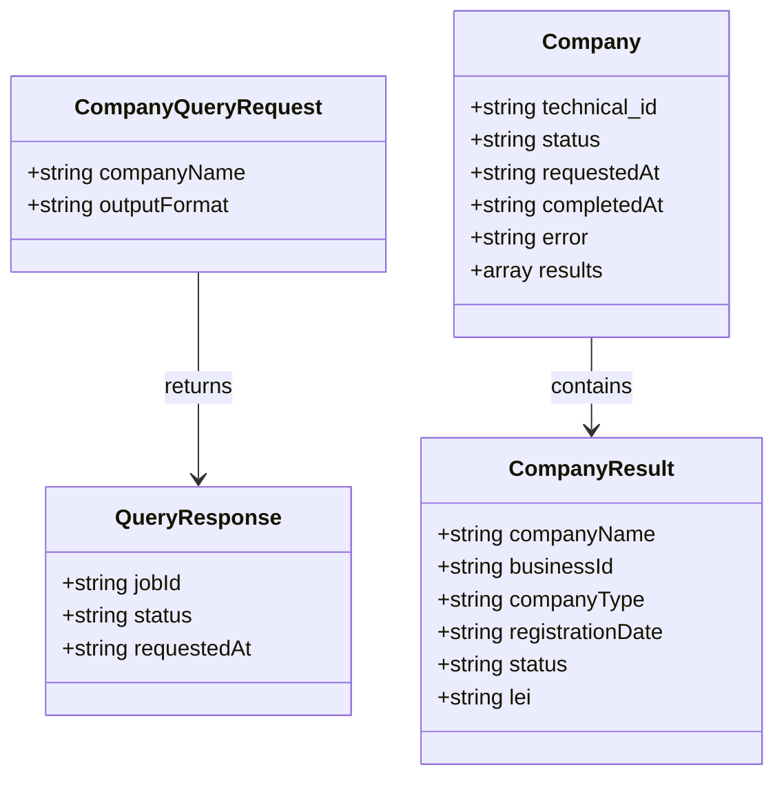

Based on the provided `prototype_cyoda.py`, we can create the following Mermaid Entity-Relationship (ER) diagrams and class diagrams for the entity model "companies". 

### Mermaid ER Diagram for "companies"

### Mermaid Class Diagram for "companies"

### Explanation

1. **ER Diagram**:
   - The `COMPANY` entity represents the job record created when a company query is initiated. It contains fields for tracking the job's status, timestamps, and results.
   - The `COMPANY_RESULT` entity represents the individual company data that is enriched and returned as part of the job results. Each company has attributes like `companyName`, `businessId`, `companyType`, etc.
   - The relationship indicates that a `COMPANY` can have multiple `COMPANY_RESULT` entries.

2. **Class Diagram**:
   - The `CompanyQueryRequest` class represents the request structure for querying companies, containing the company name and output format.
   - The `QueryResponse` class represents the response structure that includes the job ID, status, and requested timestamp.
   - The `Company` class encapsulates the job's metadata and results.
   - The `CompanyResult` class encapsulates the details of each enriched company.
   - The arrows indicate the relationships between the classes, showing that a `CompanyQueryRequest` leads to a `QueryResponse`, and a `Company` contains multiple `CompanyResult` instances.

These diagrams provide a clear representation of the entities and their relationships as defined in the provided code.