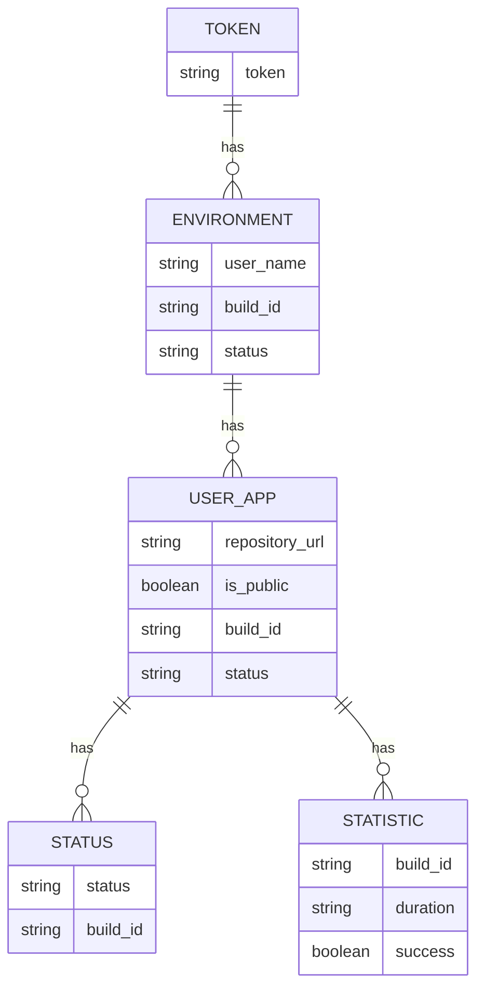
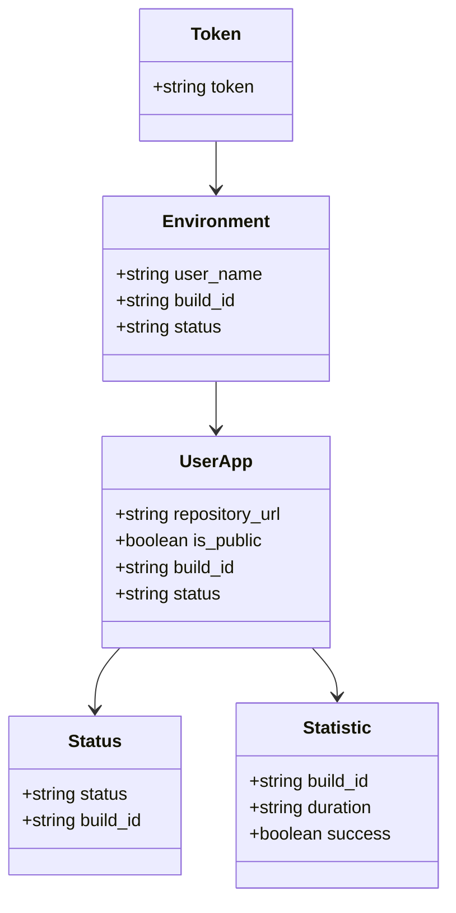
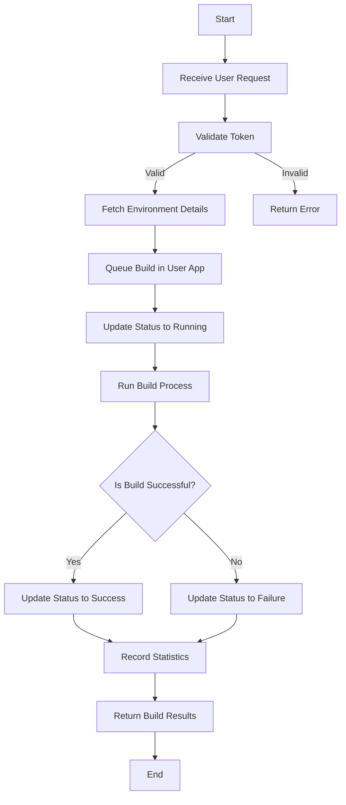

Based on the provided JSON design document, here are the Mermaid diagrams for the entities and workflows.

### Entity-Relationship (ER) Diagram

### Class Diagram

### Flow Chart for Workflows

#### Workflow for Building an Application

These diagrams represent the entities and their relationships, as well as the workflow for building an application based on the provided JSON design document.