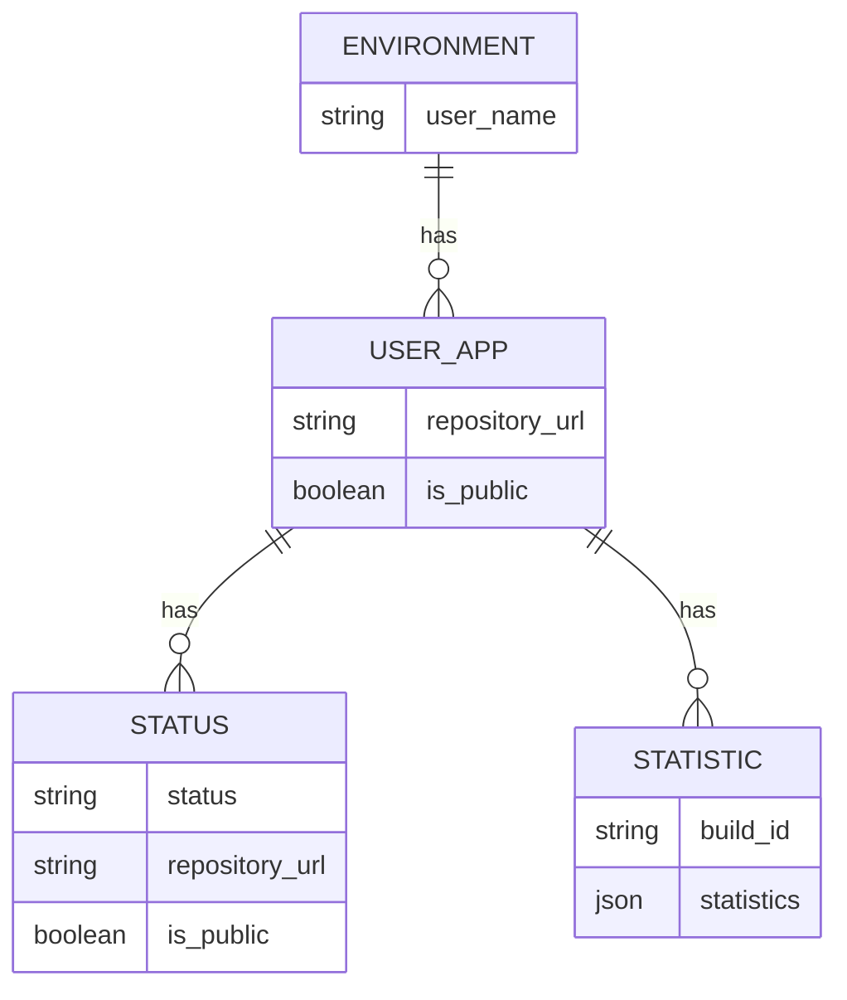
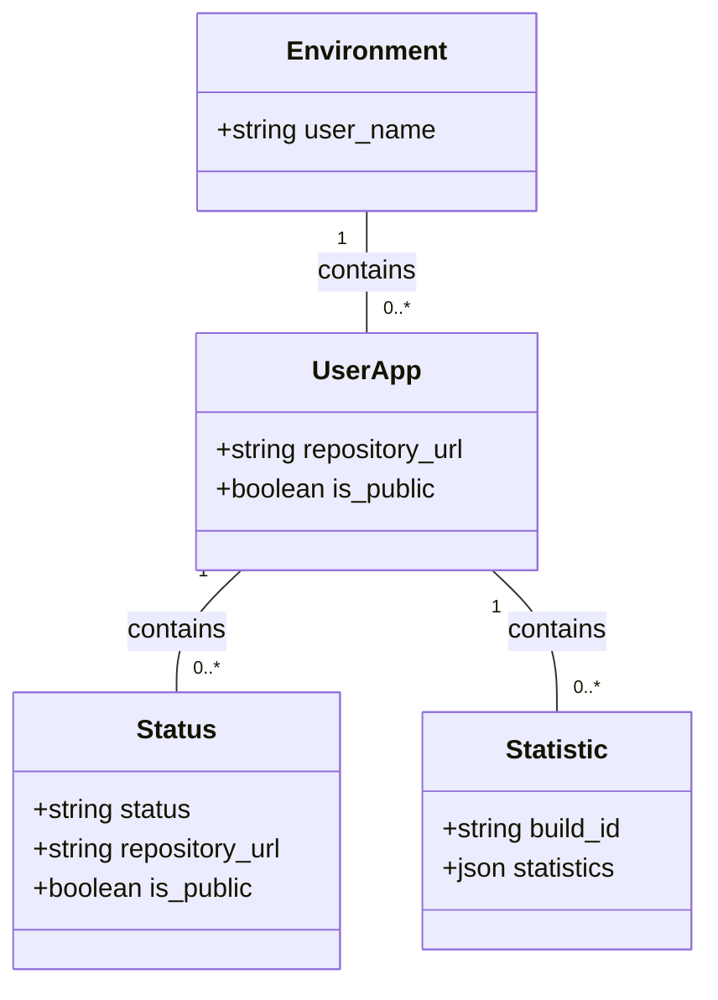
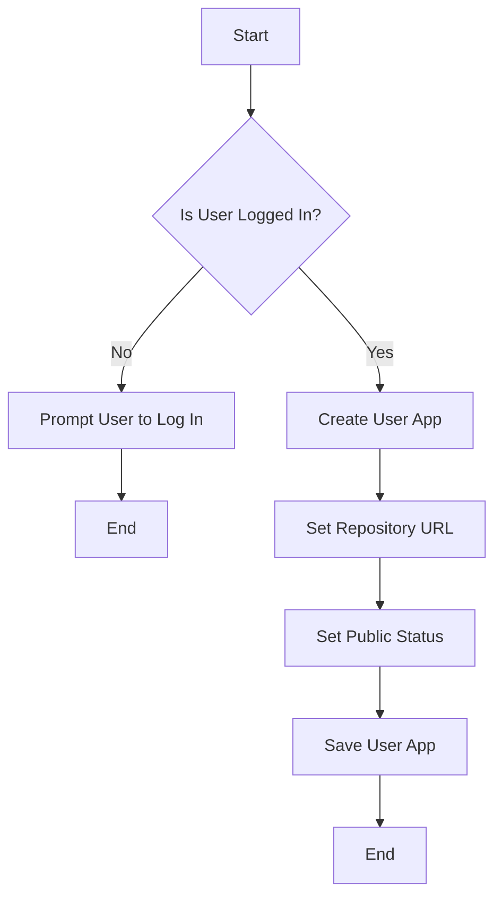
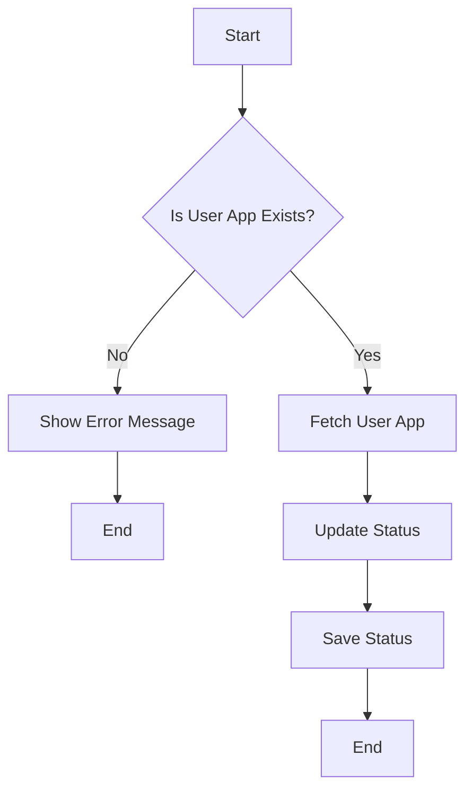
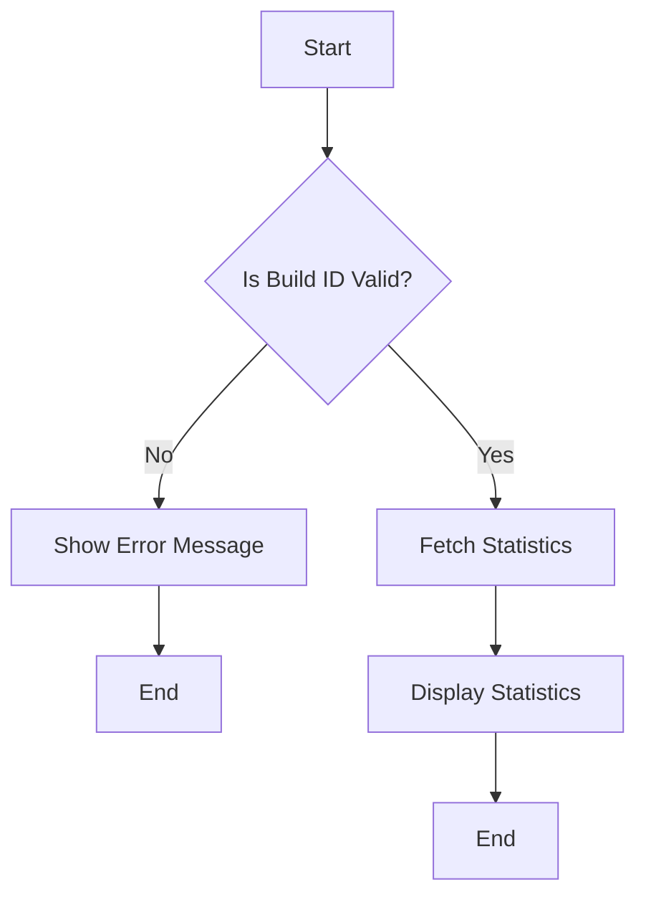

Based on the provided JSON design document, here are the Mermaid diagrams for the entities and their relationships, as well as flowcharts for the workflows.

### Entity-Relationship Diagram (ERD)

### Class Diagram

### Flowchart for Workflows

#### Workflow for User Application Creation

#### Workflow for Status Update

#### Workflow for Statistics Retrieval

These diagrams and flowcharts represent the entities, their relationships, and workflows as specified in the JSON design document.