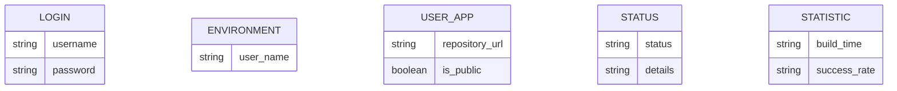
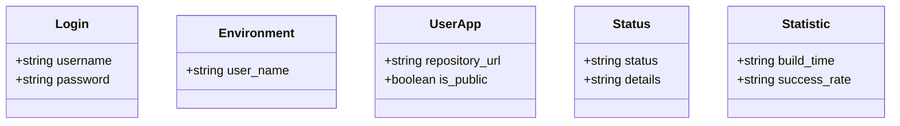
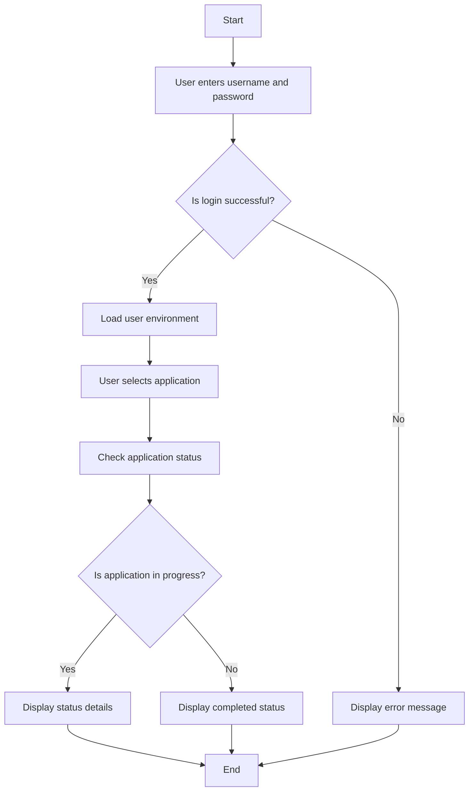

Based on the provided JSON design document, here are the Mermaid diagrams for the entities, class diagrams, and flow charts for workflows.

### Entity-Relationship Diagram (ERD)

### Class Diagram

### Flow Chart for Workflows

Assuming a generic workflow for logging in and checking the status of a user application, here’s a flowchart:

These diagrams represent the entities, their relationships, and a basic workflow based on the provided JSON design document. If you have specific workflows in mind, please provide more details, and I can adjust the flowchart accordingly.