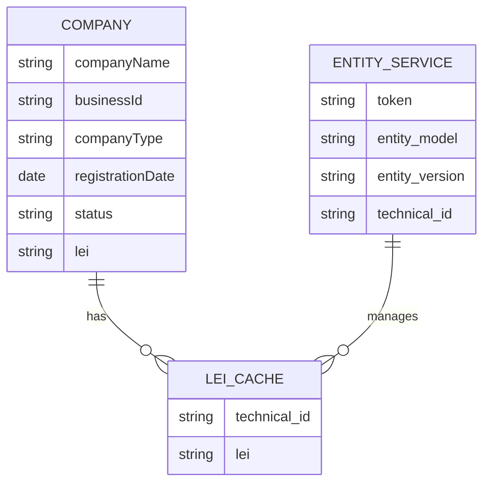
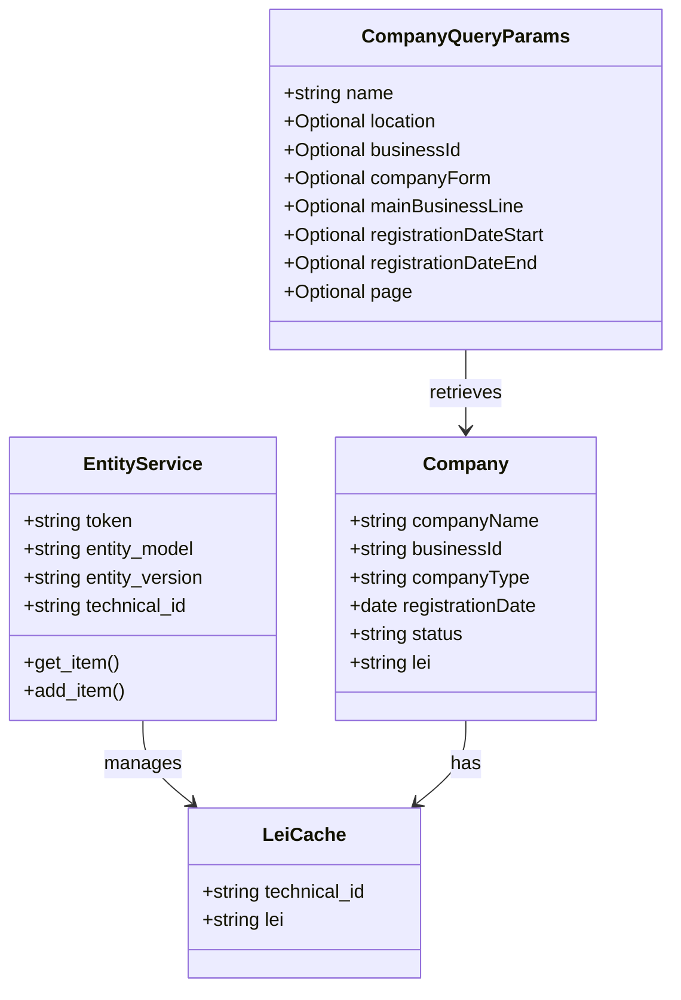

Based on the provided documents, here are the Mermaid entity ER diagrams and class diagrams for the Finnish Companies Data Retrieval and Enrichment Application.

### Entity Relationship Diagram (ERD)

### Class Diagram

### Explanation

1. **Entity Relationship Diagram (ERD)**:
   - The `COMPANY` entity represents the company data retrieved from the Finnish Companies Registry, including fields such as `companyName`, `businessId`, `companyType`, `registrationDate`, `status`, and `lei`.
   - The `ENTITY_SERVICE` entity represents the external service used for caching and retrieving LEI data, which includes fields for `token`, `entity_model`, `entity_version`, and `technical_id`.
   - The `LEI_CACHE` entity represents the cached LEI data associated with a business ID.

2. **Class Diagram**:
   - The `CompanyQueryParams` class defines the parameters for querying companies, including required and optional fields.
   - The `Company` class represents the structure of the company data returned by the application.
   - The `EntityService` class represents the external service responsible for managing LEI caching, with methods for getting and adding items.
   - The `LeiCache` class represents the structure of the cached LEI data.

These diagrams provide a visual representation of the entities and their relationships within the application, as well as the classes used for data handling and API interactions.