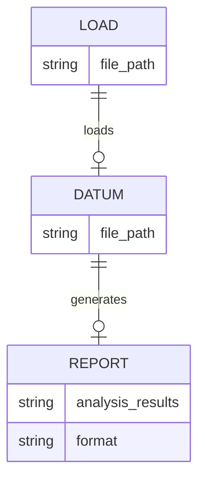
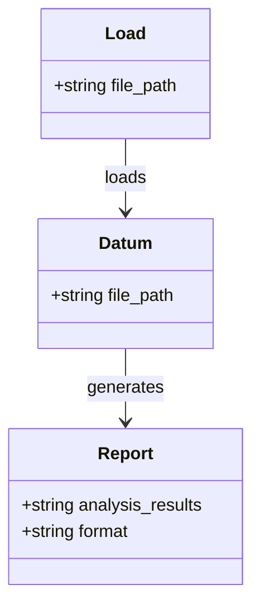
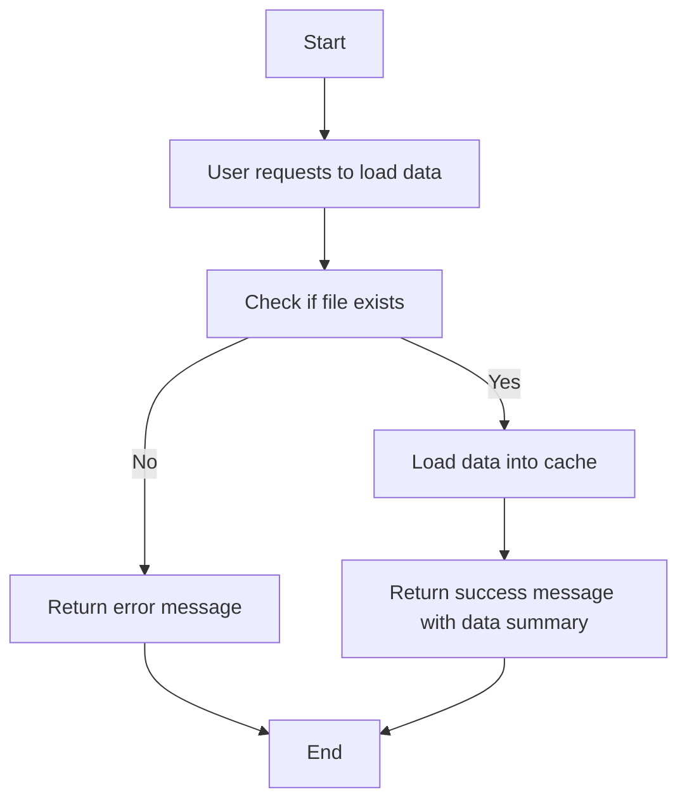
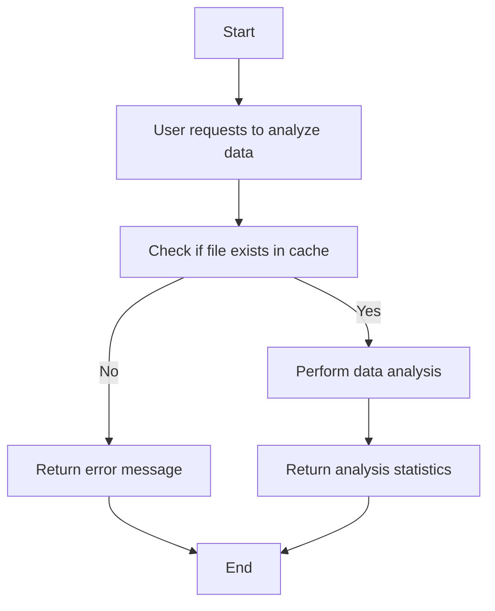
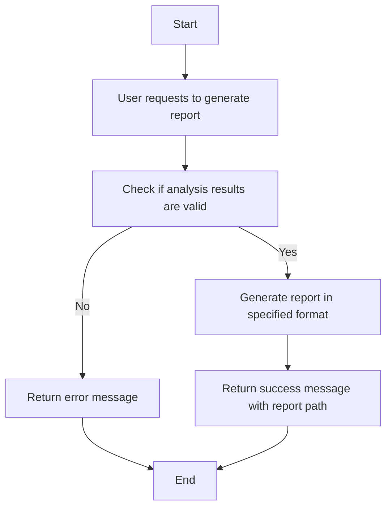

Here are the Mermaid diagrams based on the provided JSON design document.

### Entity-Relationship Diagrams (ERD)

### Class Diagrams

### Flow Charts for Each Workflow

#### Workflow for Loading Data

#### Workflow for Analyzing Data

#### Workflow for Generating Report

These diagrams represent the entities, their relationships, and the workflows based on the provided JSON design document.