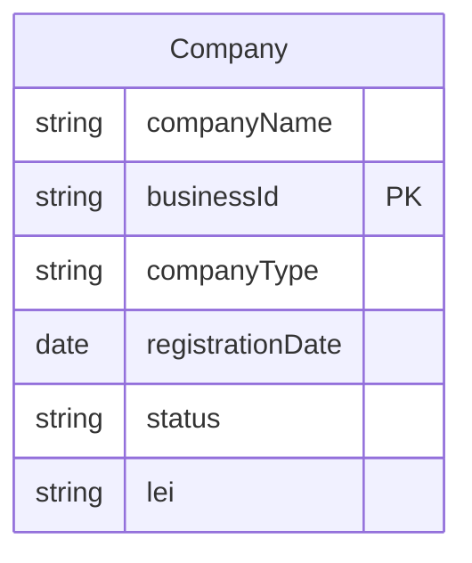
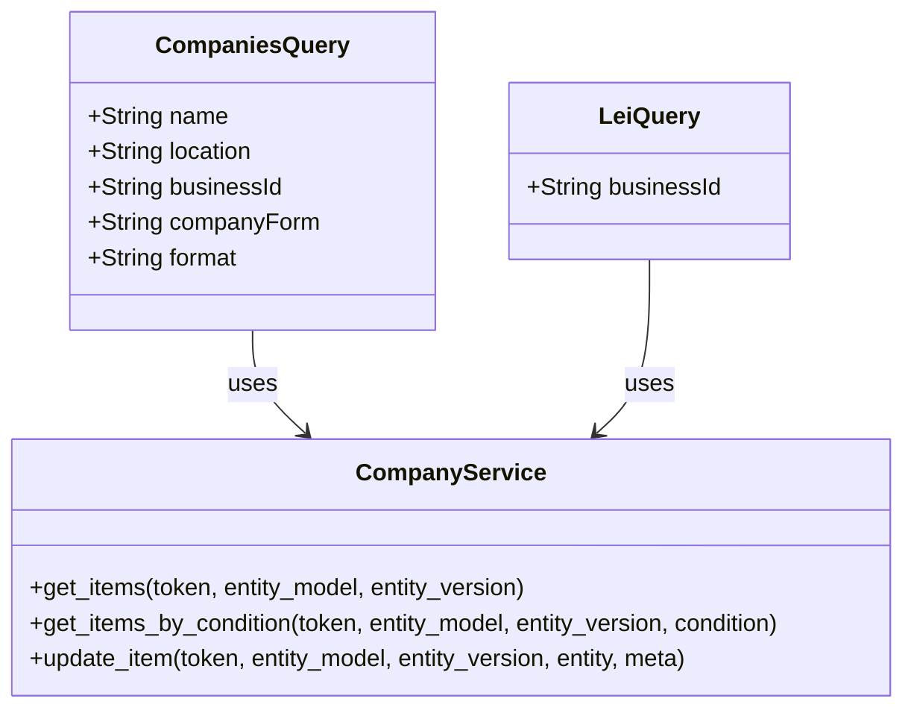

Based on the provided documents, I will create the Mermaid entity-relationship (ER) diagrams and class diagrams for the entities involved in the Finnish Companies Data Retrieval and Enrichment Application.

### Entity-Relationship Diagram (ERD)

The ERD will represent the relationships between the entities involved in the application. Based on the functional requirements and the code provided, we can identify the following entities:

1. **Company**
   - Attributes:
     - companyName: String
     - businessId: String (Primary Key)
     - companyType: String
     - registrationDate: Date
     - status: String
     - lei: String

### Class Diagram

The class diagram will represent the classes and their relationships based on the provided code. The main classes identified from the code are:

1. **CompaniesQuery**
   - Attributes:
     - name: String
     - location: String
     - businessId: String
     - companyForm: String
     - format: String

2. **LeiQuery**
   - Attributes:
     - businessId: String

3. **CompanyService** (representing the entity_service)
   - Methods:
     - get_items(token, entity_model, entity_version)
     - get_items_by_condition(token, entity_model, entity_version, condition)
     - update_item(token, entity_model, entity_version, entity, meta)

### Summary

- The **ERD** illustrates the structure of the `Company` entity, which holds various attributes related to companies.
- The **Class Diagram** shows the `CompaniesQuery` and `LeiQuery` classes that represent the query parameters for the API endpoints, as well as the `CompanyService` class that encapsulates the methods for interacting with the external service.

These diagrams provide a clear representation of the entities and their relationships based on the provided documents. If you need further modifications or additional details, please let me know!