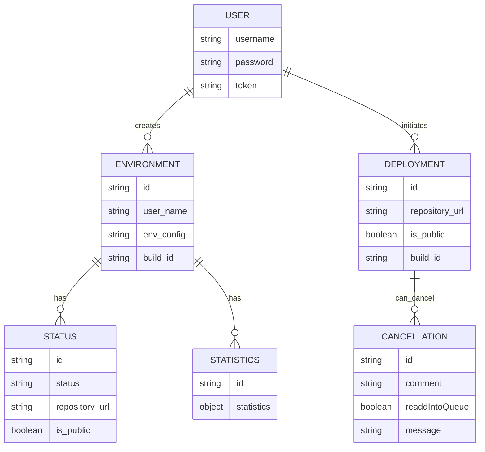
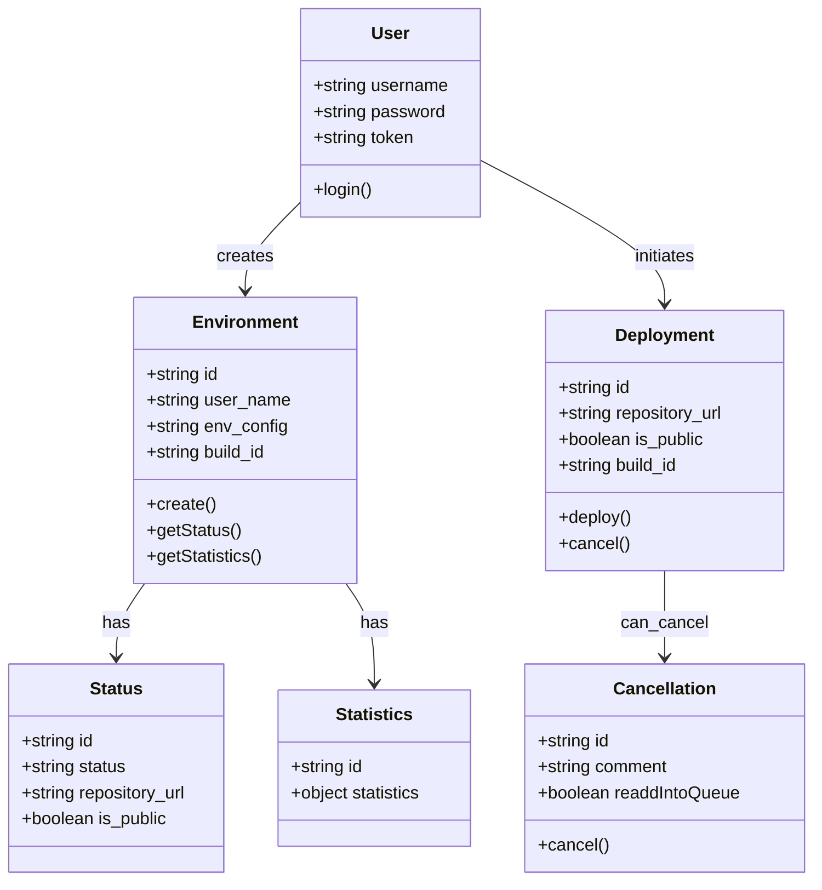
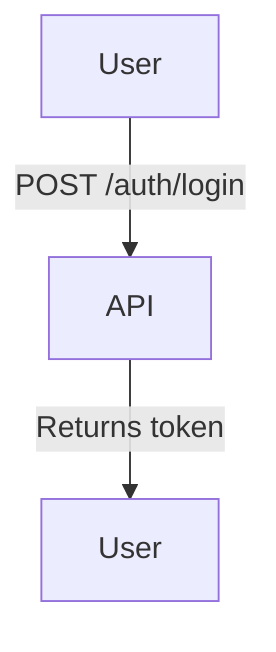
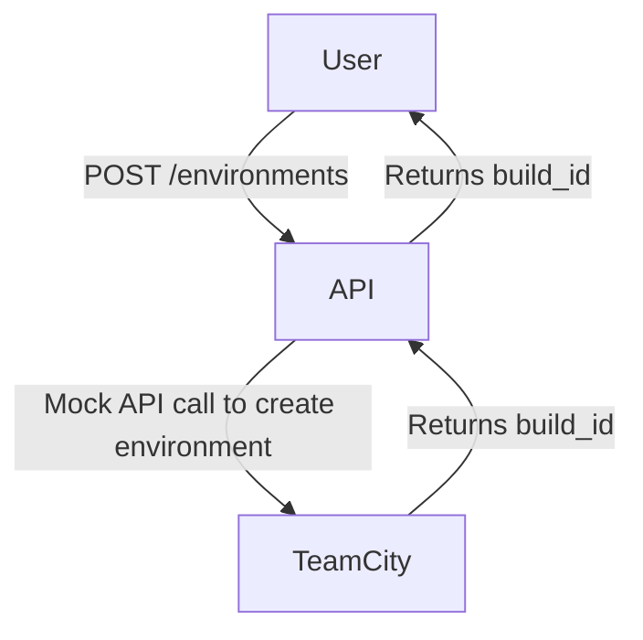
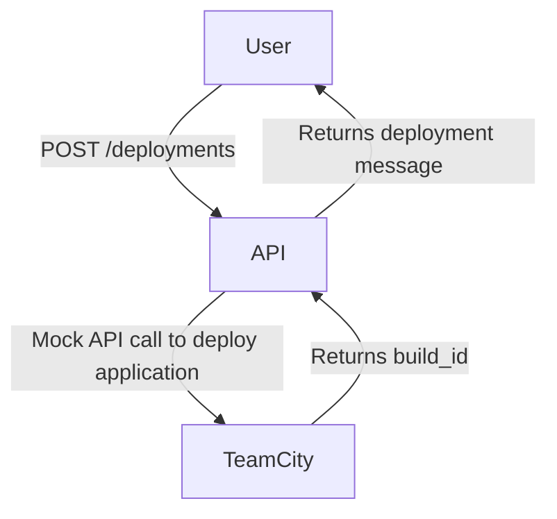

Based on the provided JSON design document, here are the requested Mermaid diagrams for the entities and workflows.

### Entity Relationship Diagram (ERD)



### Class Diagram



### Flow Chart for Each Workflow

#### User Authentication Workflow



#### Create Environment Workflow



#### Deploy Application Workflow



#### Get Environment Status Workflow

```mermaid
flowchart TD
    A[User] -->|GET /environments/{id}/status| B[API]
    B -->|Mock API call to get status| C[TeamCity]
    C -->|Returns status| B
    B -->|Returns status| A
```

#### Get Environment Statistics Workflow

```mermaid
flowchart TD
    A[User] -->|GET /environments/{id}/statistics| B[API]
    B -->|Mock API call to get statistics| C[TeamCity]
    C -->|Returns statistics| B
    B -->|Returns statistics| A
```

#### Cancel Deployment Workflow

```mermaid
flowchart TD
    A[User] -->|POST /deployments/{id}/cancel| B[API]
    B -->|Mock API call to cancel deployment| C[TeamCity]
    C -->|Returns cancellation confirmation| B
    B -->|Returns cancellation message| A
```

These diagrams represent the entities, their relationships, and the workflows as specified in the provided JSON design document.