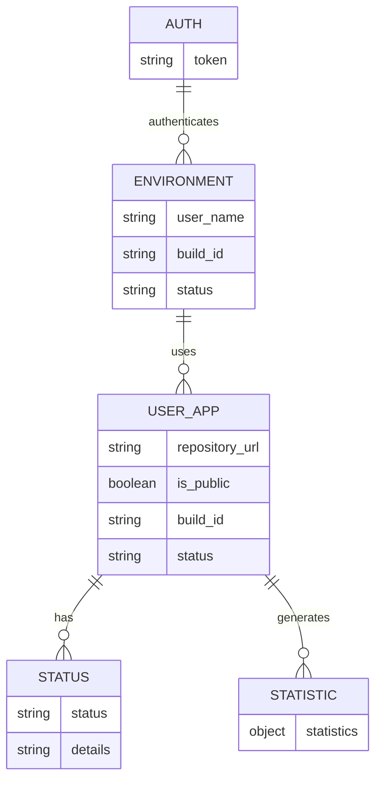
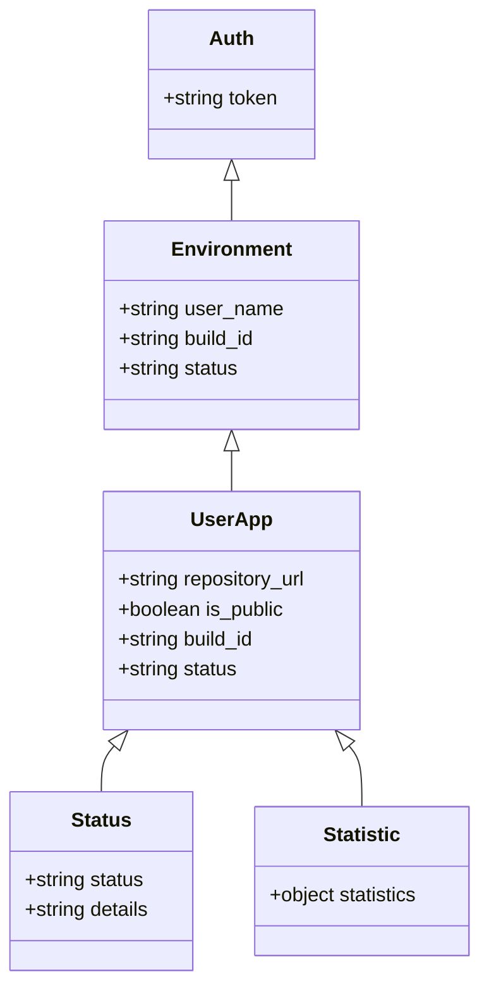
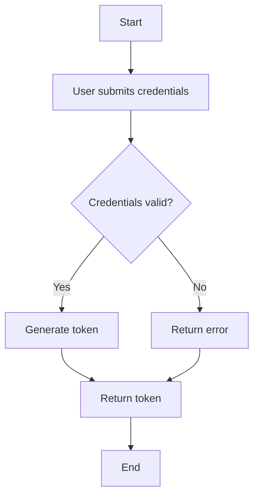
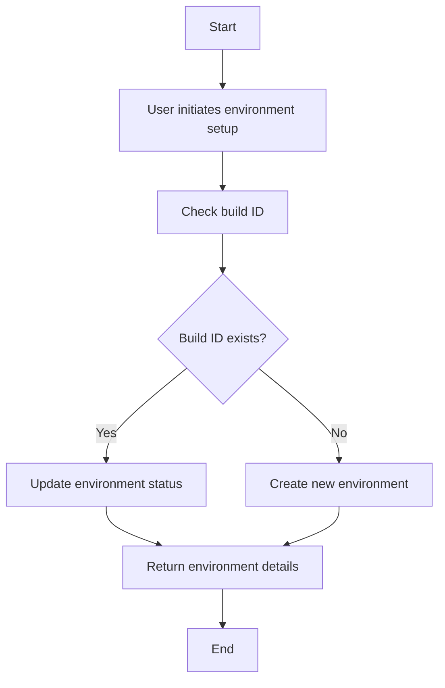
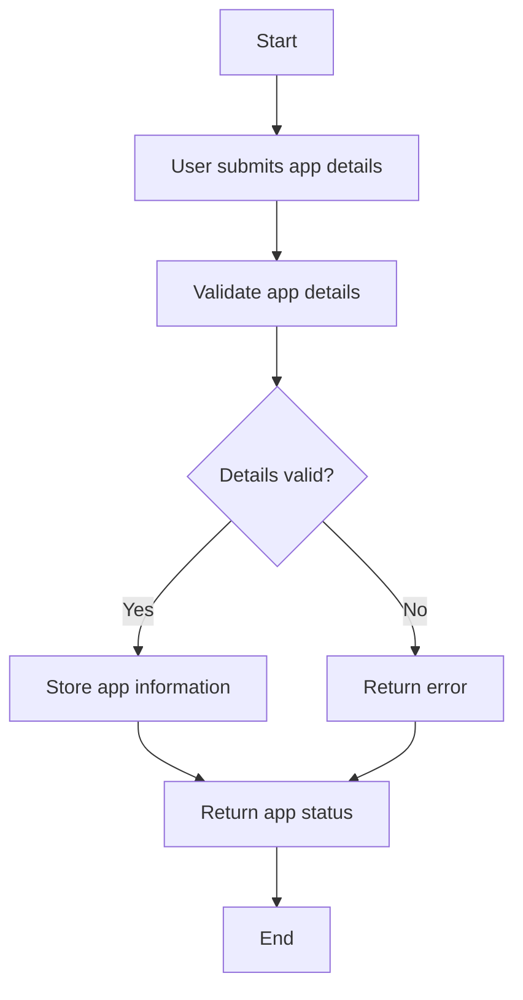
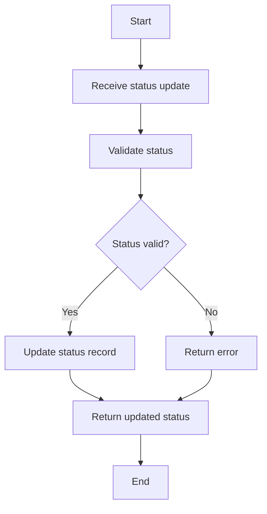
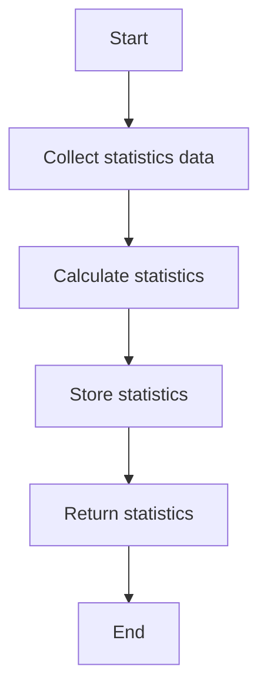

Based on the provided JSON design document, here are the Mermaid diagrams for the entities and workflows.

### Entity-Relationship (ER) Diagram

### Class Diagram

### Flow Chart for Workflows

#### Workflow for User Authentication

#### Workflow for Environment Setup

#### Workflow for User Application Management

#### Workflow for Status Update

#### Workflow for Statistics Generation

These diagrams represent the entities, their relationships, and workflows as specified in the JSON design document.