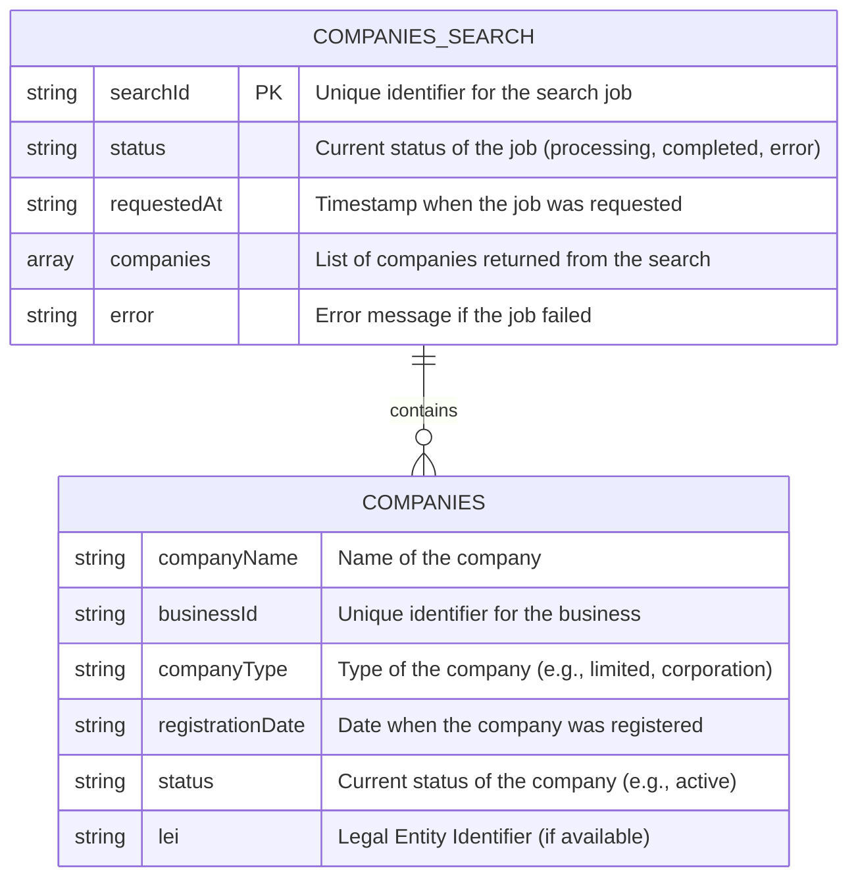
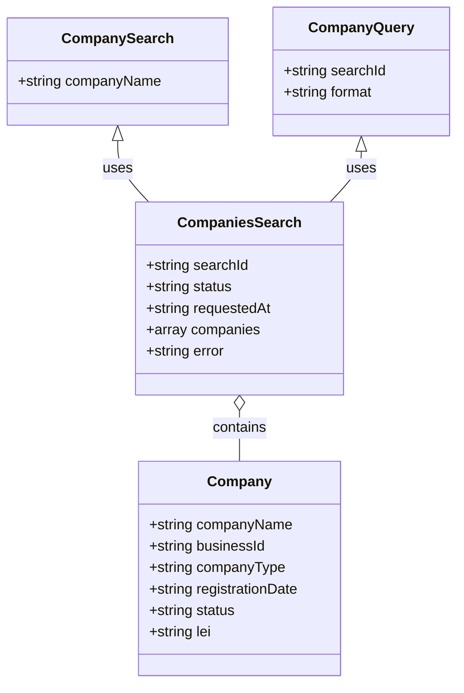

Based on the provided code and the entity model used in the `entity_service`, we can create the following Mermaid diagrams for the entity-relationship (ER) and class diagrams. The primary entity model identified in the code is `companies_search`, which is used to manage job records for company searches.

### Mermaid Entity-Relationship Diagram (ERD)

### Mermaid Class Diagram

### Explanation of the Diagrams

1. **Entity-Relationship Diagram (ERD)**:
   - The `COMPANIES_SEARCH` entity represents the job records for company searches. It has attributes such as `searchId`, `status`, `requestedAt`, `companies`, and `error`.
   - The `COMPANIES` entity represents the individual companies returned from the search, with attributes like `companyName`, `businessId`, `companyType`, `registrationDate`, `status`, and `lei`.
   - The relationship indicates that a `COMPANIES_SEARCH` can contain multiple `COMPANIES`.

2. **Class Diagram**:
   - The `CompanySearch` class represents the input for the search operation, containing the required `companyName`.
   - The `CompanyQuery` class represents the input for retrieving results, containing `searchId` and an optional `format`.
   - The `CompaniesSearch` class represents the job record, containing the relevant attributes.
   - The `Company` class represents the structure of each company returned in the search results.
   - The relationships indicate that `CompaniesSearch` uses both `CompanySearch` and `CompanyQuery`, and it contains multiple `Company` instances.

These diagrams provide a clear representation of the data structures and their relationships as defined in the provided code.