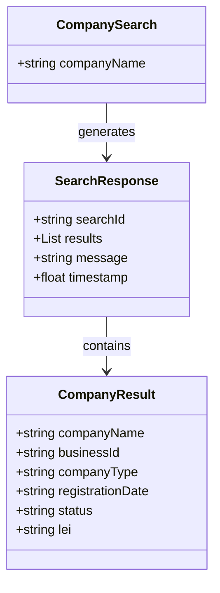

Based on the provided code and the context of the application, we can create the following Mermaid entity-relationship (ER) diagrams and class diagrams for the entities involved.

### Entity-Relationship Diagram (ERD)

```mermaid
erDiagram
    CompanySearch {
        string companyName
    }

    CompanyResult {
        string companyName
        string businessId
        string companyType
        string registrationDate
        string status
        string lei
    }

    SearchResponse {
        string searchId
        list<CompanyResult> results
        string message
        float timestamp
    }

    CompanySearch ||--o{ SearchResponse : generates
    SearchResponse ||--o{ CompanyResult : contains
```

### Class Diagram



### Explanation

1. **Entity-Relationship Diagram (ERD)**:
   - **CompanySearch**: Represents the input data structure for searching companies, containing a single attribute `companyName`.
   - **CompanyResult**: Represents the result of a company search, encapsulating various attributes related to a company.
   - **SearchResponse**: Represents the response structure returned after a search operation, which includes a list of `CompanyResult` objects.
   - The relationships indicate that a `CompanySearch` generates a `SearchResponse`, and a `SearchResponse` contains multiple `CompanyResult` entries.

2. **Class Diagram**:
   - The class diagram mirrors the structure of the ERD, showing the classes and their attributes.
   - The arrows indicate the relationships between the classes, where `CompanySearch` generates a `SearchResponse`, and `SearchResponse` contains multiple `CompanyResult` instances.

These diagrams provide a clear representation of the entities and their relationships within the context of the provided code.