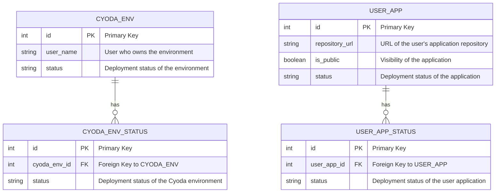
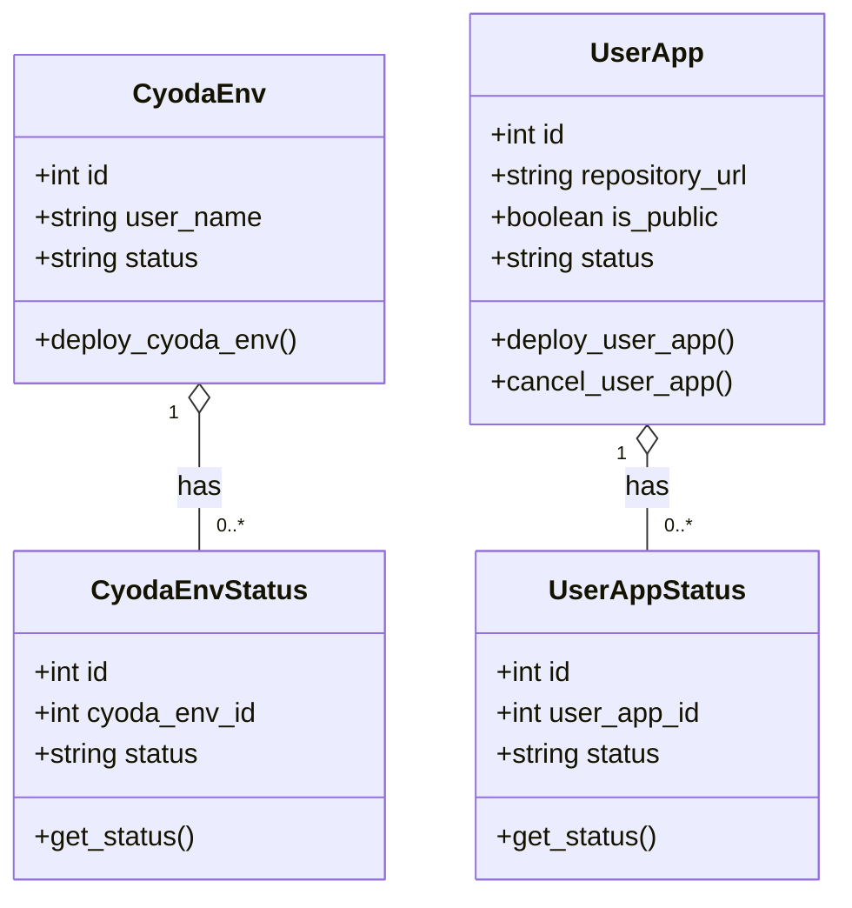
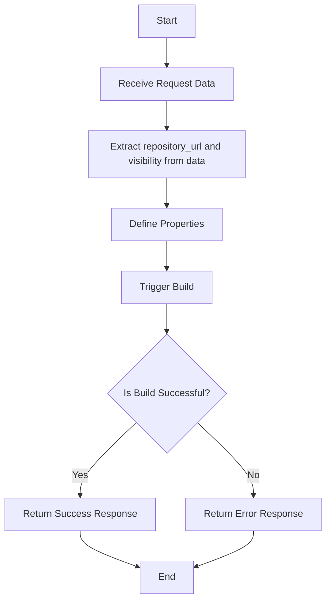
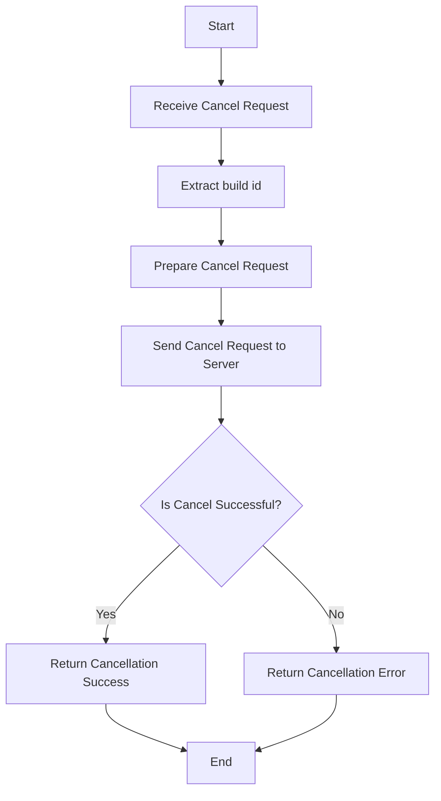

Based on the provided JSON design document, here are the Mermaid entity-relationship (ER) diagrams, class diagrams, and flowcharts for the workflows concerning `cyoda_env` and `user_app`.

### ER Diagram

```mermaid
erDiagram
    CYODA_ENV {
        int id PK "Primary Key"
        string user_name "User who owns the environment"
        string status "Deployment status of the environment"
    }
    USER_APP {
        int id PK "Primary Key"
        string repository_url "URL of the user's application repository"
        boolean is_public "Visibility of the application"
        string status "Deployment status of the application"
    }
    CYODA_ENV_STATUS {
        int id PK "Primary Key"
        int cyoda_env_id FK "Foreign Key to CYODA_ENV"
        string status "Deployment status of the Cyoda environment"
    }
    USER_APP_STATUS {
        int id PK "Primary Key"
        int user_app_id FK "Foreign Key to USER_APP"
        string status "Deployment status of the user application"
    }

    CYODA_ENV ||--o{ CYODA_ENV_STATUS : has
    USER_APP ||--o{ USER_APP_STATUS : has
```

### Class Diagram

```mermaid
classDiagram
    class CyodaEnv {
        +int id
        +string user_name
        +string status
        +deploy_cyoda_env()
    }
    class UserApp {
        +int id
        +string repository_url
        +boolean is_public
        +string status
        +deploy_user_app()
        +cancel_user_app()
    }
    class CyodaEnvStatus {
        +int id
        +int cyoda_env_id
        +string status
        +get_status()
    }
    class UserAppStatus {
        +int id
        +int user_app_id
        +string status
        +get_status()
    }

    CyodaEnv "1" o-- "0..*" CyodaEnvStatus : has
    UserApp "1" o-- "0..*" UserAppStatus : has
```

### Flowchart for Deploy Cyoda Environment

```mermaid
flowchart TD
    A[Start] --> B[Receive Request Data]
    B --> C[Extract user_name from data]
    C --> D[Define Properties]
    D --> E[Trigger Build]
    E --> F{Is Build Successful?}
    F -- Yes --> G[Return Success Response]
    F -- No --> H[Return Error Response]
    G --> I[End]
    H --> I[End]
```

### Flowchart for Deploy User Application

```mermaid
flowchart TD
    A[Start] --> B[Receive Request Data]
    B --> C[Extract repository_url and visibility from data]
    C --> D[Define Properties]
    D --> E[Trigger Build]
    E --> F{Is Build Successful?}
    F -- Yes --> G[Return Success Response]
    F -- No --> H[Return Error Response]
    G --> I[End]
    H --> I[End]
```

### Flowchart for Cancel User Application Build

```mermaid
flowchart TD
    A[Start] --> B[Receive Cancel Request]
    B --> C[Extract build id]
    C --> D[Prepare Cancel Request]
    D --> E[Send Cancel Request to Server]
    E --> F{Is Cancel Successful?}
    F -- Yes --> G[Return Cancellation Success]
    F -- No --> H[Return Cancellation Error]
    G --> I[End]
    H --> I[End]
```

Here, the diagrams illustrate the entities and relationships defined in the JSON input and show the processes for deploying and canceling user applications, as well as the deployment of Cyoda environments.