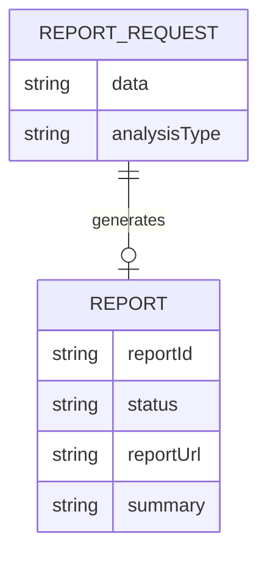
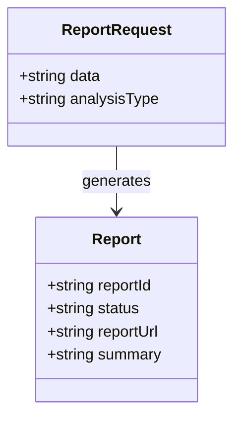
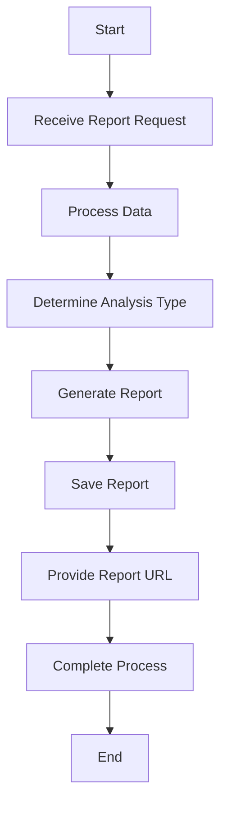

Based on the provided JSON design document, I will create mermaid entity-relationship (ER) diagrams and class diagrams, along with flow charts for the workflows represented by the entities.

### ER Diagram

```mermaid
erDiagram
    REPORT_REQUEST {
        string data
        string analysisType
    }
    
    REPORT {
        string reportId
        string status
        string reportUrl
        string summary
    }
    
    REPORT_REQUEST ||--o| REPORT : generates
```

### Class Diagram

```mermaid
classDiagram
    class ReportRequest {
        +string data
        +string analysisType
    }

    class Report {
        +string reportId
        +string status
        +string reportUrl
        +string summary
    }

    ReportRequest --> Report : generates
```

### Flow Chart for the Workflow

Since there are two entities, "report_request" and "report," I'll provide a flow chart that depicts the workflow of generating a report from a report request.

```mermaid
flowchart TD
    A[Start] --> B[Receive Report Request]
    B --> C[Process Data]
    C --> D[Determine Analysis Type]
    D --> E[Generate Report]
    E --> F[Save Report]
    F --> G[Provide Report URL]
    G --> H[Complete Process]
    H --> I[End]
```

### Summary

- The ER diagram captures the relationship between the "report_request" and "report" entities, indicating that a report request generates a report.
- The class diagram presents the structure of each entity with their respective attributes.
- The flow chart outlines the process of handling a report request and generating a report.

These diagrams and flowcharts adhere strictly to the information provided in the JSON design document.