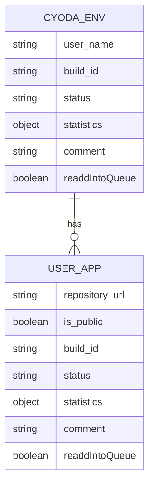
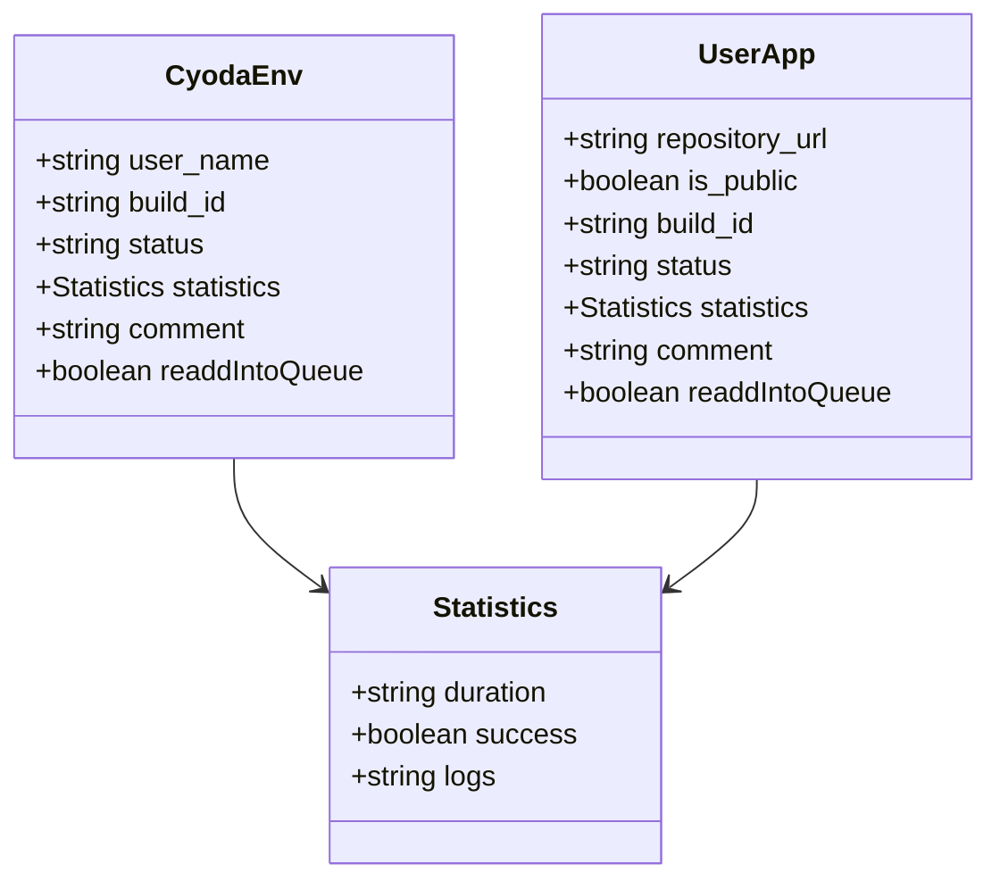
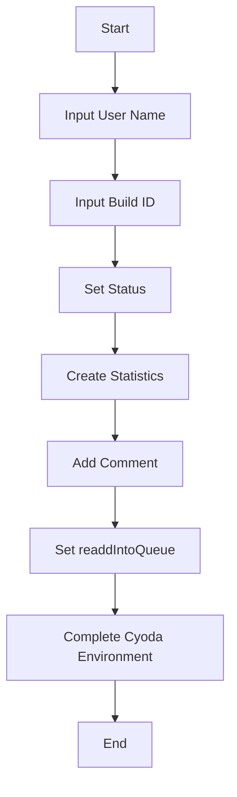
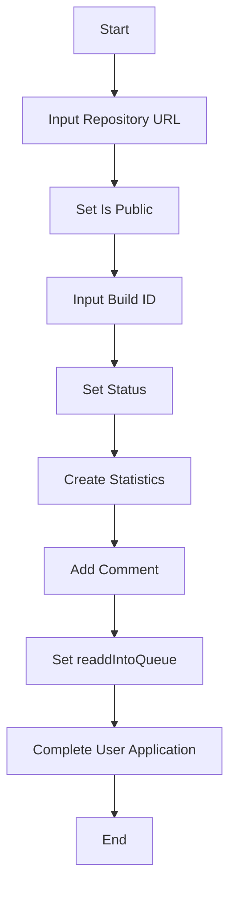

Based on the provided JSON design document, here are the Mermaid entity relationship diagrams (ERD) and class diagrams for the specified entities, as well as flowcharts for the workflow.

### Entity Relationship Diagram (ERD)

```mermaid
erDiagram
    CYODA_ENV {
        string user_name
        string build_id
        string status
        object statistics
        string comment
        boolean readdIntoQueue
    }
    USER_APP {
        string repository_url
        boolean is_public
        string build_id
        string status
        object statistics
        string comment
        boolean readdIntoQueue
    }
    
    CYODA_ENV ||--o{ USER_APP : "has"
```

### Class Diagrams

```mermaid
classDiagram
    class CyodaEnv {
        +string user_name
        +string build_id
        +string status
        +Statistics statistics
        +string comment
        +boolean readdIntoQueue
    }
    
    class UserApp {
        +string repository_url
        +boolean is_public
        +string build_id
        +string status
        +Statistics statistics
        +string comment
        +boolean readdIntoQueue
    }
    
    class Statistics {
        +string duration
        +boolean success
        +string logs
    }
    
    CyodaEnv --> Statistics
    UserApp --> Statistics
```

### Flow Chart for Each Workflow

#### Workflow: Cyoda Environment Actions

```mermaid
flowchart TD
    A[Start] --> B[Input User Name]
    B --> C[Input Build ID]
    C --> D[Set Status]
    D --> E[Create Statistics]
    E --> F[Add Comment]
    F --> G[Set readdIntoQueue]
    G --> H[Complete Cyoda Environment]
    H --> I[End]
```

#### Workflow: User Application Actions

```mermaid
flowchart TD
    A[Start] --> B[Input Repository URL]
    B --> C[Set Is Public]
    C --> D[Input Build ID]
    D --> E[Set Status]
    E --> F[Create Statistics]
    F --> G[Add Comment]
    G --> H[Set readdIntoQueue]
    H --> I[Complete User Application]
    I --> J[End]
```

These diagrams represent the structure and relationships of the entities as well as the workflows associated with each operation based on your JSON design document.