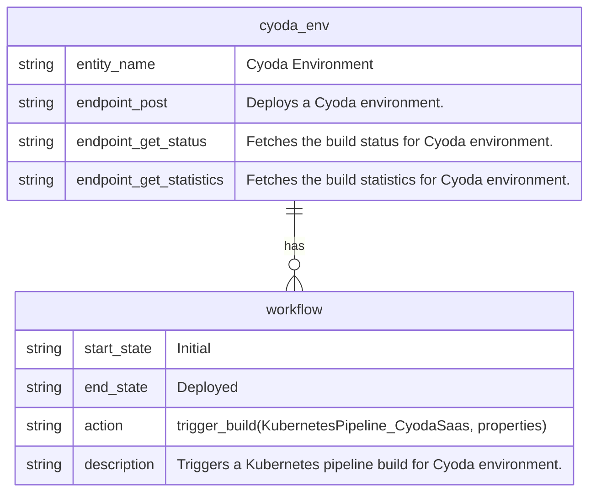
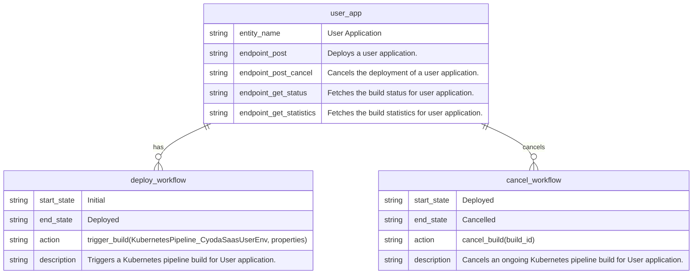
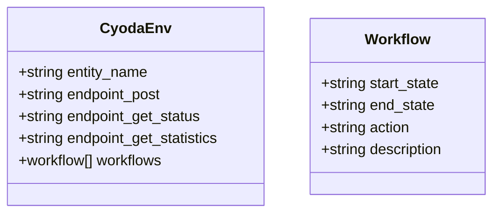
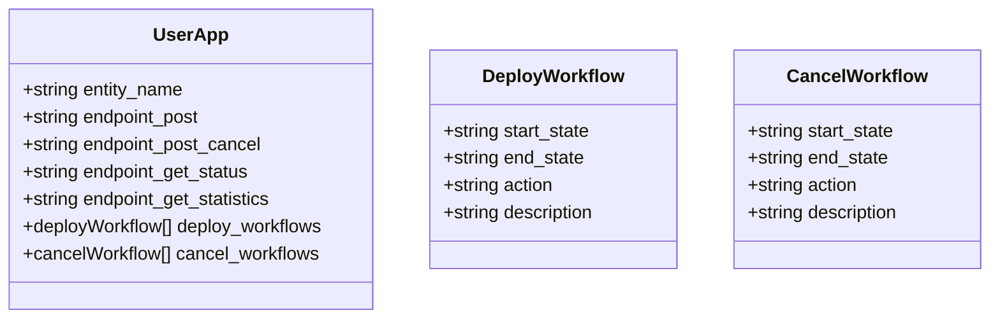

Below are the Mermaid diagrams and flowcharts based on the provided JSON design documents for the entities `cyoda_env` and `user_app`.

### Entity-Relationship Diagrams (ER Diagrams)

#### Cyoda Environment ER Diagram

```mermaid
erDiagram
    cyoda_env {
        string entity_name "Cyoda Environment"
        string endpoint_post "Deploys a Cyoda environment."
        string endpoint_get_status "Fetches the build status for Cyoda environment."
        string endpoint_get_statistics "Fetches the build statistics for Cyoda environment."
    }
    
    cyoda_env ||--o{ workflow : has
    workflow {
        string start_state "Initial"
        string end_state "Deployed"
        string action "trigger_build(KubernetesPipeline_CyodaSaas, properties)"
        string description "Triggers a Kubernetes pipeline build for Cyoda environment."
    }
```

#### User Application ER Diagram

```mermaid
erDiagram
    user_app {
        string entity_name "User Application"
        string endpoint_post "Deploys a user application."
        string endpoint_post_cancel "Cancels the deployment of a user application."
        string endpoint_get_status "Fetches the build status for user application."
        string endpoint_get_statistics "Fetches the build statistics for user application."
    }
    
    user_app ||--o{ deploy_workflow : has
    deploy_workflow {
        string start_state "Initial"
        string end_state "Deployed"
        string action "trigger_build(KubernetesPipeline_CyodaSaasUserEnv, properties)"
        string description "Triggers a Kubernetes pipeline build for User application."
    }
    
    user_app ||--o{ cancel_workflow : cancels
    cancel_workflow {
        string start_state "Deployed"
        string end_state "Cancelled"
        string action "cancel_build(build_id)"
        string description "Cancels an ongoing Kubernetes pipeline build for User application."
    }
```

### Class Diagrams

#### Cyoda Environment Class Diagram

```mermaid
classDiagram
    class CyodaEnv {
        +string entity_name
        +string endpoint_post
        +string endpoint_get_status
        +string endpoint_get_statistics
        +workflow[] workflows
    }
    
    class Workflow {
        +string start_state
        +string end_state
        +string action
        +string description
    }
```

#### User Application Class Diagram

```mermaid
classDiagram
    class UserApp {
        +string entity_name
        +string endpoint_post
        +string endpoint_post_cancel
        +string endpoint_get_status
        +string endpoint_get_statistics
        +deployWorkflow[] deploy_workflows
        +cancelWorkflow[] cancel_workflows
    }
    
    class DeployWorkflow {
        +string start_state
        +string end_state
        +string action
        +string description
    }
    
    class CancelWorkflow {
        +string start_state
        +string end_state
        +string action
        +string description
    }
```

### Flow Charts

#### Cyoda Environment Workflow Flowchart
```mermaid
flowchart TD
    A[Initial State] --> B[Trigger Build for Cyoda Environment]
    B --> C[Deployed State]
    C --> D[Build Triggered: trigger_build(KubernetesPipeline_CyodaSaas, properties)]
```

#### User Application Deployment Workflow Flowchart
```mermaid
flowchart TD
    A[Initial State] --> B[Trigger Build for User Application]
    B --> C[Deployed State]
    C --> D[Build Triggered: trigger_build(KubernetesPipeline_CyodaSaasUserEnv, properties)]
```

#### User Application Cancellation Workflow Flowchart
```mermaid
flowchart TD
    A[Deployed State] --> B[Cancel Deployment of User Application]
    B --> C[Cancelled State]
    C --> D[Build Cancelled: cancel_build(build_id)]
```

These diagrams and flowcharts visually represent the entities, their relationships, actions, and workflows as specified in the provided design documents.