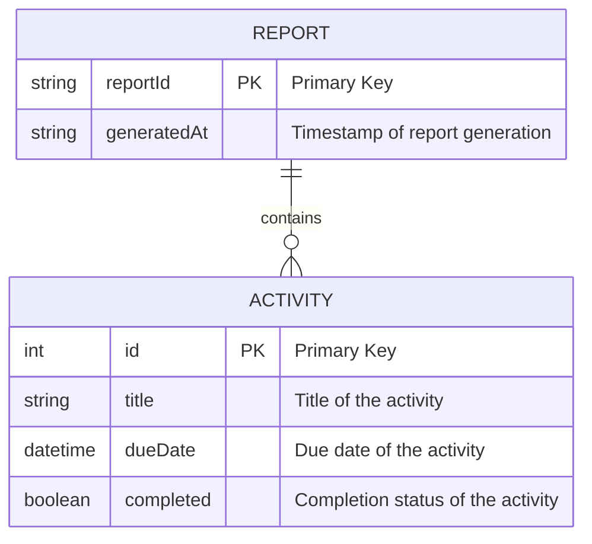
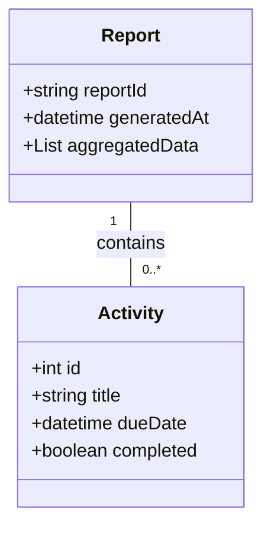
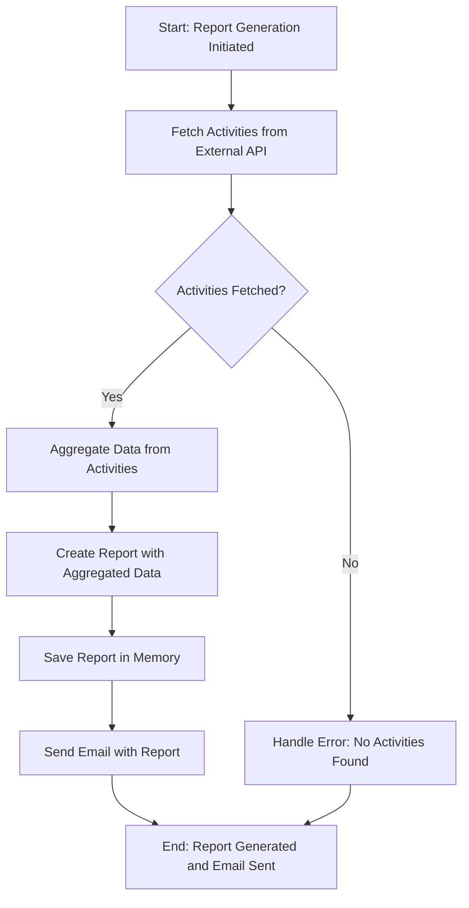
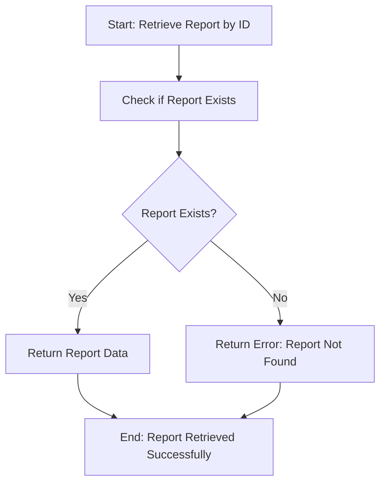

Below are the Mermaid diagrams for the entities and workflows based on the provided JSON design document.

### Entity Relationship Diagram (ERD)

```mermaid
erDiagram
    REPORT {
        string reportId PK "Primary Key"
        string generatedAt "Timestamp of report generation"
    }
    ACTIVITY {
        int id PK "Primary Key"
        string title "Title of the activity"
        datetime dueDate "Due date of the activity"
        boolean completed "Completion status of the activity"
    }
    REPORT ||--o{ ACTIVITY : contains
```

### Class Diagram

```mermaid
classDiagram
    class Report {
        +string reportId
        +datetime generatedAt
        +List<Activity> aggregatedData
    }

    class Activity {
        +int id
        +string title
        +datetime dueDate
        +boolean completed
    }

    Report "1" -- "0..*" Activity : contains
```

### Workflow Flowchart for Report Generation

```mermaid
flowchart TD
    A[Start: Report Generation Initiated] --> B[Fetch Activities from External API]
    B --> C{Activities Fetched?}
    C -- Yes --> D[Aggregate Data from Activities]
    D --> E[Create Report with Aggregated Data]
    E --> F[Save Report in Memory]
    F --> G[Send Email with Report]
    G --> H[End: Report Generated and Email Sent]
    C -- No --> I[Handle Error: No Activities Found]
    I --> H
```

### Workflow Flowchart for Report Retrieval

```mermaid
flowchart TD
    A[Start: Retrieve Report by ID] --> B[Check if Report Exists]
    B --> C{Report Exists?}
    C -- Yes --> D[Return Report Data]
    D --> E[End: Report Retrieved Successfully]
    C -- No --> F[Return Error: Report Not Found]
    F --> E
```

### Summary
- The **Entity Relationship Diagram (ERD)** illustrates the relationship between the `Report` and `Activity` entities, where a report can contain multiple activities.
- The **Class Diagram** provides a structural representation of the `Report` and `Activity` classes, including their attributes and relationships.
- The **Flowcharts** depict the workflows for generating a report and retrieving a report by ID, outlining the steps involved in each process.

These diagrams can be used to visualize the structure and workflows of your application based on the provided design document. If you need any further modifications or additional diagrams, feel free to ask!