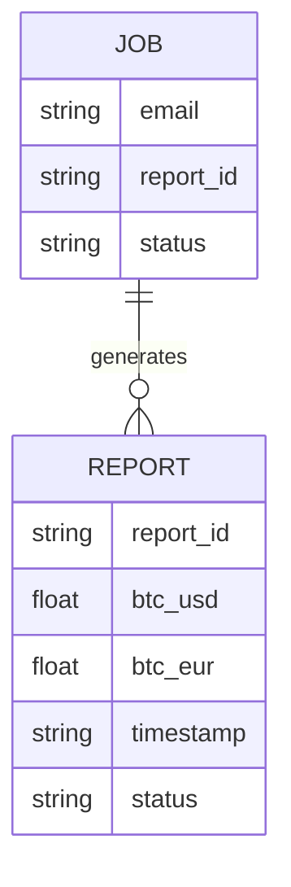
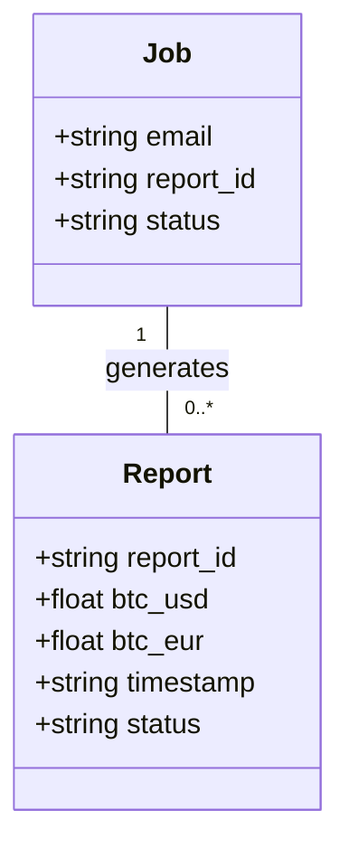
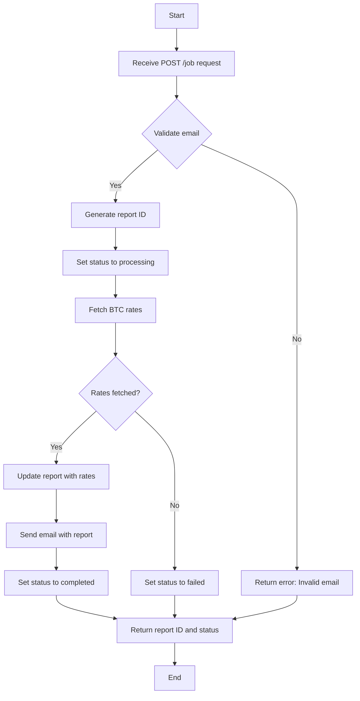

Here are the requested Mermaid diagrams based on the provided JSON design document for the entities "job" and "report," along with flowcharts for the workflows.

### Entity Relationship (ER) Diagram

```mermaid
erDiagram
    JOB {
        string email
        string report_id
        string status
    }
    REPORT {
        string report_id
        float btc_usd
        float btc_eur
        string timestamp
        string status
    }
    
    JOB ||--o{ REPORT : generates
```

### Class Diagram

```mermaid
classDiagram
    class Job {
        +string email
        +string report_id
        +string status
    }

    class Report {
        +string report_id
        +float btc_usd
        +float btc_eur
        +string timestamp
        +string status
    }

    Job "1" -- "0..*" Report : generates
```

### Workflow Flowchart for Job Creation

```mermaid
flowchart TD
    A[Start] --> B[Receive POST /job request]
    B --> C{Validate email}
    C -- Yes --> D[Generate report ID]
    D --> E[Set status to processing]
    E --> F[Fetch BTC rates]
    F --> G{Rates fetched?}
    G -- Yes --> H[Update report with rates]
    H --> I[Send email with report]
    I --> J[Set status to completed]
    J --> K[Return report ID and status]
    G -- No --> L[Set status to failed]
    L --> K
    C -- No --> M[Return error: Invalid email]
    M --> K
    K --> N[End]
```

### Explanation
- **ER Diagram**: Shows the relationship between the `JOB` and `REPORT` entities, indicating that a job generates one or more reports.
- **Class Diagram**: Represents the structure of the `Job` and `Report` classes, including their attributes and the relationship between them.
- **Workflow Flowchart**: Illustrates the steps involved in creating a job, including validation, fetching rates, and sending emails, along with decision points for handling success and failure.

These diagrams provide a clear visual representation of the entities and workflows based on the provided design document. If you need any further modifications or additional diagrams, let me know!