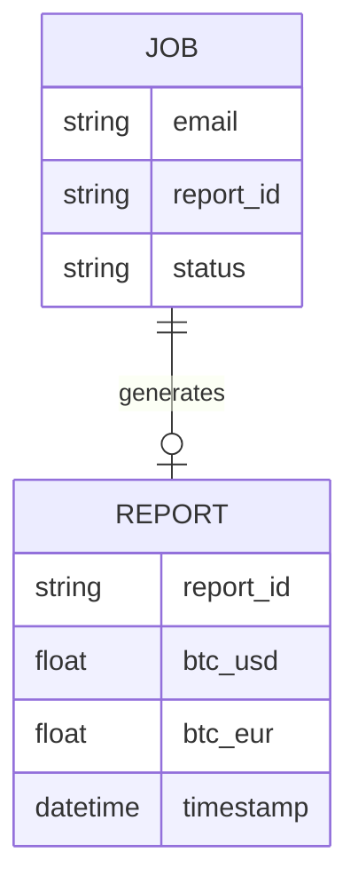
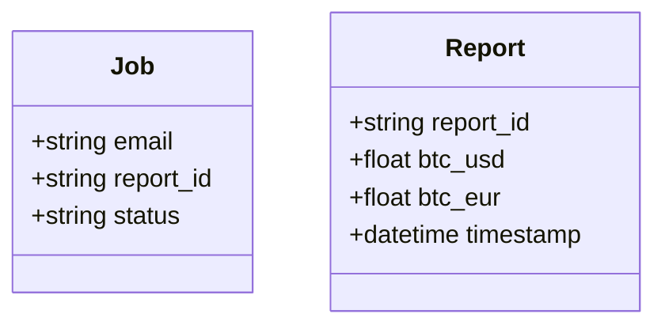
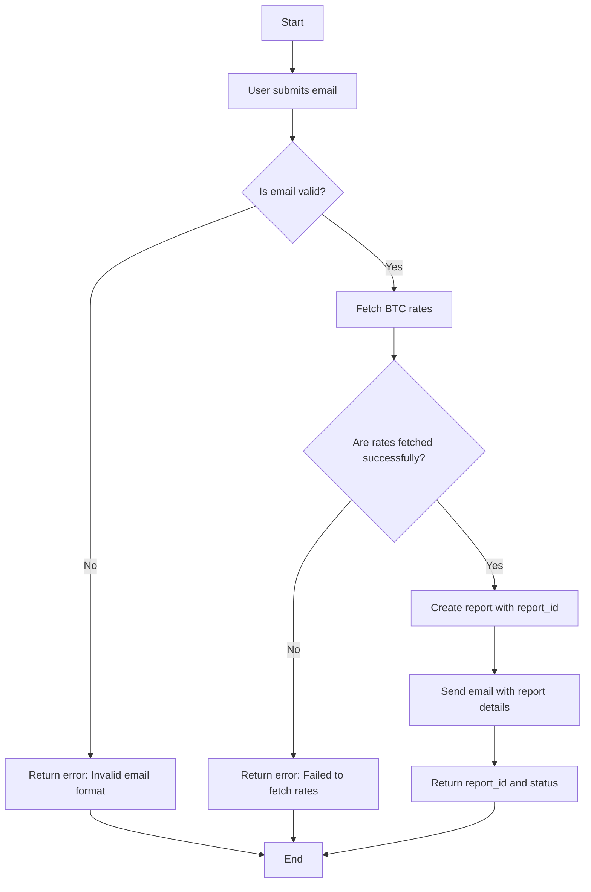

Here are the requested Mermaid diagrams based on the provided JSON design document.

### Entity-Relationship (ER) Diagram

```mermaid
erDiagram
    JOB {
        string email
        string report_id
        string status
    }
    REPORT {
        string report_id
        float btc_usd
        float btc_eur
        datetime timestamp
    }
    
    JOB ||--o| REPORT : generates
```

### Class Diagram

```mermaid
classDiagram
    class Job {
        +string email
        +string report_id
        +string status
    }

    class Report {
        +string report_id
        +float btc_usd
        +float btc_eur
        +datetime timestamp
    }
```

### Flow Chart for Workflow

#### Workflow for Creating a Report

```mermaid
flowchart TD
    A[Start] --> B[User submits email]
    B --> C{Is email valid?}
    C -- Yes --> D[Fetch BTC rates]
    C -- No --> E[Return error: Invalid email format]
    D --> F{Are rates fetched successfully?}
    F -- Yes --> G[Create report with report_id]
    G --> H[Send email with report details]
    H --> I[Return report_id and status]
    F -- No --> J[Return error: Failed to fetch rates]
    E --> K[End]
    J --> K
    I --> K
```

### Explanation:
- **ER Diagram**: Shows the relationship between the `JOB` and `REPORT` entities, indicating that a job generates a report.
- **Class Diagram**: Represents the attributes of each class corresponding to the entities, with public attributes.
- **Flow Chart**: Illustrates the workflow for creating a report, including decision points for email validation and fetching rates.

These diagrams provide a clear visual representation of the entities, their relationships, and the workflow based on the provided design document. If you need any modifications or additional diagrams, feel free to ask!