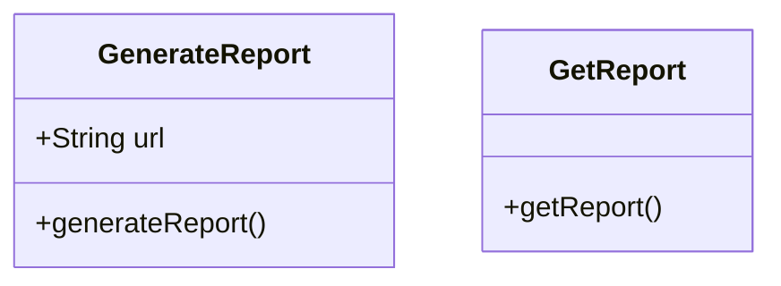
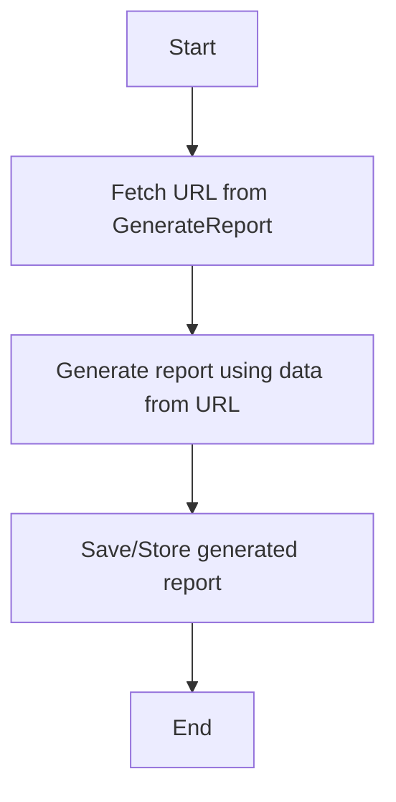
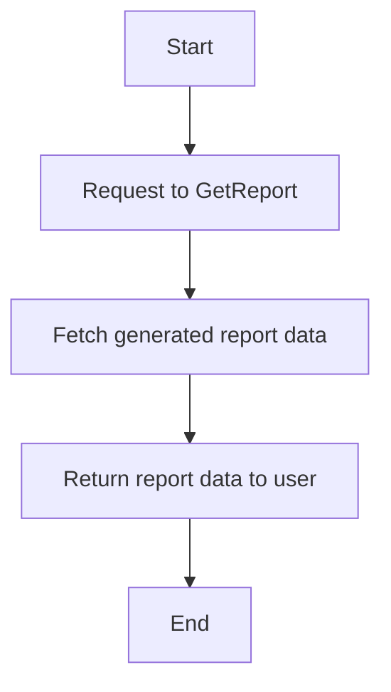

Based on the provided JSON design document, here are the Mermaid entity ER diagrams, class diagrams for each entity, and flow charts for each workflow related to the entities in the document.

### Entity Relationship (ER) Diagram
```mermaid
erDiagram
    GENERATE_REPORT {
        string url
    }
    
    GET_REPORT {
        // No attributes defined in the design
    }

    GENERATE_REPORT ||--o{ GET_REPORT: contains
```

### Class Diagram

```mermaid
classDiagram
    class GenerateReport {
        +String url
        +generateReport()
    }

    class GetReport {
        +getReport()
    }
```

### Flowcharts for Each Workflow

#### Generate Report Workflow

```mermaid
flowchart TD
    A[Start] --> B[Fetch URL from GenerateReport]
    B --> C[Generate report using data from URL]
    C --> D[Save/Store generated report]
    D --> E[End]
```

#### Get Report Workflow

```mermaid
flowchart TD
    A[Start] --> B[Request to GetReport]
    B --> C[Fetch generated report data]
    C --> D[Return report data to user]
    D --> E[End]
```

### Summary
- We define two entities: `GenerateReport` and `GetReport`.
- The entity relationship diagram indicates that `GetReport` is somewhat dependent on or contains `GenerateReport`.
- The class diagram illustrates the methods associated with each entity.
- Two workflows are detailed as flowcharts, covering the processes for generating and retrieving reports.

If you need any specific modifications or additional details, feel free to ask!