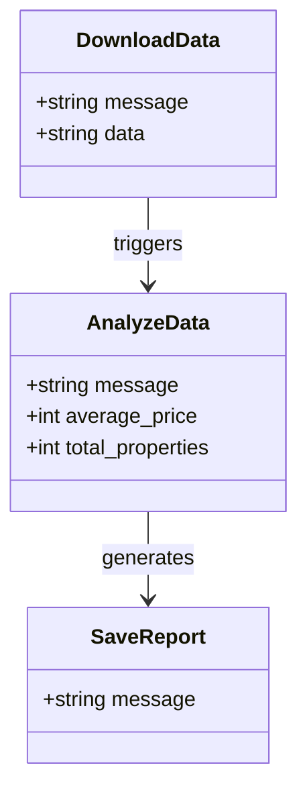
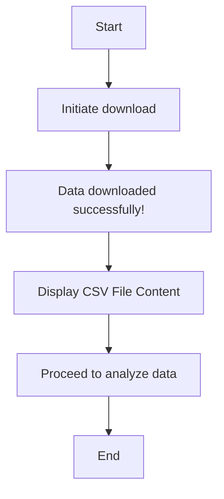
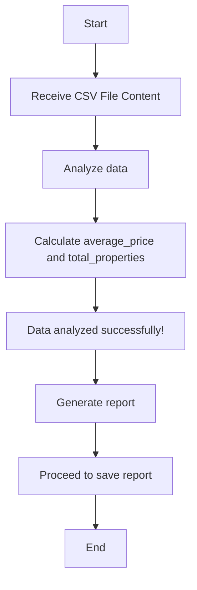
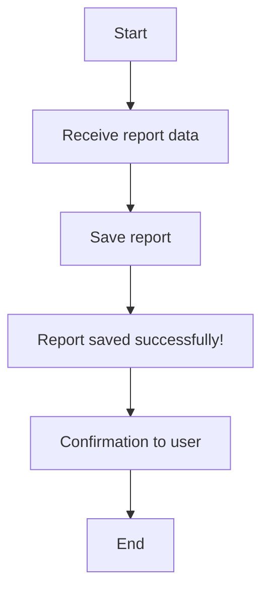

Based on the provided JSON design document, here are the requested diagrams using Mermaid syntax. 

### Entity-Relationship (ER) Diagram
```mermaid
erDiagram
    DOWNLOAD_DATA {
        string message "Data downloaded successfully!"
        string data "CSV File Content"
    }

    ANALYZE_DATA {
        string message "Data analyzed successfully!"
        average_price int 450000
        total_properties int 100
    }

    SAVE_REPORT {
        string message "Report saved successfully!"
    }

    DOWNLOAD_DATA ||--o| ANALYZE_DATA : triggers
    ANALYZE_DATA ||--o| SAVE_REPORT : generates
```

### Class Diagram

```mermaid
classDiagram
    class DownloadData {
        +string message
        +string data
    }

    class AnalyzeData {
        +string message
        +int average_price
        +int total_properties
    }

    class SaveReport {
        +string message
    }

    DownloadData --> AnalyzeData : triggers
    AnalyzeData --> SaveReport : generates
```

### Flowchart for Each Workflow
1. **Download Data Workflow**

```mermaid
flowchart TD
    A[Start] --> B[Initiate download]
    B --> C[Data downloaded successfully!]
    C --> D[Display CSV File Content]
    D --> E[Proceed to analyze data]
    E --> F[End]
```

2. **Analyze Data Workflow**

```mermaid
flowchart TD
    A[Start] --> B[Receive CSV File Content]
    B --> C[Analyze data]
    C --> D[Calculate average_price and total_properties]
    D --> E[Data analyzed successfully!]
    E --> F[Generate report]
    F --> G[Proceed to save report]
    G --> H[End]
```

3. **Save Report Workflow**

```mermaid
flowchart TD
    A[Start] --> B[Receive report data]
    B --> C[Save report]
    C --> D[Report saved successfully!]
    D --> E[Confirmation to user]
    E --> F[End]
```

These diagrams illustrate the relationships, data structures, and workflows based on your design document. If you have any further requests or modifications, feel free to let me know!