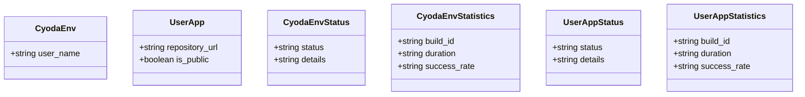
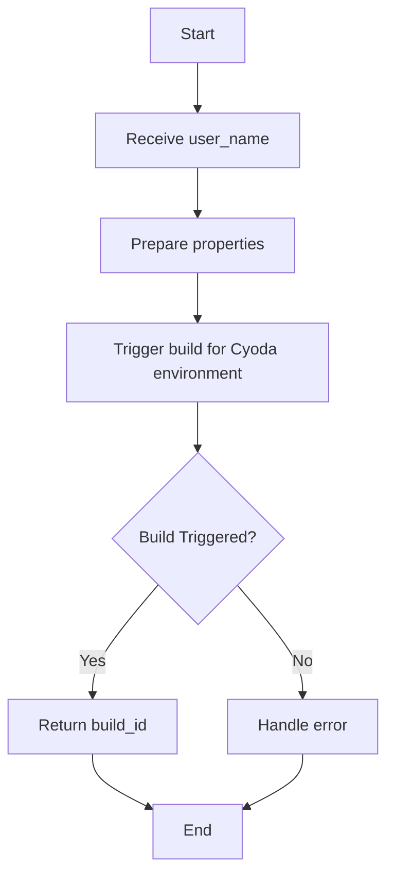
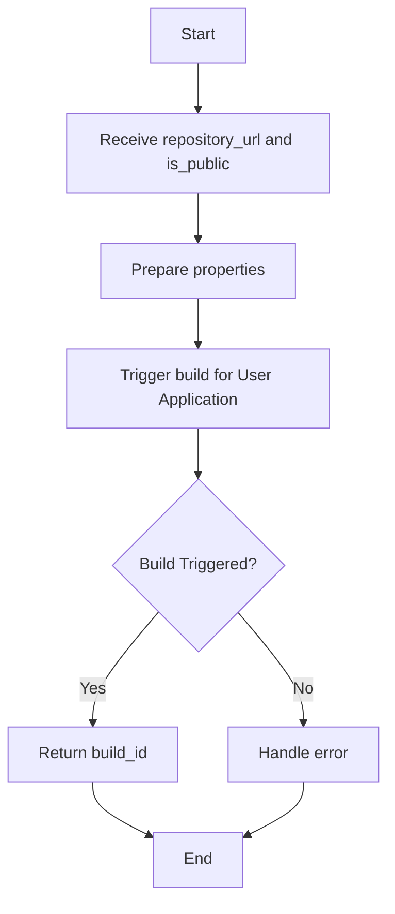

Here are the Mermaid diagrams for the entity-relationship (ER) diagrams, class diagrams for each entity, and flowcharts for each workflow based on the provided JSON design document.

### Entity-Relationship (ER) Diagram

```mermaid
erDiagram
    CYODA_ENV {
        string user_name
    }
    USER_APP {
        string repository_url
        boolean is_public
    }
    CYODA_ENV_STATUS {
        string status
        string details
    }
    CYODA_ENV_STATISTICS {
        string build_id
        string duration
        string success_rate
    }
    USER_APP_STATUS {
        string status
        string details
    }
    USER_APP_STATISTICS {
        string build_id
        string duration
        string success_rate
    }

    CYODA_ENV ||--o{ CYODA_ENV_STATUS : has
    CYODA_ENV ||--o{ CYODA_ENV_STATISTICS : has
    USER_APP ||--o{ USER_APP_STATUS : has
    USER_APP ||--o{ USER_APP_STATISTICS : has
```

### Class Diagrams

```mermaid
classDiagram
    class CyodaEnv {
        +string user_name
    }

    class UserApp {
        +string repository_url
        +boolean is_public
    }

    class CyodaEnvStatus {
        +string status
        +string details
    }

    class CyodaEnvStatistics {
        +string build_id
        +string duration
        +string success_rate
    }

    class UserAppStatus {
        +string status
        +string details
    }

    class UserAppStatistics {
        +string build_id
        +string duration
        +string success_rate
    }
```

### Flowcharts for Workflows

#### Workflow for Deploying Cyoda Environment

```mermaid
flowchart TD
    A[Start] --> B[Receive user_name]
    B --> C[Prepare properties]
    C --> D[Trigger build for Cyoda environment]
    D --> E{Build Triggered?}
    E -- Yes --> F[Return build_id]
    E -- No --> G[Handle error]
    F --> H[End]
    G --> H
```

#### Workflow for Deploying User Application

```mermaid
flowchart TD
    A[Start] --> B[Receive repository_url and is_public]
    B --> C[Prepare properties]
    C --> D[Trigger build for User Application]
    D --> E{Build Triggered?}
    E -- Yes --> F[Return build_id]
    E -- No --> G[Handle error]
    F --> H[End]
    G --> H
```

These diagrams represent the structure and workflows of the entities as specified in your design document. You can use these diagrams to visualize the relationships and processes within your application.