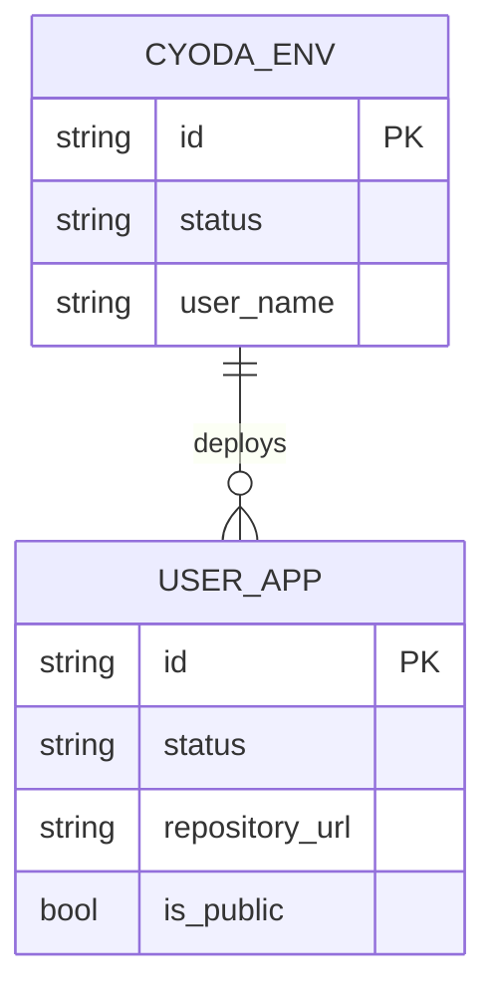
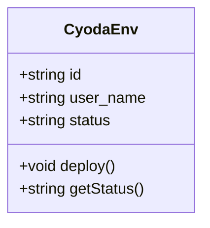
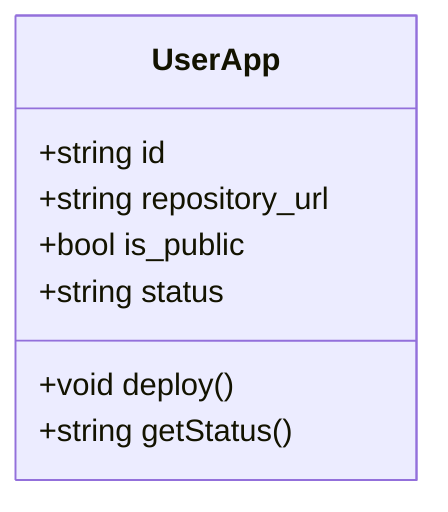
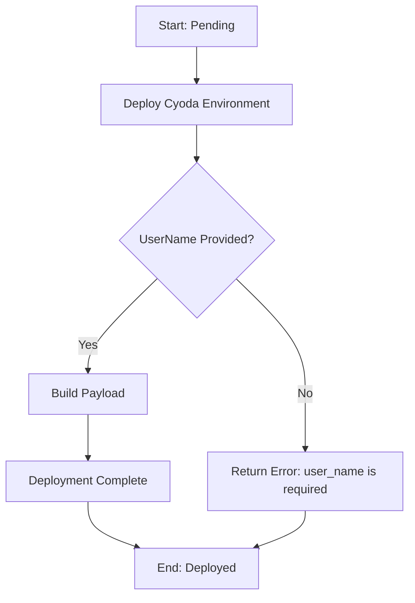
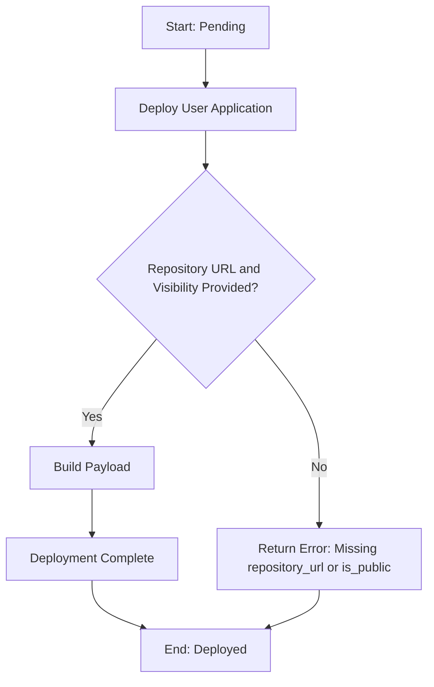

Sure! Below are the Mermaid syntax representations for ER Diagrams, Class Diagrams, and Flowcharts based on the provided JSON data. 

### Mermaid ER Diagram
This ER Diagram depicts the primary and secondary entities and their relationships.

```mermaid
erDiagram
    CYODA_ENV {
        string id PK
        string status
        string user_name
    }

    USER_APP {
        string id PK
        string status
        string repository_url
        bool is_public
    }

    CYODA_ENV ||--o{ USER_APP: deploys
```

### Mermaid Class Diagrams
This Class Diagram outlines the classes corresponding to the entities, including attributes and methods.

#### Class Diagram for `CyodaEnv`

```mermaid
classDiagram
    class CyodaEnv {
        +string id
        +string user_name
        +string status
        +void deploy()
        +string getStatus()
    }
```

#### Class Diagram for `UserApp`

```mermaid
classDiagram
    class UserApp {
        +string id
        +string repository_url
        +bool is_public
        +string status
        +void deploy()
        +string getStatus()
    }
```

### Mermaid Flowchart
These Flowcharts illustrate the respective workflows for deploying `CyodaEnv` and `UserApp`.

#### Flowchart for Deploying `CyodaEnv`

```mermaid
flowchart TD
    A[Start: Pending] --> B[Deploy Cyoda Environment]
    B --> C{UserName Provided?}
    C -- Yes --> D[Build Payload]
    C -- No --> E[Return Error: user_name is required]
    D --> F[Deployment Complete]
    F --> G[End: Deployed]
    E --> G
```

#### Flowchart for Deploying `UserApp`

```mermaid
flowchart TD
    A[Start: Pending] --> B[Deploy User Application]
    B --> C{Repository URL and Visibility Provided?}
    C -- Yes --> D[Build Payload]
    C -- No --> E[Return Error: Missing repository_url or is_public]
    D --> F[Deployment Complete]
    F --> G[End: Deployed]
    E --> G
```

### Summary
The above representations encapsulate the entities (`CyodaEnv` and `UserApp`), relationships between them, and their respective deployment workflows. If you'd like to see modifications or additional details, feel free to ask!