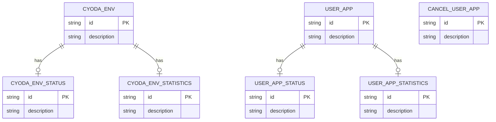
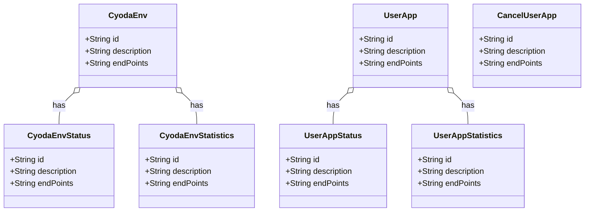

Certainly! Below is the Mermaid syntax for Entity Relationship (ER) diagrams based on the provided entities and their relationships. The relationships between the entities are inferred based on their secondary entities mentioned in the deployment workflows. 

### Mermaid Entity Relationship Diagram

```mermaid
erDiagram
    CYODA_ENV {
        string id PK
        string description
    }
    USER_APP {
        string id PK
        string description
    }
    CANCEL_USER_APP {
        string id PK
        string description
    }
    CYODA_ENV_STATUS {
        string id PK
        string description
    }
    CYODA_ENV_STATISTICS {
        string id PK
        string description
    }
    USER_APP_STATUS {
        string id PK
        string description
    }
    USER_APP_STATISTICS {
        string id PK
        string description
    }

    CYODA_ENV ||--o| CYODA_ENV_STATUS : has
    CYODA_ENV ||--o| CYODA_ENV_STATISTICS : has
    USER_APP ||--o| USER_APP_STATUS : has
    USER_APP ||--o| USER_APP_STATISTICS : has
```

### Mermaid Class Diagram

```mermaid
classDiagram
    class CyodaEnv {
        +String id
        +String description
        +String endPoints
    }
    
    class UserApp {
        +String id
        +String description
        +String endPoints
    }
    
    class CancelUserApp {
        +String id
        +String description
        +String endPoints
    }
    
    class CyodaEnvStatus {
        +String id
        +String description
        +String endPoints
    }
    
    class CyodaEnvStatistics {
        +String id
        +String description
        +String endPoints
    }

    class UserAppStatus {
        +String id
        +String description
        +String endPoints
    }
    
    class UserAppStatistics {
        +String id
        +String description
        +String endPoints
    }

    CyodaEnv o-- CyodaEnvStatus : has
    CyodaEnv o-- CyodaEnvStatistics : has
    UserApp o-- UserAppStatus : has
    UserApp o-- UserAppStatistics : has
```

### Explanation:
1. **Entities**: Each entity is represented with its attributes.
2. **Relationships**: 
   - `CyodaEnv` has a relationship with both `CyodaEnvStatus` and `CyodaEnvStatistics`.
   - `UserApp` has a relationship with both `UserAppStatus` and `UserAppStatistics`.
   - `CancelUserApp` does not have any relationships with other specified entities based on the given data.
3. **Class Diagram**: Each class corresponds to an entity, showing its attributes and denoting relationships clearly.

Make sure to visualize these diagrams in a Markdown viewer that supports Mermaid syntax.