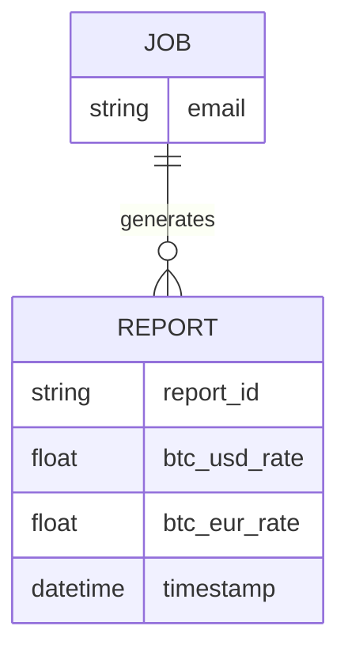
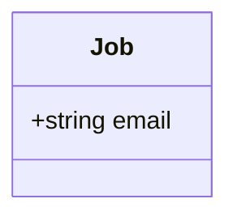
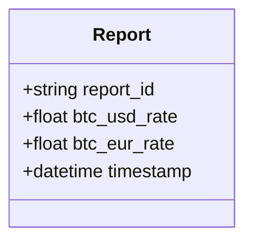
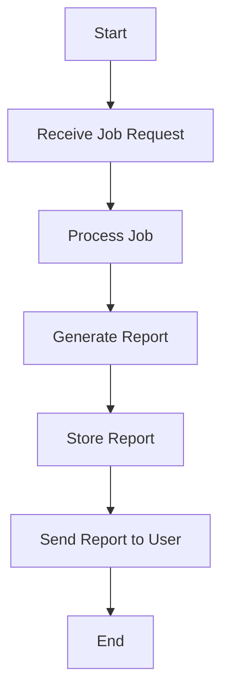

Based on the provided JSON design document, here are the Mermaid entity-relationship (ER) diagrams, class diagrams for each entity, and flow charts for each workflow.

### Mermaid ER Diagram

```mermaid
erDiagram
    JOB {
        string email
    }
    
    REPORT {
        string report_id
        float btc_usd_rate
        float btc_eur_rate
        datetime timestamp
    }

    JOB ||--o{ REPORT : generates
```

### Mermaid Class Diagrams

#### Job Class Diagram

```mermaid
classDiagram
    class Job {
        +string email
    }
```

#### Report Class Diagram

```mermaid
classDiagram
    class Report {
        +string report_id
        +float btc_usd_rate
        +float btc_eur_rate
        +datetime timestamp
    }
```

### Flow Chart for Each Workflow

Assuming a simple workflow where a job generates a report, here is a flowchart:

```mermaid
flowchart TD
    A[Start] --> B[Receive Job Request]
    B --> C[Process Job]
    C --> D[Generate Report]
    D --> E[Store Report]
    E --> F[Send Report to User]
    F --> G[End]
```

### Summary

- The ER diagram shows the relationship between the `Job` and `Report` entities.
- Each class diagram defines the attributes of the `Job` and `Report` classes.
- The flowchart outlines a basic workflow from receiving a job request to sending the generated report to the user. 

Feel free to ask if you need any further modifications or additional details!