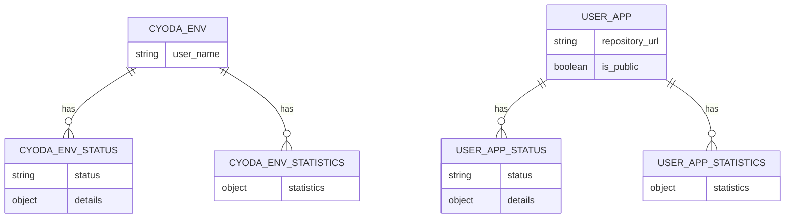
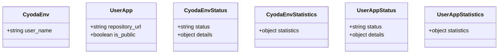
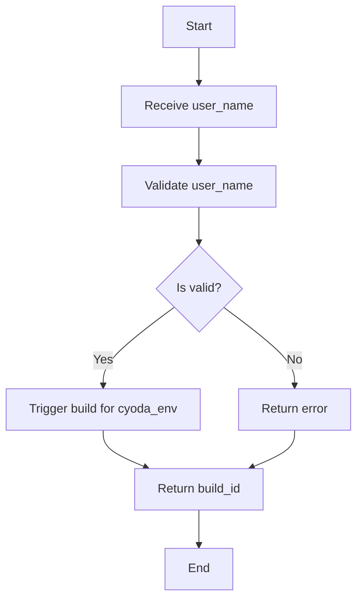
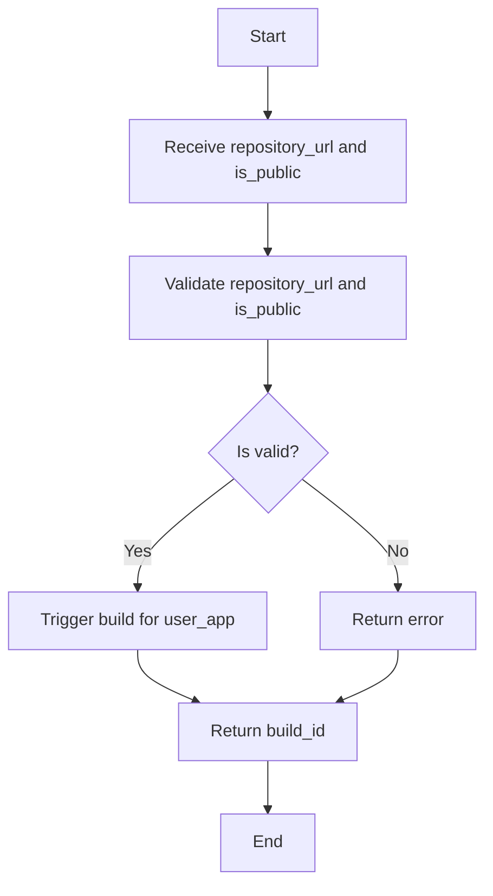

Here are the Mermaid diagrams based on the provided JSON design document, including entity ER diagrams, class diagrams for each entity, and flowcharts for the workflows.

### Entity Relationship (ER) Diagrams

```mermaid
erDiagram
    CYODA_ENV {
        string user_name
    }
    
    USER_APP {
        string repository_url
        boolean is_public
    }
    
    CYODA_ENV_STATUS {
        string status
        object details
    }
    
    CYODA_ENV_STATISTICS {
        object statistics
    }
    
    USER_APP_STATUS {
        string status
        object details
    }
    
    USER_APP_STATISTICS {
        object statistics
    }

    CYODA_ENV ||--o{ CYODA_ENV_STATUS : has
    CYODA_ENV ||--o{ CYODA_ENV_STATISTICS : has
    USER_APP ||--o{ USER_APP_STATUS : has
    USER_APP ||--o{ USER_APP_STATISTICS : has
```

### Class Diagrams

```mermaid
classDiagram
    class CyodaEnv {
        +string user_name
    }

    class UserApp {
        +string repository_url
        +boolean is_public
    }

    class CyodaEnvStatus {
        +string status
        +object details
    }

    class CyodaEnvStatistics {
        +object statistics
    }

    class UserAppStatus {
        +string status
        +object details
    }

    class UserAppStatistics {
        +object statistics
    }
```

### Flowcharts for Workflows

#### Workflow for Deploying `cyoda_env`

```mermaid
flowchart TD
    A[Start] --> B[Receive user_name]
    B --> C[Validate user_name]
    C --> D{Is valid?}
    D -- Yes --> E[Trigger build for cyoda_env]
    D -- No --> F[Return error]
    E --> G[Return build_id]
    F --> G
    G --> H[End]
```

#### Workflow for Deploying `user_app`

```mermaid
flowchart TD
    A[Start] --> B[Receive repository_url and is_public]
    B --> C[Validate repository_url and is_public]
    C --> D{Is valid?}
    D -- Yes --> E[Trigger build for user_app]
    D -- No --> F[Return error]
    E --> G[Return build_id]
    F --> G
    G --> H[End]
```

These diagrams provide a visual representation of the entities, their relationships, and the workflows associated with deploying the `cyoda_env` and `user_app`. If you need any further modifications or additional diagrams, feel free to ask!