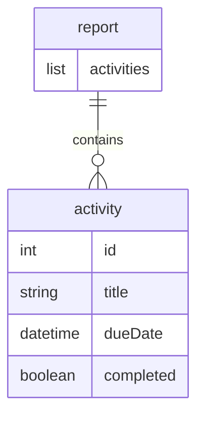
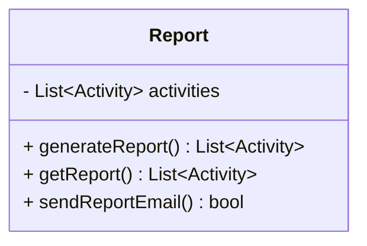
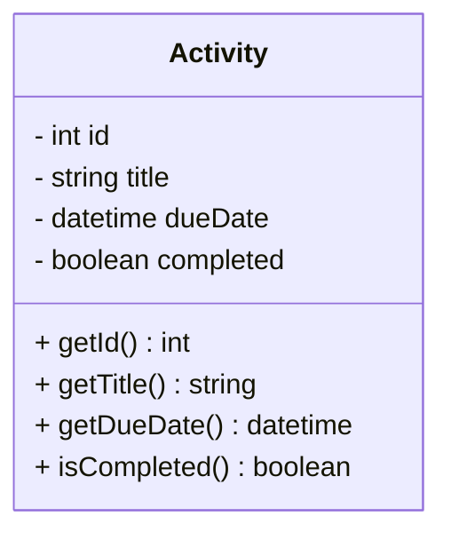
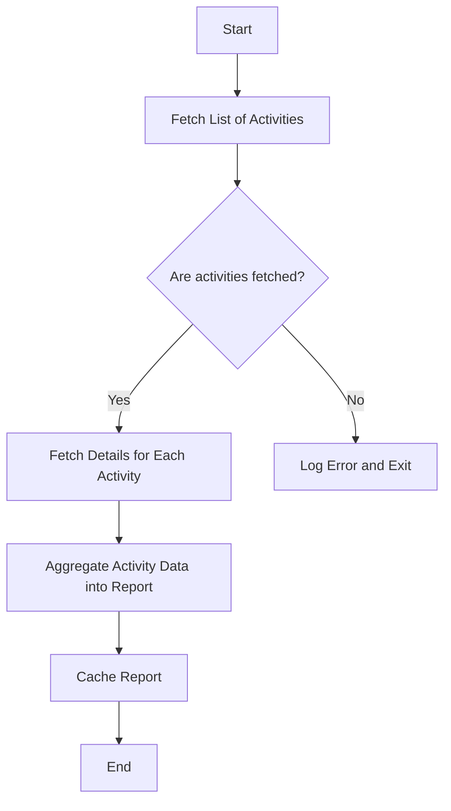
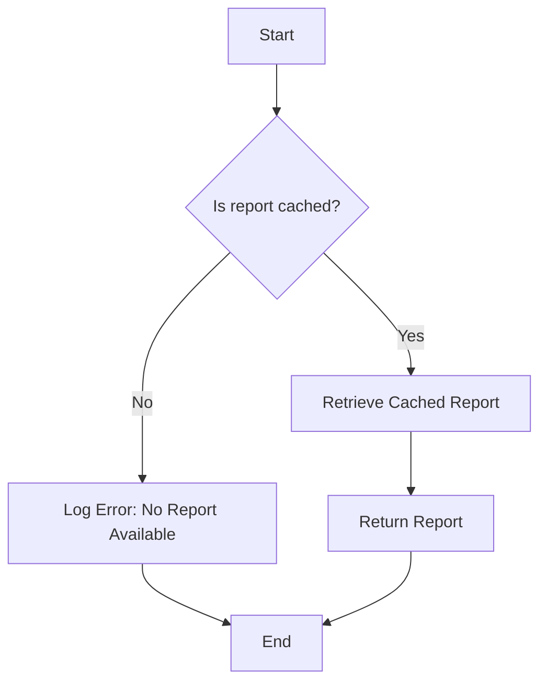
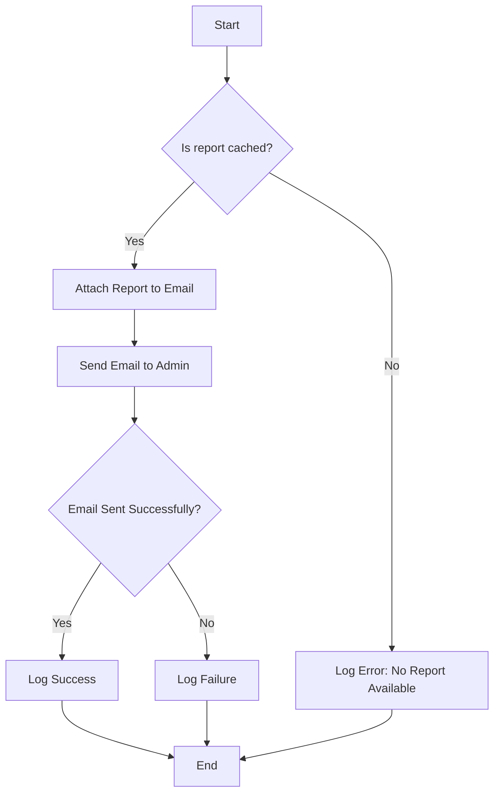

Below are the **Mermaid diagrams** for the entities and workflows based on the provided JSON design document. These include **Entity-Relationship (ER) diagrams**, **class diagrams**, and **flowcharts** for each workflow.

---

### **1. Entity-Relationship (ER) Diagram**

```mermaid
erDiagram
    report ||--o{ activity : contains
    report {
        list activities
    }
    activity {
        int id
        string title
        datetime dueDate
        boolean completed
    }
```

---

### **2. Class Diagrams**

#### **Report Class**

```mermaid
classDiagram
    class Report {
        - List~Activity~ activities
        + generateReport() List~Activity~
        + getReport() List~Activity~
        + sendReportEmail() bool
    }
```

#### **Activity Class**

```mermaid
classDiagram
    class Activity {
        - int id
        - string title
        - datetime dueDate
        - boolean completed
        + getId() int
        + getTitle() string
        + getDueDate() datetime
        + isCompleted() boolean
    }
```

---

### **3. Flowcharts for Workflows**

#### **Workflow 1: Generate Report**

```mermaid
flowchart TD
    A[Start] --> B[Fetch List of Activities]
    B --> C{Are activities fetched?}
    C -->|Yes| D[Fetch Details for Each Activity]
    C -->|No| E[Log Error and Exit]
    D --> F[Aggregate Activity Data into Report]
    F --> G[Cache Report]
    G --> H[End]
```

#### **Workflow 2: Retrieve Report**

```mermaid
flowchart TD
    A[Start] --> B{Is report cached?}
    B -->|Yes| C[Retrieve Cached Report]
    B -->|No| D[Log Error: No Report Available]
    C --> E[Return Report]
    D --> F[End]
    E --> F
```

#### **Workflow 3: Send Report via Email**

```mermaid
flowchart TD
    A[Start] --> B{Is report cached?}
    B -->|Yes| C[Attach Report to Email]
    B -->|No| D[Log Error: No Report Available]
    C --> E[Send Email to Admin]
    E --> F{Email Sent Successfully?}
    F -->|Yes| G[Log Success]
    F -->|No| H[Log Failure]
    G --> I[End]
    H --> I
    D --> I
```

---

### **Explanation of Diagrams**

1. **ER Diagram**:
   - The `report` entity contains a list of `activity` entities.
   - The `activity` entity has attributes: `id`, `title`, `dueDate`, and `completed`.

2. **Class Diagrams**:
   - The `Report` class has methods to generate, retrieve, and send the report.
   - The `Activity` class encapsulates the properties of an activity and provides getter methods.

3. **Flowcharts**:
   - **Generate Report**: Fetches activities, retrieves details, aggregates data, and caches the report.
   - **Retrieve Report**: Checks if the report is cached and returns it if available.
   - **Send Report via Email**: Attaches the cached report to an email and sends it to the admin.

These diagrams are consistent with the provided JSON design document and do not deviate from the specified requirements. Let me know if you need further clarification or adjustments!