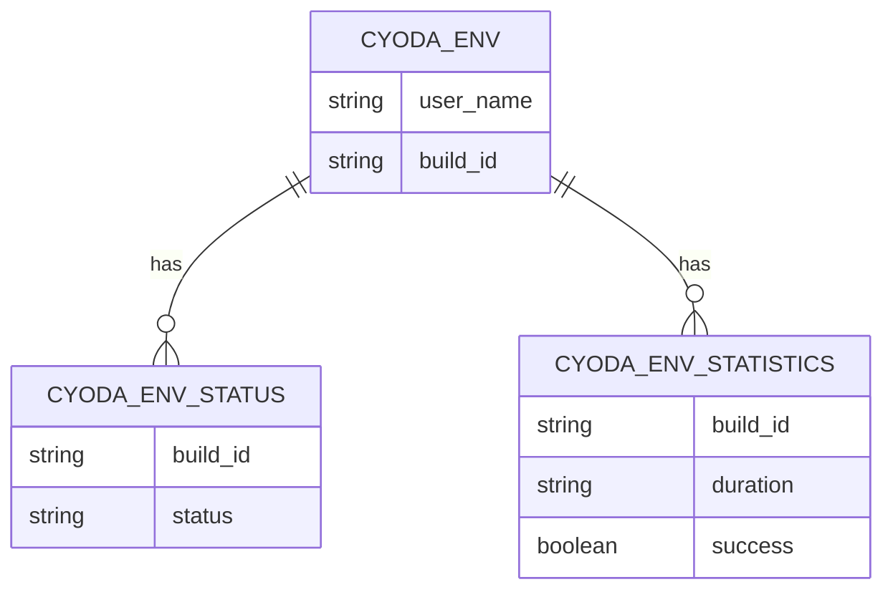
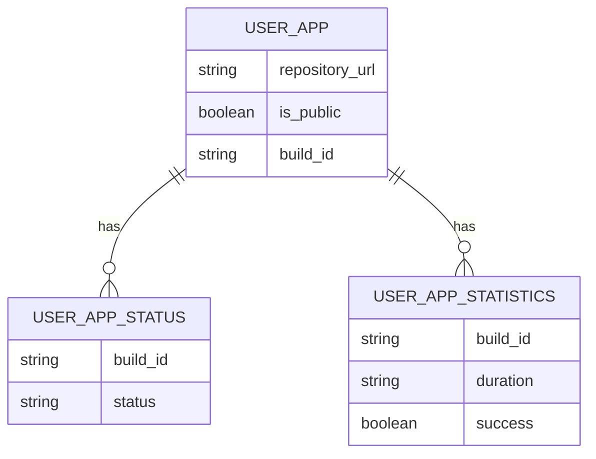
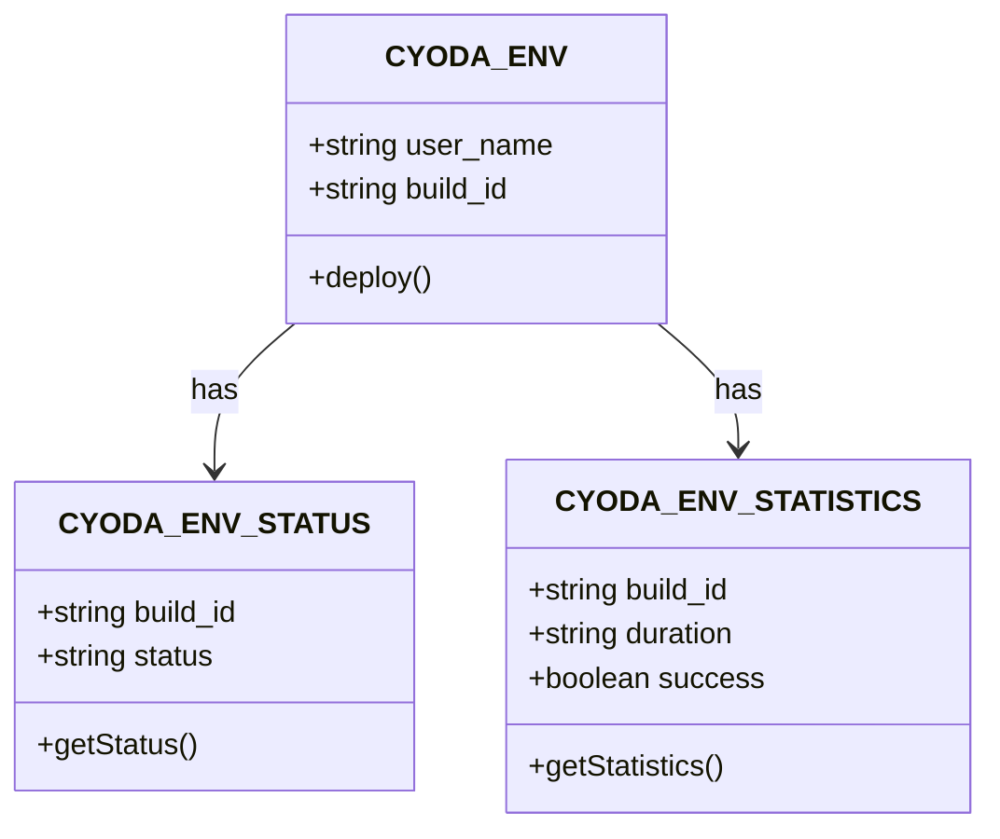
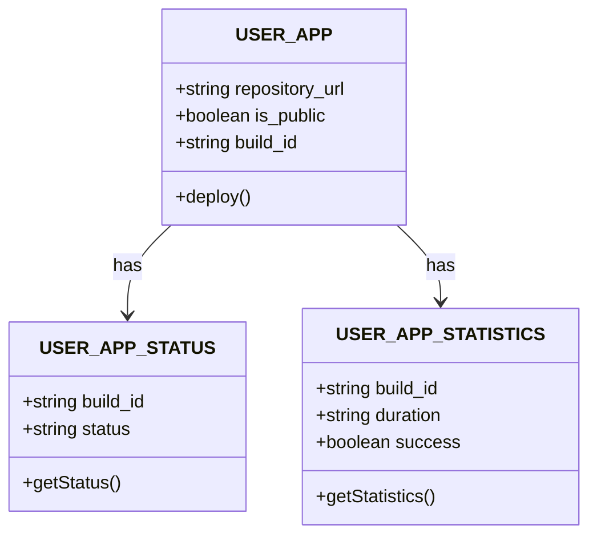
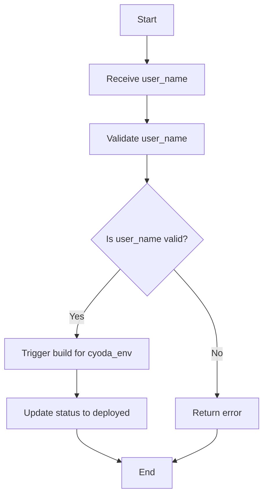

Here are the Mermaid diagrams based on the provided JSON design document. The diagrams include Entity-Relationship (ER) diagrams for each entity, class diagrams for each entity, and flowcharts for each workflow.

### Entity-Relationship (ER) Diagrams

#### ER Diagram for `cyoda_env`

```mermaid
erDiagram
    CYODA_ENV {
        string user_name
        string build_id
    }
    CYODA_ENV_STATUS {
        string build_id
        string status
    }
    CYODA_ENV_STATISTICS {
        string build_id
        string duration
        boolean success
    }

    CYODA_ENV ||--o{ CYODA_ENV_STATUS : has
    CYODA_ENV ||--o{ CYODA_ENV_STATISTICS : has
```

#### ER Diagram for `user_app`

```mermaid
erDiagram
    USER_APP {
        string repository_url
        boolean is_public
        string build_id
    }
    USER_APP_STATUS {
        string build_id
        string status
    }
    USER_APP_STATISTICS {
        string build_id
        string duration
        boolean success
    }

    USER_APP ||--o{ USER_APP_STATUS : has
    USER_APP ||--o{ USER_APP_STATISTICS : has
```

### Class Diagrams

#### Class Diagram for `cyoda_env`

```mermaid
classDiagram
    class CYODA_ENV {
        +string user_name
        +string build_id
        +deploy()
    }

    class CYODA_ENV_STATUS {
        +string build_id
        +string status
        +getStatus()
    }

    class CYODA_ENV_STATISTICS {
        +string build_id
        +string duration
        +boolean success
        +getStatistics()
    }

    CYODA_ENV --> CYODA_ENV_STATUS : has
    CYODA_ENV --> CYODA_ENV_STATISTICS : has
```

#### Class Diagram for `user_app`

```mermaid
classDiagram
    class USER_APP {
        +string repository_url
        +boolean is_public
        +string build_id
        +deploy()
    }

    class USER_APP_STATUS {
        +string build_id
        +string status
        +getStatus()
    }

    class USER_APP_STATISTICS {
        +string build_id
        +string duration
        +boolean success
        +getStatistics()
    }

    USER_APP --> USER_APP_STATUS : has
    USER_APP --> USER_APP_STATISTICS : has
```

### Flowcharts for Workflows

#### Workflow for Deploying `cyoda_env`

```mermaid
flowchart TD
    A[Start] --> B[Receive user_name]
    B --> C[Validate user_name]
    C --> D{Is user_name valid?}
    D -- Yes --> E[Trigger build for cyoda_env]
    D -- No --> F[Return error]
    E --> G[Update status to deployed]
    G --> H[End]
    F --> H
```

#### Workflow for Deploying `user_app`
```mermaid
flowchart TD
    A[Start] --> B[Receive repository_url and is_public]
    B --> C[Validate repository_url]
    C --> D{Is repository_url valid?}
    D -- Yes --> E[Trigger build for user_app]
    D -- No --> F[Return error]
    E --> G[Update status to deployed]
    G --> H