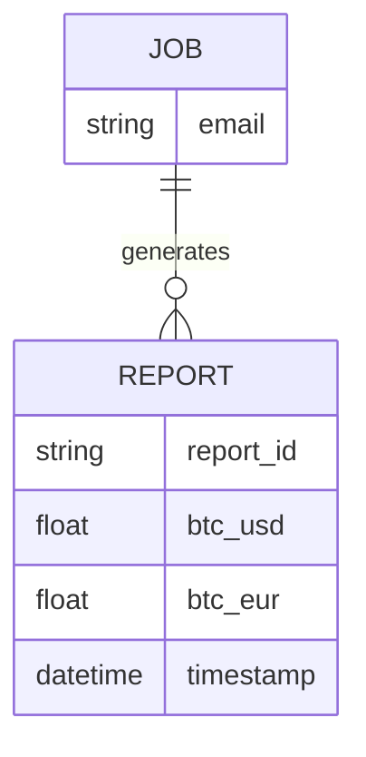
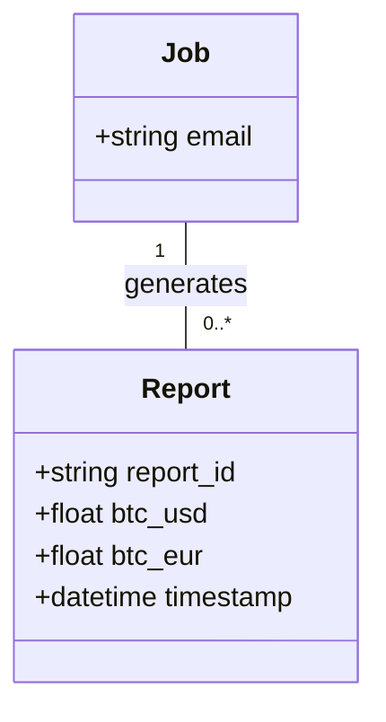
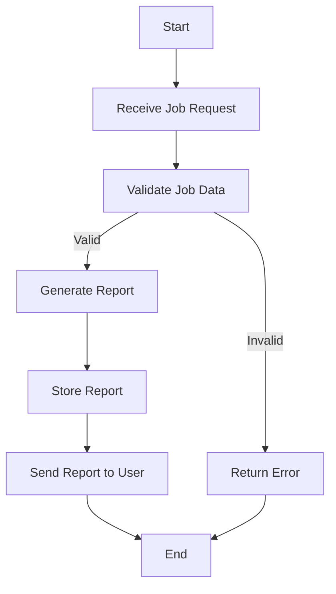

Based on the provided JSON design document, here are the Mermaid diagrams for the entities and workflows.

### Entity-Relationship (ER) Diagram

```mermaid
erDiagram
    JOB {
        string email
    }
    
    REPORT {
        string report_id
        float btc_usd
        float btc_eur
        datetime timestamp
    }

    JOB ||--o{ REPORT : generates
```

### Class Diagram

```mermaid
classDiagram
    class Job {
        +string email
    }

    class Report {
        +string report_id
        +float btc_usd
        +float btc_eur
        +datetime timestamp
    }

    Job "1" -- "0..*" Report : generates
```

### Flow Chart for Workflow

Since the JSON does not specify a particular workflow, I will create a generic flow chart that represents the process of generating a report from a job.

```mermaid
flowchart TD
    A[Start] --> B[Receive Job Request]
    B --> C[Validate Job Data]
    C -->|Valid| D[Generate Report]
    C -->|Invalid| E[Return Error]
    D --> F[Store Report]
    F --> G[Send Report to User]
    G --> H[End]
    E --> H
```

These diagrams represent the entities and their relationships, as well as a generic workflow for generating reports based on job requests. If you have specific workflows or additional details to include, please provide them!