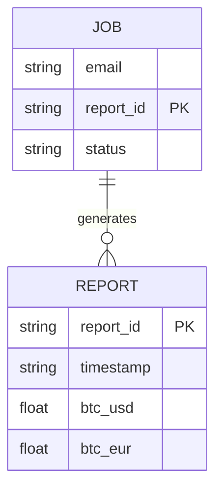
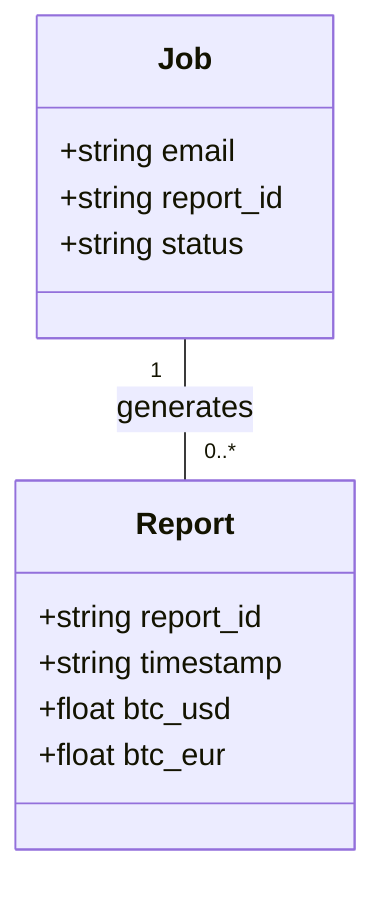
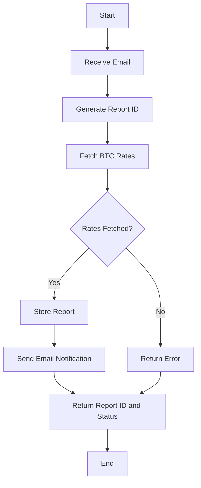

Here are the requested Mermaid diagrams based on the provided JSON design document.

### Entity Relationship (ER) Diagram

```mermaid
erDiagram
    JOB {
        string email
        string report_id PK
        string status
    }

    REPORT {
        string report_id PK
        string timestamp
        float btc_usd
        float btc_eur
    }

    JOB ||--o{ REPORT : generates
```

### Class Diagram

```mermaid
classDiagram
    class Job {
        +string email
        +string report_id
        +string status
    }

    class Report {
        +string report_id
        +string timestamp
        +float btc_usd
        +float btc_eur
    }

    Job "1" -- "0..*" Report : generates
```

### Flow Chart for Workflow

#### Workflow for Creating a Report

```mermaid
flowchart TD
    A[Start] --> B[Receive Email]
    B --> C[Generate Report ID]
    C --> D[Fetch BTC Rates]
    D --> E{Rates Fetched?}
    E -- Yes --> F[Store Report]
    E -- No --> G[Return Error]
    F --> H[Send Email Notification]
    H --> I[Return Report ID and Status]
    G --> I
    I --> J[End]
```

### Explanation:
- **ER Diagram**: Shows the relationship between the `Job` and `Report` entities, indicating that a job generates one or more reports.
- **Class Diagram**: Represents the attributes of each class (entity) and their relationship, where a `Job` can generate multiple `Reports`.
- **Flow Chart**: Illustrates the workflow for creating a report, detailing the steps from receiving the email to returning the report ID and status, including error handling.

These diagrams provide a clear visual representation of the entities, their relationships, and the workflows involved in your application. If you need any further modifications or additional diagrams, feel free to ask!